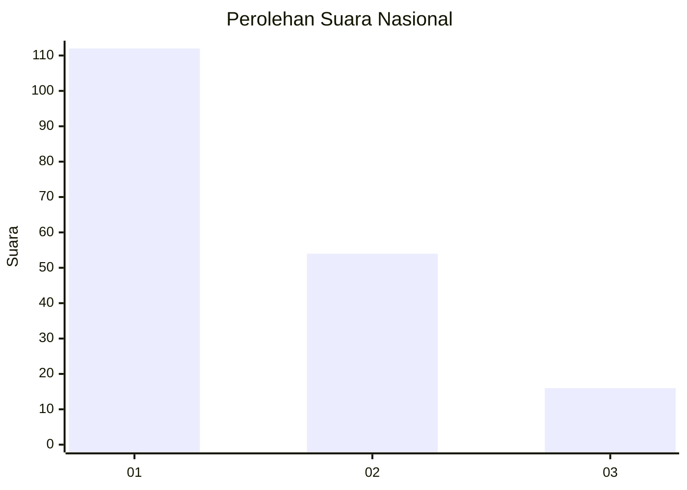
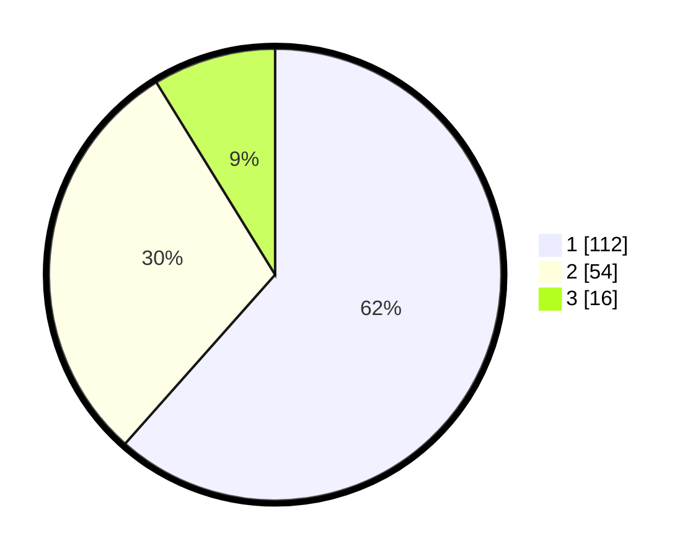

# Hasil

## Grafik

## Tabel

| No. | Nama Paslon    | Suara | Suara (raw) | Persentase |
|:--- |:-------------- | -----:| -----------:| ----------:|
| 1   | ANIES MUHAIMIN | 112   | [112][p-1]  | 61,54      |
| 2   | PRABOWO GIBRAN | 54    | [54][p-2]   | 29,67      |
| 3   | GANJAR MAHFUD  | 16    | [16][p-3]   | 8,79       |

[p-1]: https://github.com/gigit-pemilu/pemilu-2024/blob/main/pilpres/hitung-suara/sub/14-riau/sub/04-indragiri-hilir/sub/13-tembilahan-hulu/sub/2003-pulaupalas/sub/017-tps/sub/paslon-1.txt
[p-2]: https://github.com/gigit-pemilu/pemilu-2024/blob/main/pilpres/hitung-suara/sub/14-riau/sub/04-indragiri-hilir/sub/13-tembilahan-hulu/sub/2003-pulaupalas/sub/017-tps/sub/paslon-2.txt
[p-3]: https://github.com/gigit-pemilu/pemilu-2024/blob/main/pilpres/hitung-suara/sub/14-riau/sub/04-indragiri-hilir/sub/13-tembilahan-hulu/sub/2003-pulaupalas/sub/017-tps/sub/paslon-3.txt

## Foto C Plano

https://sirekap-obj-formc.kpu.go.id/07c8/pemilu/ppwp/14/04/13/20/03/1404132003017-20240214-235627--beb42c97-d089-4985-a123-944fd6e755bb.jpg

https://sirekap-obj-formc.kpu.go.id/07c8/pemilu/ppwp/14/04/13/20/03/1404132003017-20240214-235534--373d9d33-ab33-47a0-8b4b-75188bf033f5.jpg

https://sirekap-obj-formc.kpu.go.id/07c8/pemilu/ppwp/14/04/13/20/03/1404132003017-20240214-235549--f1fa8fb0-6fa8-4142-8639-c8c0f49acbb3.jpg

## Metadata

| Key        | Value               |
| ---------- | ------------------- |
| Time Stamp | 2024-02-25 11:00:00 |

