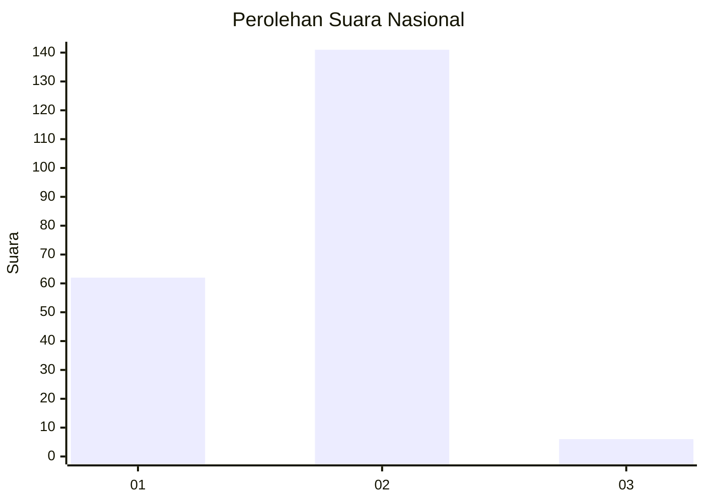
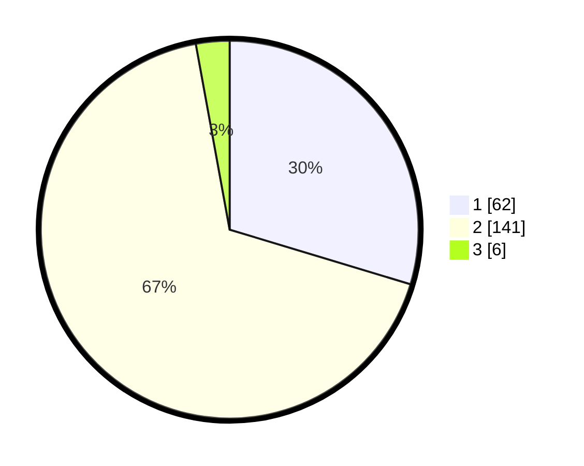

# Hasil

## Grafik

## Tabel

| No. | Nama Paslon    | Suara | Suara (raw) | Persentase |
|:--- |:-------------- | -----:| -----------:| ----------:|
| 1   | ANIES MUHAIMIN | 62    | [62][p-1]   | 29,67      |
| 2   | PRABOWO GIBRAN | 141   | [141][p-2]  | 67,46      |
| 3   | GANJAR MAHFUD  | 6     | [6][p-3]    | 2,87       |

[p-1]: https://github.com/gigit-pemilu/pemilu-2024/blob/main/pilpres/hitung-suara/sub/14-riau/sub/04-indragiri-hilir/sub/14-kemuning/sub/1001-selensen/sub/003-tps/sub/paslon-1.txt
[p-2]: https://github.com/gigit-pemilu/pemilu-2024/blob/main/pilpres/hitung-suara/sub/14-riau/sub/04-indragiri-hilir/sub/14-kemuning/sub/1001-selensen/sub/003-tps/sub/paslon-2.txt
[p-3]: https://github.com/gigit-pemilu/pemilu-2024/blob/main/pilpres/hitung-suara/sub/14-riau/sub/04-indragiri-hilir/sub/14-kemuning/sub/1001-selensen/sub/003-tps/sub/paslon-3.txt

## Foto C Plano

https://sirekap-obj-formc.kpu.go.id/9212/pemilu/ppwp/14/04/14/10/01/1404141001003-20240215-000543--afdd6870-d57a-4550-bd7a-892bf1cae296.jpg

https://sirekap-obj-formc.kpu.go.id/9212/pemilu/ppwp/14/04/14/10/01/1404141001003-20240215-000112--06a818ff-e006-4306-ab25-19810cfa1533.jpg

https://sirekap-obj-formc.kpu.go.id/9212/pemilu/ppwp/14/04/14/10/01/1404141001003-20240215-000302--f4a87fa0-55e8-42df-af39-e44b94deb745.jpg

## Metadata

| Key        | Value               |
| ---------- | ------------------- |
| Time Stamp | 2024-02-25 12:00:00 |

