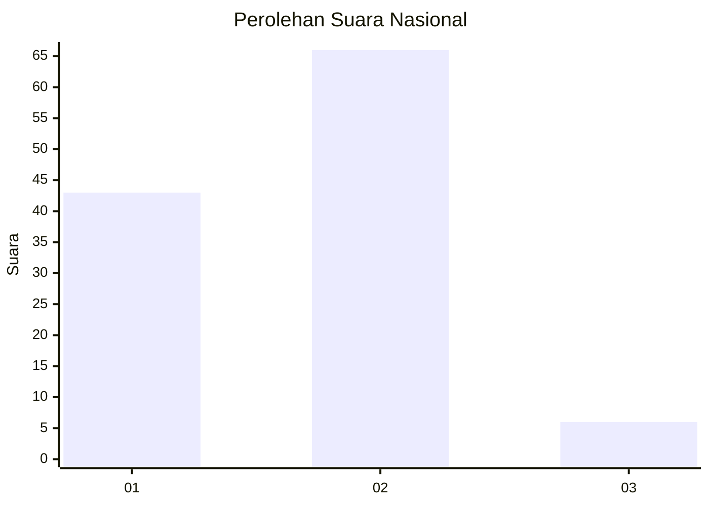
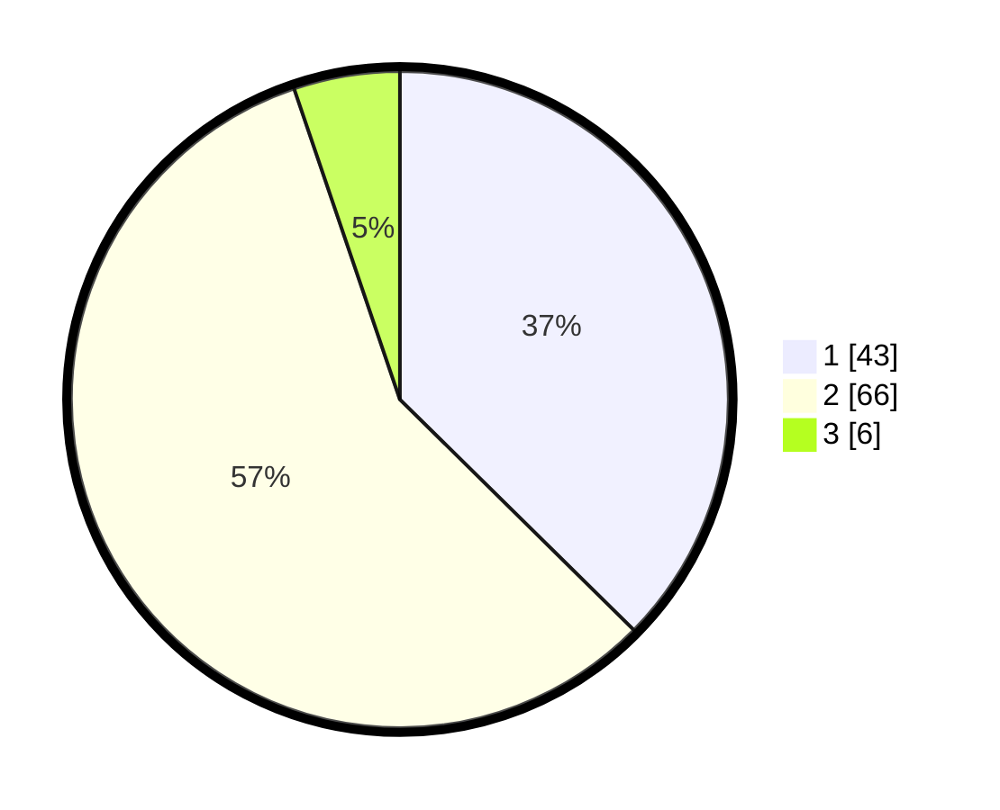

# Hasil

## Grafik

## Tabel

| No. | Nama Paslon    | Suara | Suara (raw) | Persentase |
|:--- |:-------------- | -----:| -----------:| ----------:|
| 1   | ANIES MUHAIMIN | 43    | [43][p-1]   | 37,39      |
| 2   | PRABOWO GIBRAN | 66    | [66][p-2]   | 57,39      |
| 3   | GANJAR MAHFUD  | 6     | [6][p-3]    | 5,22       |

[p-1]: https://github.com/gigit-pemilu/pemilu-2024/blob/main/pilpres/hitung-suara/sub/14-riau/sub/04-indragiri-hilir/sub/14-kemuning/sub/1001-selensen/sub/004-tps/sub/paslon-1.txt
[p-2]: https://github.com/gigit-pemilu/pemilu-2024/blob/main/pilpres/hitung-suara/sub/14-riau/sub/04-indragiri-hilir/sub/14-kemuning/sub/1001-selensen/sub/004-tps/sub/paslon-2.txt
[p-3]: https://github.com/gigit-pemilu/pemilu-2024/blob/main/pilpres/hitung-suara/sub/14-riau/sub/04-indragiri-hilir/sub/14-kemuning/sub/1001-selensen/sub/004-tps/sub/paslon-3.txt

## Foto C Plano

https://sirekap-obj-formc.kpu.go.id/2819/pemilu/ppwp/14/04/14/10/01/1404141001004-20240214-223925--3ac21217-665d-455a-9efd-ab66941acc80.jpg

https://sirekap-obj-formc.kpu.go.id/2819/pemilu/ppwp/14/04/14/10/01/1404141001004-20240214-223939--1d242e22-52d3-48f0-83ec-2a19b8eee112.jpg

https://sirekap-obj-formc.kpu.go.id/2819/pemilu/ppwp/14/04/14/10/01/1404141001004-20240214-224029--09d82737-5352-4c5c-9153-c4d9812c718d.jpg

## Metadata

| Key        | Value               |
| ---------- | ------------------- |
| Time Stamp | 2024-02-24 22:31:28 |

