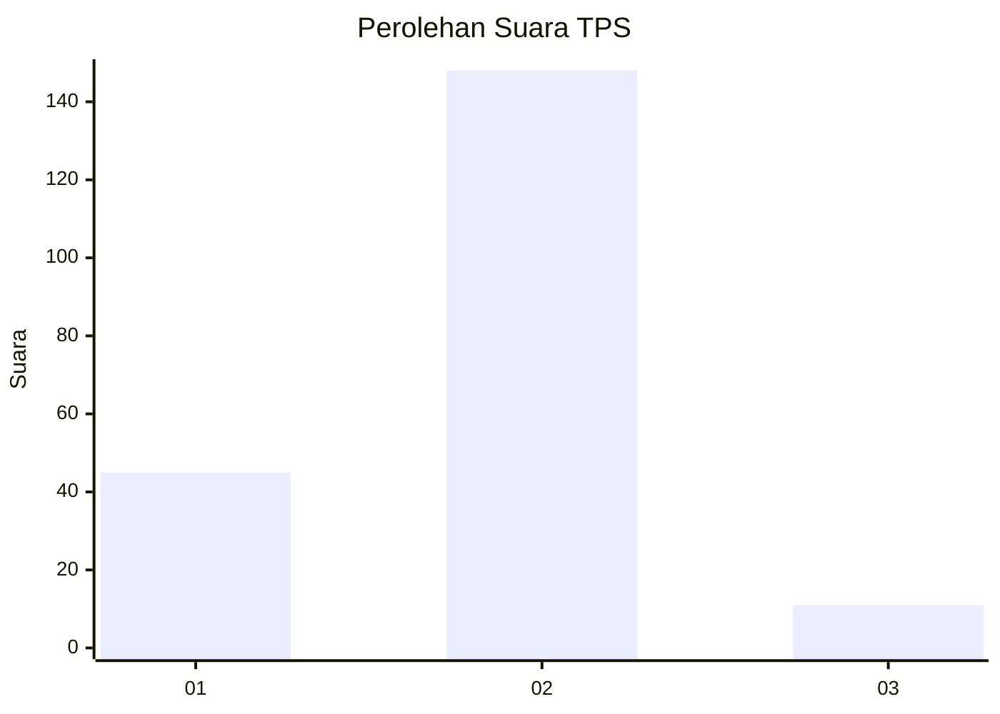
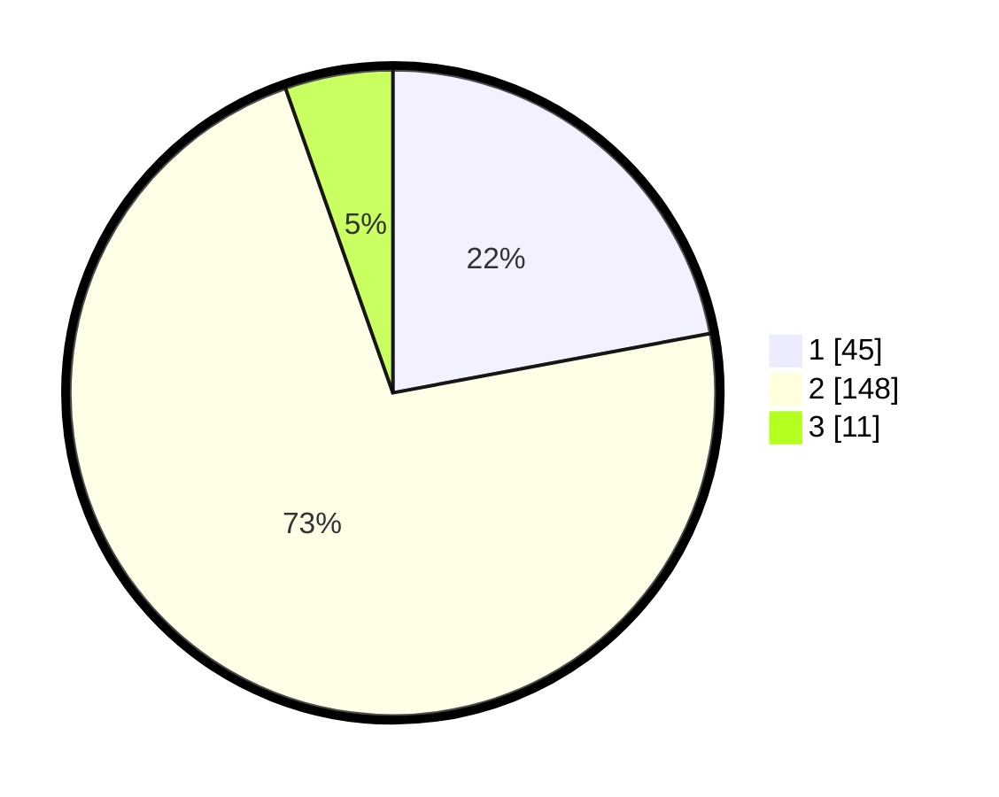

# Hasil

## Grafik

## Tabel

| No. | Nama Paslon    | Suara | Suara (raw) | Persentase |
|:--- |:-------------- | -----:| -----------:| ----------:|
| 1   | ANIES MUHAIMIN | 45    | [45][p-1]   | 22,06      |
| 2   | PRABOWO GIBRAN | 148   | [148][p-2]  | 72,55      |
| 3   | GANJAR MAHFUD  | 11    | [11][p-3]   | 5,39       |

[p-1]: https://github.com/gigit-pemilu/pemilu-2024-14-riau/blob/main/pilpres/hitung-suara/sub/14-riau/sub/04-indragiri-hilir/sub/14-kemuning/sub/1001-selensen/sub/005-tps/sub/paslon-1.txt
[p-2]: https://github.com/gigit-pemilu/pemilu-2024-14-riau/blob/main/pilpres/hitung-suara/sub/14-riau/sub/04-indragiri-hilir/sub/14-kemuning/sub/1001-selensen/sub/005-tps/sub/paslon-2.txt
[p-3]: https://github.com/gigit-pemilu/pemilu-2024-14-riau/blob/main/pilpres/hitung-suara/sub/14-riau/sub/04-indragiri-hilir/sub/14-kemuning/sub/1001-selensen/sub/005-tps/sub/paslon-3.txt

## Foto C Plano

https://sirekap-obj-formc.kpu.go.id/8a6e/pemilu/ppwp/14/04/14/10/01/1404141001005-20240214-214815--78a50356-8cfe-4042-9b02-0a54b7800bfd.jpg

https://sirekap-obj-formc.kpu.go.id/8a6e/pemilu/ppwp/14/04/14/10/01/1404141001005-20240214-214928--66c21b75-41b5-45f8-991a-1d9c9ac9982c.jpg

https://sirekap-obj-formc.kpu.go.id/8a6e/pemilu/ppwp/14/04/14/10/01/1404141001005-20240214-215043--bc04b1ab-ec6a-4f06-8b71-dc1d426ed0ae.jpg

## Metadata

| Key        | Value               |
| ---------- | ------------------- |
| Time Stamp | 2024-02-25 23:00:00 |

