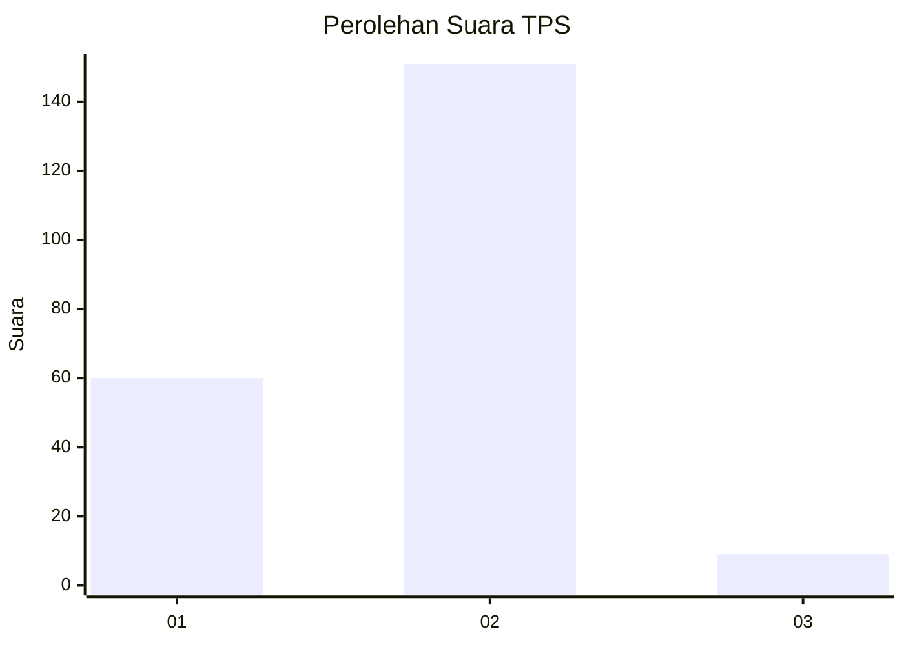
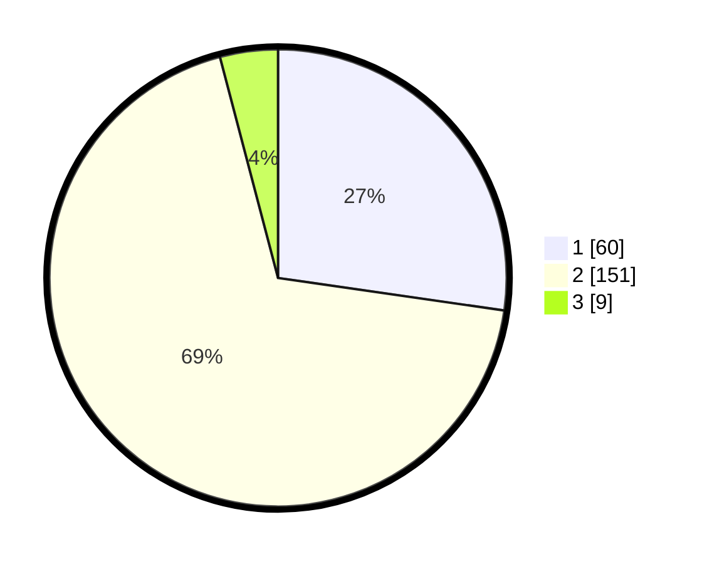

# Hasil

## Grafik

## Tabel

| No. | Nama Paslon    | Suara | Suara (raw) | Persentase |
|:--- |:-------------- | -----:| -----------:| ----------:|
| 1   | ANIES MUHAIMIN | 60    | [60][p-1]   | 27,27      |
| 2   | PRABOWO GIBRAN | 151   | [151][p-2]  | 68,64      |
| 3   | GANJAR MAHFUD  | 9     | [9][p-3]    | 4,09       |

[p-1]: https://github.com/gigit-pemilu/pemilu-2024-14-riau/blob/main/pilpres/hitung-suara/sub/14-riau/sub/04-indragiri-hilir/sub/14-kemuning/sub/1001-selensen/sub/006-tps/sub/paslon-1.txt
[p-2]: https://github.com/gigit-pemilu/pemilu-2024-14-riau/blob/main/pilpres/hitung-suara/sub/14-riau/sub/04-indragiri-hilir/sub/14-kemuning/sub/1001-selensen/sub/006-tps/sub/paslon-2.txt
[p-3]: https://github.com/gigit-pemilu/pemilu-2024-14-riau/blob/main/pilpres/hitung-suara/sub/14-riau/sub/04-indragiri-hilir/sub/14-kemuning/sub/1001-selensen/sub/006-tps/sub/paslon-3.txt

## Foto C Plano

https://sirekap-obj-formc.kpu.go.id/22cc/pemilu/ppwp/14/04/14/10/01/1404141001006-20240214-232831--aac00c60-72a9-47c5-9107-ebd70b5a7502.jpg

https://sirekap-obj-formc.kpu.go.id/22cc/pemilu/ppwp/14/04/14/10/01/1404141001006-20240214-233138--0c4214fe-78f9-4800-8147-e4d4a58fa3b3.jpg

https://sirekap-obj-formc.kpu.go.id/22cc/pemilu/ppwp/14/04/14/10/01/1404141001006-20240214-233522--186396f9-c675-4e20-ab5c-241c6c768145.jpg

## Metadata

| Key        | Value               |
| ---------- | ------------------- |
| Time Stamp | 2024-02-26 11:00:00 |

