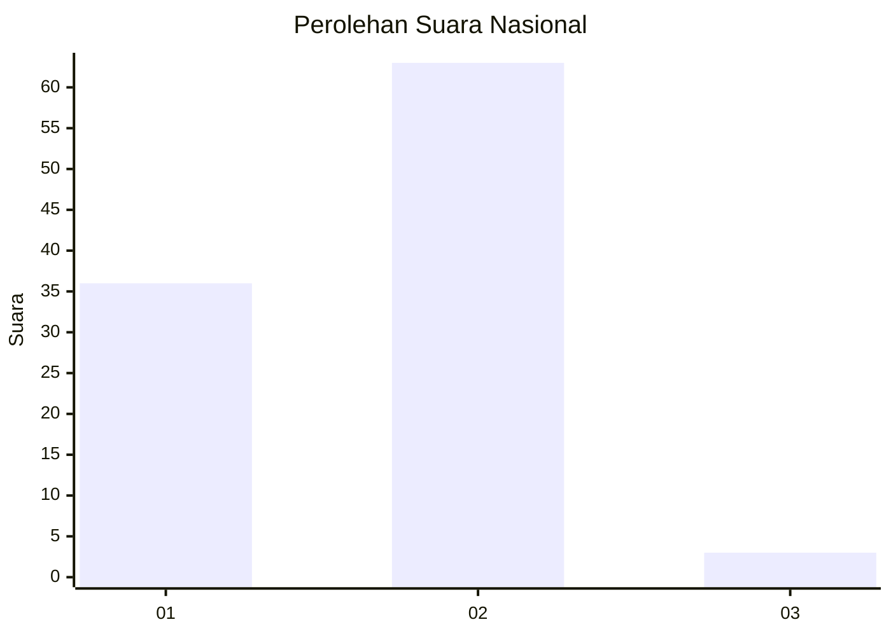
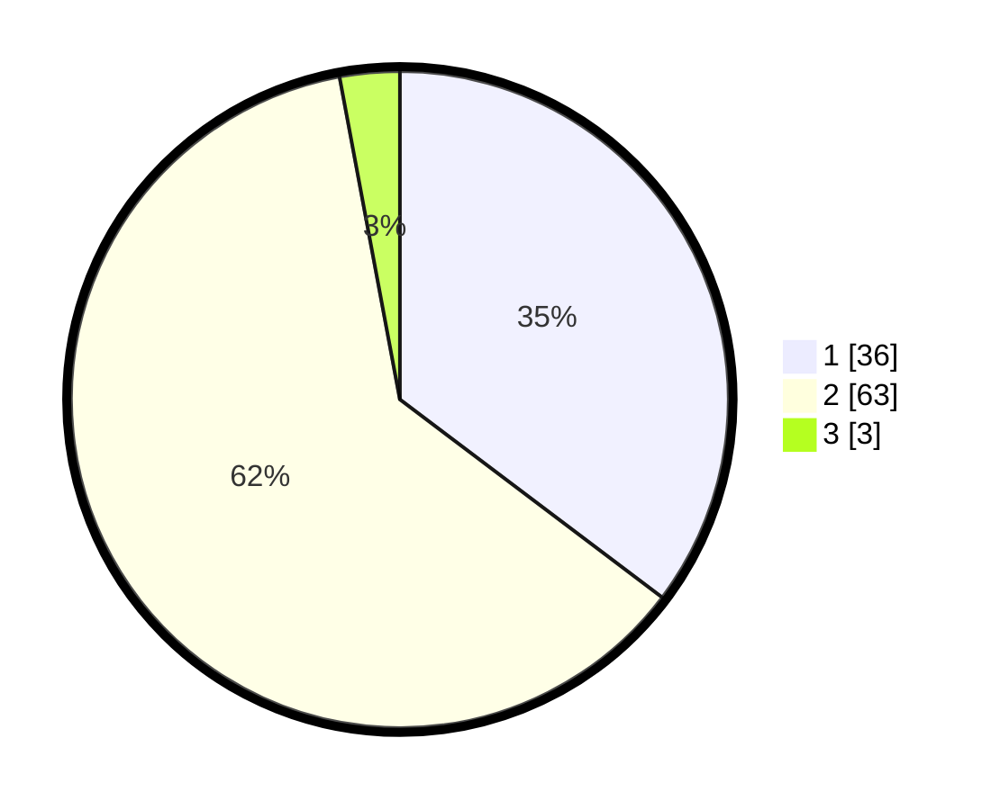

# Hasil

## Grafik

## Tabel

| No. | Nama Paslon    | Suara | Suara (raw) | Persentase |
|:--- |:-------------- | -----:| -----------:| ----------:|
| 1   | ANIES MUHAIMIN | 36    | [36][p-1]   | 35,29      |
| 2   | PRABOWO GIBRAN | 63    | [63][p-2]   | 61,76      |
| 3   | GANJAR MAHFUD  | 3     | [3][p-3]    | 2,94       |

[p-1]: https://github.com/gigit-pemilu/pemilu-2024/blob/main/pilpres/hitung-suara/sub/14-riau/sub/04-indragiri-hilir/sub/14-kemuning/sub/1001-selensen/sub/009-tps/sub/paslon-1.txt
[p-2]: https://github.com/gigit-pemilu/pemilu-2024/blob/main/pilpres/hitung-suara/sub/14-riau/sub/04-indragiri-hilir/sub/14-kemuning/sub/1001-selensen/sub/009-tps/sub/paslon-2.txt
[p-3]: https://github.com/gigit-pemilu/pemilu-2024/blob/main/pilpres/hitung-suara/sub/14-riau/sub/04-indragiri-hilir/sub/14-kemuning/sub/1001-selensen/sub/009-tps/sub/paslon-3.txt

## Foto C Plano

https://sirekap-obj-formc.kpu.go.id/554d/pemilu/ppwp/14/04/14/10/01/1404141001009-20240215-001753--fce52aa0-80c3-47f4-9c56-5ada50e2b6cb.jpg

https://sirekap-obj-formc.kpu.go.id/554d/pemilu/ppwp/14/04/14/10/01/1404141001009-20240215-001840--546d5e7e-1d9a-4fc3-8f32-3fd1a0d66853.jpg

https://sirekap-obj-formc.kpu.go.id/554d/pemilu/ppwp/14/04/14/10/01/1404141001009-20240215-001920--a7e6a5be-7059-43d4-8592-63e72cc91a1b.jpg

## Metadata

| Key        | Value               |
| ---------- | ------------------- |
| Time Stamp | 2024-02-25 21:00:00 |

