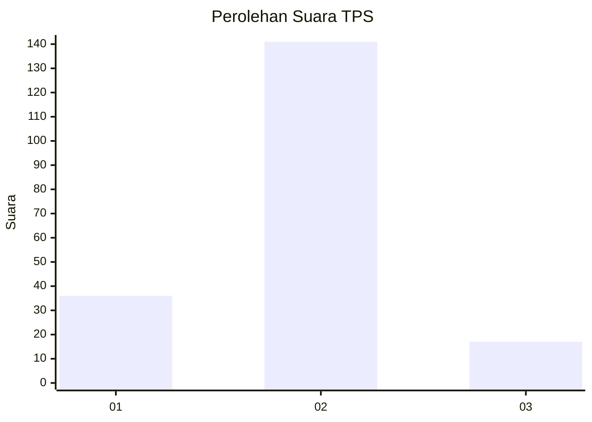
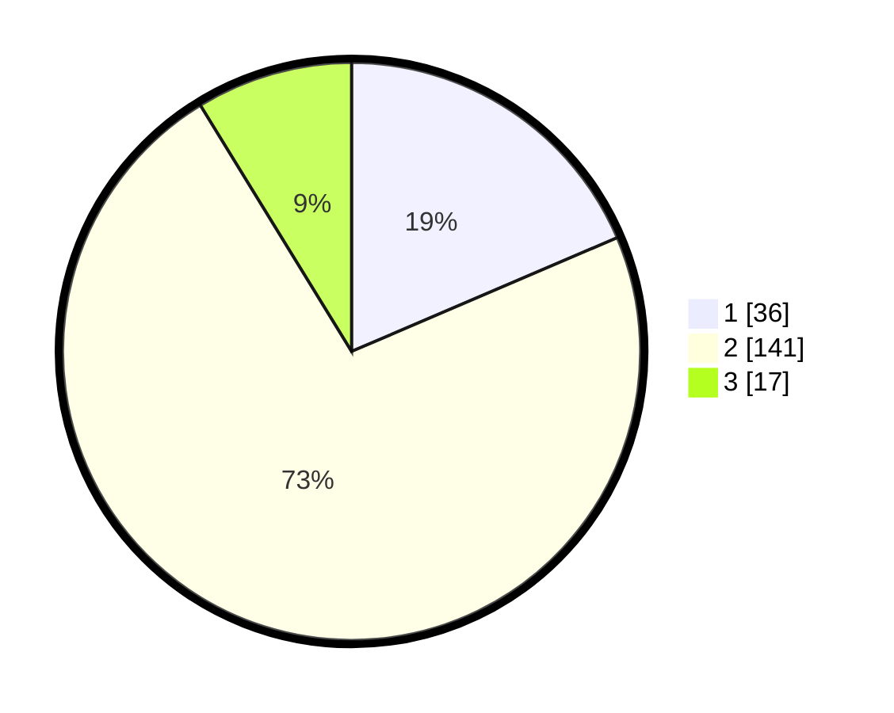

# Hasil

## Grafik

## Tabel

| No. | Nama Paslon    | Suara | Suara (raw) | Persentase |
|:--- |:-------------- | -----:| -----------:| ----------:|
| 1   | ANIES MUHAIMIN | 36    | [36][p-1]   | 18,56      |
| 2   | PRABOWO GIBRAN | 141   | [141][p-2]  | 72,68      |
| 3   | GANJAR MAHFUD  | 17    | [17][p-3]   | 8,76       |

[p-1]: https://github.com/gigit-pemilu/pemilu-2024-14-riau/blob/main/pilpres/hitung-suara/sub/14-riau/sub/04-indragiri-hilir/sub/14-kemuning/sub/2002-batu-ampar/sub/015-tps/sub/paslon-1.txt
[p-2]: https://github.com/gigit-pemilu/pemilu-2024-14-riau/blob/main/pilpres/hitung-suara/sub/14-riau/sub/04-indragiri-hilir/sub/14-kemuning/sub/2002-batu-ampar/sub/015-tps/sub/paslon-2.txt
[p-3]: https://github.com/gigit-pemilu/pemilu-2024-14-riau/blob/main/pilpres/hitung-suara/sub/14-riau/sub/04-indragiri-hilir/sub/14-kemuning/sub/2002-batu-ampar/sub/015-tps/sub/paslon-3.txt

## Foto C Plano

https://sirekap-obj-formc.kpu.go.id/1496/pemilu/ppwp/14/04/14/20/02/1404142002015-20240215-230603--f2e12479-7b9e-4087-9b87-1f83880c2b22.jpg

https://sirekap-obj-formc.kpu.go.id/1496/pemilu/ppwp/14/04/14/20/02/1404142002015-20240215-231226--7cf12d93-c9d1-4720-a754-8f8a705935f1.jpg

https://sirekap-obj-formc.kpu.go.id/1496/pemilu/ppwp/14/04/14/20/02/1404142002015-20240215-231419--0fd941d6-8b30-4185-a24e-7c479c8a8072.jpg

## Metadata

| Key        | Value               |
| ---------- | ------------------- |
| Time Stamp | 2024-02-25 00:00:00 |

