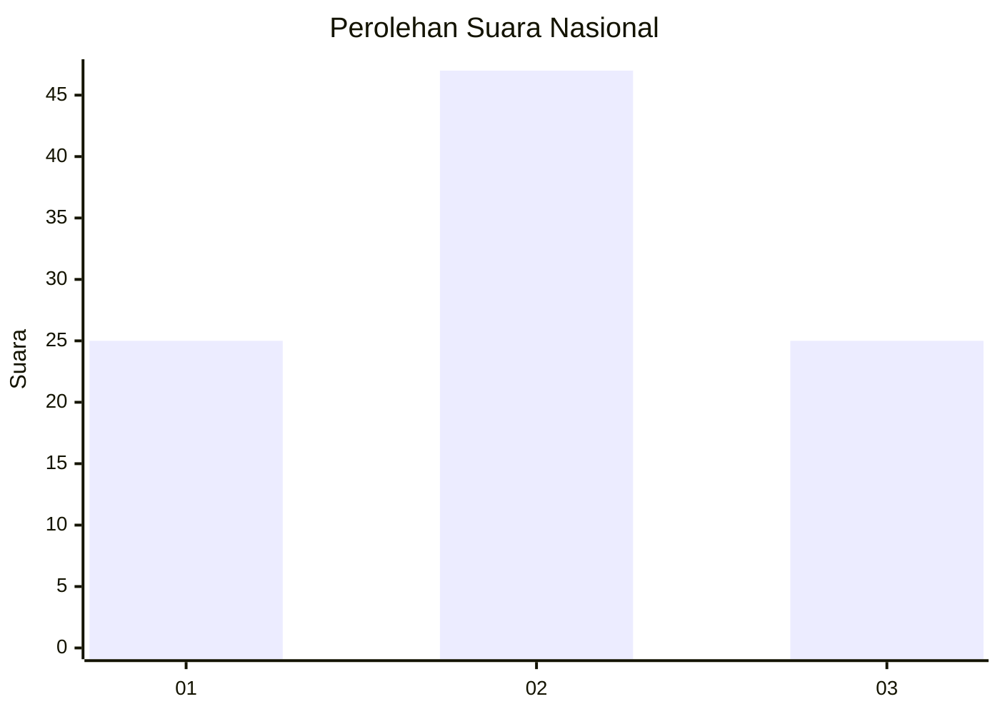
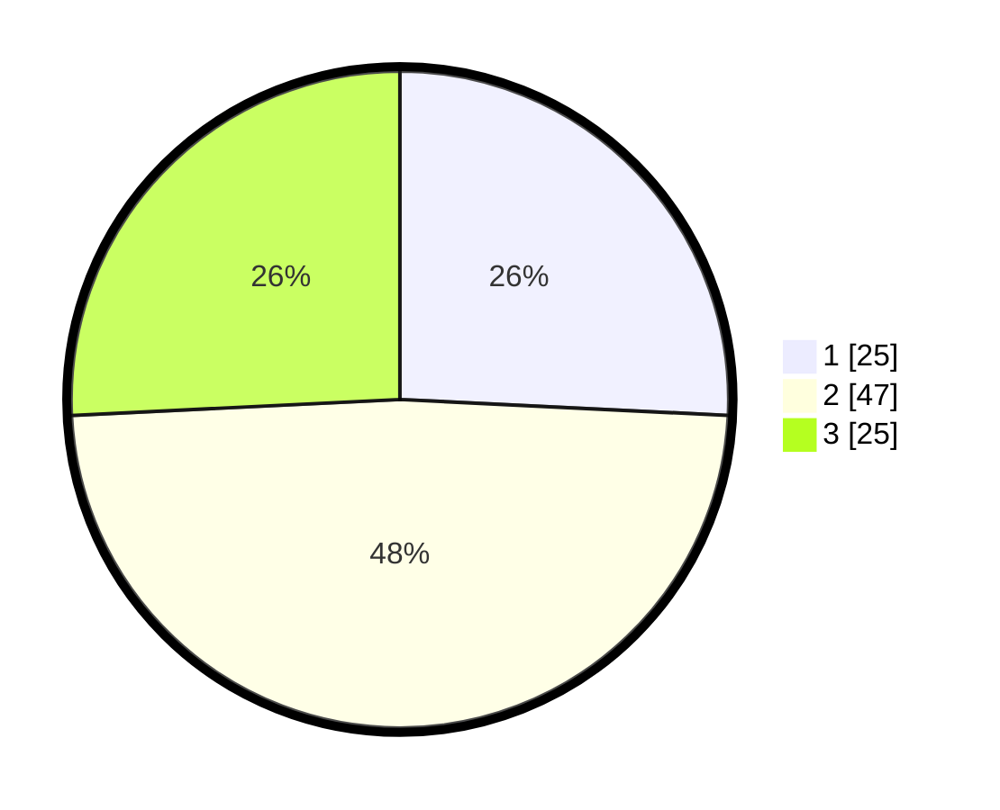

# Hasil

## Grafik

## Tabel

| No. | Nama Paslon    | Suara | Suara (raw) | Persentase |
|:--- |:-------------- | -----:| -----------:| ----------:|
| 1   | ANIES MUHAIMIN | 25    | [25][p-1]   | 25,77      |
| 2   | PRABOWO GIBRAN | 47    | [47][p-2]   | 48,45      |
| 3   | GANJAR MAHFUD  | 25    | [25][p-3]   | 25,77      |

[p-1]: https://github.com/gigit-pemilu/pemilu-2024/blob/main/pilpres/hitung-suara/sub/14-riau/sub/04-indragiri-hilir/sub/14-kemuning/sub/2003-keritang/sub/016-tps/sub/paslon-1.txt
[p-2]: https://github.com/gigit-pemilu/pemilu-2024/blob/main/pilpres/hitung-suara/sub/14-riau/sub/04-indragiri-hilir/sub/14-kemuning/sub/2003-keritang/sub/016-tps/sub/paslon-2.txt
[p-3]: https://github.com/gigit-pemilu/pemilu-2024/blob/main/pilpres/hitung-suara/sub/14-riau/sub/04-indragiri-hilir/sub/14-kemuning/sub/2003-keritang/sub/016-tps/sub/paslon-3.txt

## Foto C Plano

https://sirekap-obj-formc.kpu.go.id/cfe2/pemilu/ppwp/14/04/14/20/03/1404142003016-20240214-214058--dae28c29-7c27-4a73-a4fd-3ee52fdbfe5d.jpg

https://sirekap-obj-formc.kpu.go.id/cfe2/pemilu/ppwp/14/04/14/20/03/1404142003016-20240214-155142--ea3ec666-94e9-4477-a4d8-2c89776d2dd0.jpg

## Metadata

| Key        | Value               |
| ---------- | ------------------- |
| Time Stamp | 2024-02-24 23:00:00 |

