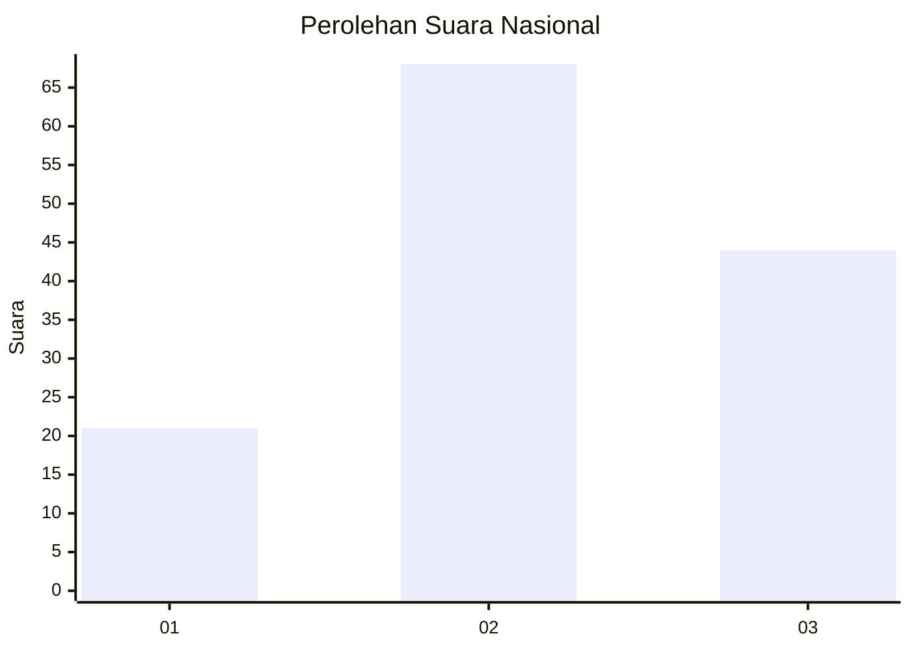
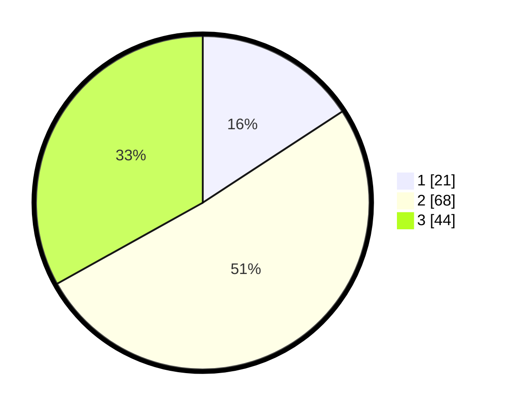

# Hasil

## Grafik

## Tabel

| No. | Nama Paslon    | Suara | Suara (raw) | Persentase |
|:--- |:-------------- | -----:| -----------:| ----------:|
| 1   | ANIES MUHAIMIN | 21    | [21][p-1]   | 15,79      |
| 2   | PRABOWO GIBRAN | 68    | [68][p-2]   | 51,13      |
| 3   | GANJAR MAHFUD  | 44    | [44][p-3]   | 33,08      |

[p-1]: https://github.com/gigit-pemilu/pemilu-2024/blob/main/pilpres/hitung-suara/sub/14-riau/sub/04-indragiri-hilir/sub/14-kemuning/sub/2007-kemuning-muda/sub/007-tps/sub/paslon-1.txt
[p-2]: https://github.com/gigit-pemilu/pemilu-2024/blob/main/pilpres/hitung-suara/sub/14-riau/sub/04-indragiri-hilir/sub/14-kemuning/sub/2007-kemuning-muda/sub/007-tps/sub/paslon-2.txt
[p-3]: https://github.com/gigit-pemilu/pemilu-2024/blob/main/pilpres/hitung-suara/sub/14-riau/sub/04-indragiri-hilir/sub/14-kemuning/sub/2007-kemuning-muda/sub/007-tps/sub/paslon-3.txt

## Foto C Plano

https://sirekap-obj-formc.kpu.go.id/dc41/pemilu/ppwp/14/04/14/20/07/1404142007007-20240215-150556--0f2df98f-2428-4047-8275-be1cd867921f.jpg

https://sirekap-obj-formc.kpu.go.id/dc41/pemilu/ppwp/14/04/14/20/07/1404142007007-20240215-150729--2c490990-199e-47a9-a46f-2f55e67cc8cc.jpg

https://sirekap-obj-formc.kpu.go.id/dc41/pemilu/ppwp/14/04/14/20/07/1404142007007-20240215-150821--8356c691-04af-42e0-b49b-78ae3c66671d.jpg

## Metadata

| Key        | Value               |
| ---------- | ------------------- |
| Time Stamp | 2024-02-24 22:31:28 |

