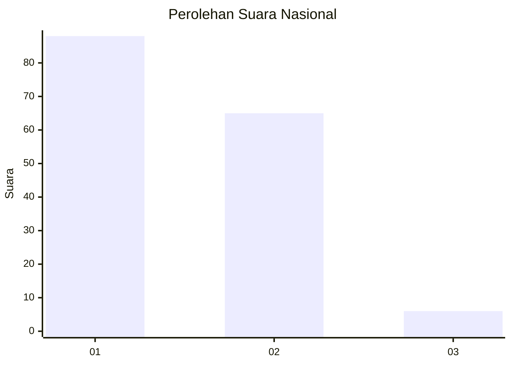
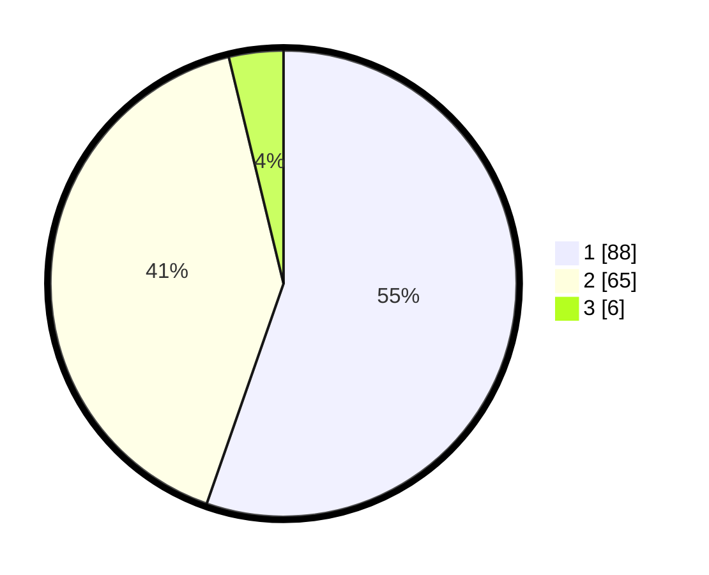

# Hasil

## Grafik

## Tabel

| No. | Nama Paslon    | Suara | Suara (raw) | Persentase |
|:--- |:-------------- | -----:| -----------:| ----------:|
| 1   | ANIES MUHAIMIN | 88    | [88][p-1]   | 55,35      |
| 2   | PRABOWO GIBRAN | 65    | [65][p-2]   | 40,88      |
| 3   | GANJAR MAHFUD  | 6     | [6][p-3]    | 3,77       |

[p-1]: https://github.com/gigit-pemilu/pemilu-2024/blob/main/pilpres/hitung-suara/sub/14-riau/sub/04-indragiri-hilir/sub/15-pelangiran/sub/1002-pelangiran/sub/003-tps/sub/paslon-1.txt
[p-2]: https://github.com/gigit-pemilu/pemilu-2024/blob/main/pilpres/hitung-suara/sub/14-riau/sub/04-indragiri-hilir/sub/15-pelangiran/sub/1002-pelangiran/sub/003-tps/sub/paslon-2.txt
[p-3]: https://github.com/gigit-pemilu/pemilu-2024/blob/main/pilpres/hitung-suara/sub/14-riau/sub/04-indragiri-hilir/sub/15-pelangiran/sub/1002-pelangiran/sub/003-tps/sub/paslon-3.txt

## Foto C Plano

https://sirekap-obj-formc.kpu.go.id/0290/pemilu/ppwp/14/04/15/10/02/1404151002003-20240214-213957--f6e1b6cd-9639-4e4c-8b01-525307aa3d7a.jpg

https://sirekap-obj-formc.kpu.go.id/0290/pemilu/ppwp/14/04/15/10/02/1404151002003-20240214-214133--e5c8d89b-f0e9-4fc1-9ff4-a428c1f239d5.jpg

https://sirekap-obj-formc.kpu.go.id/0290/pemilu/ppwp/14/04/15/10/02/1404151002003-20240214-214314--6b6d9548-58b9-4b5e-b9f5-b0c360cc7e2e.jpg

## Metadata

| Key        | Value               |
| ---------- | ------------------- |
| Time Stamp | 2024-02-25 14:00:00 |

