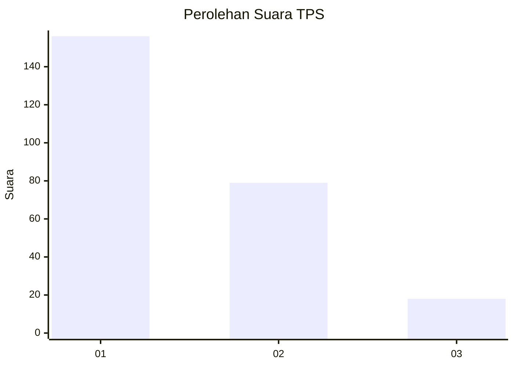
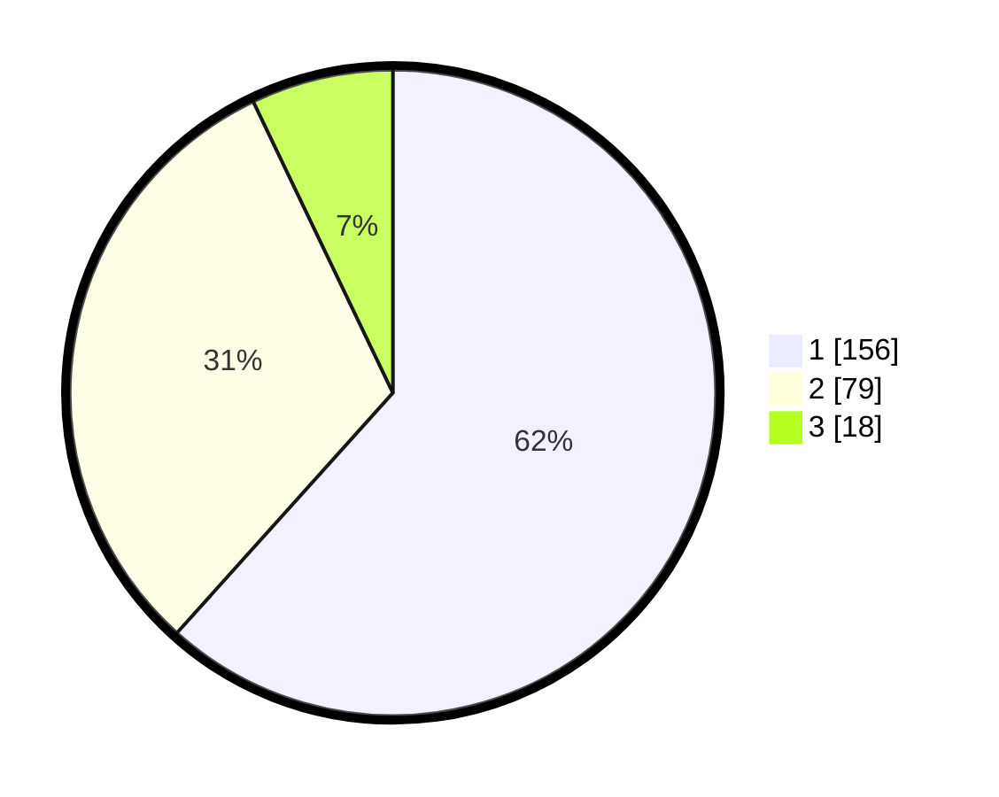

# Hasil

## Grafik

## Tabel

| No. | Nama Paslon    | Suara | Suara (raw) | Persentase |
|:--- |:-------------- | -----:| -----------:| ----------:|
| 1   | ANIES MUHAIMIN | 156   | [156][p-1]  | 61,66      |
| 2   | PRABOWO GIBRAN | 79    | [79][p-2]   | 31,23      |
| 3   | GANJAR MAHFUD  | 18    | [18][p-3]   | 7,11       |

[p-1]: https://github.com/gigit-pemilu/pemilu-2024-14-riau/blob/main/pilpres/hitung-suara/sub/14-riau/sub/04-indragiri-hilir/sub/15-pelangiran/sub/2003-simpang-kateman/sub/004-tps/sub/paslon-1.txt
[p-2]: https://github.com/gigit-pemilu/pemilu-2024-14-riau/blob/main/pilpres/hitung-suara/sub/14-riau/sub/04-indragiri-hilir/sub/15-pelangiran/sub/2003-simpang-kateman/sub/004-tps/sub/paslon-2.txt
[p-3]: https://github.com/gigit-pemilu/pemilu-2024-14-riau/blob/main/pilpres/hitung-suara/sub/14-riau/sub/04-indragiri-hilir/sub/15-pelangiran/sub/2003-simpang-kateman/sub/004-tps/sub/paslon-3.txt

## Foto C Plano

https://sirekap-obj-formc.kpu.go.id/b975/pemilu/ppwp/14/04/15/20/03/1404152003004-20240215-004617--3159a73d-4d4d-42fd-a682-d7f6410e3568.jpg

https://sirekap-obj-formc.kpu.go.id/b975/pemilu/ppwp/14/04/15/20/03/1404152003004-20240215-004802--bdb1efa7-ed65-49ca-b489-07e976a20a2e.jpg

https://sirekap-obj-formc.kpu.go.id/b975/pemilu/ppwp/14/04/15/20/03/1404152003004-20240215-004843--357c7138-9cab-4053-b200-71d653fe8cda.jpg

## Metadata

| Key        | Value               |
| ---------- | ------------------- |
| Time Stamp | 2024-02-24 22:31:28 |

