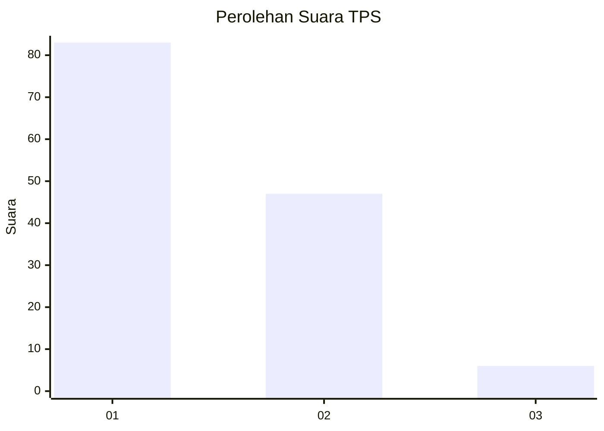
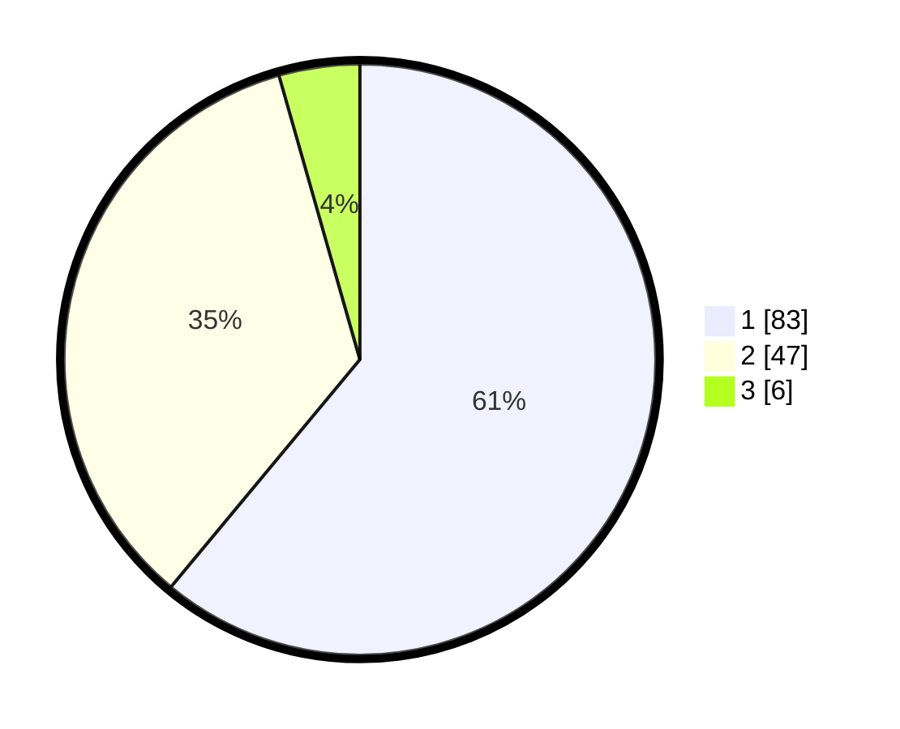

# Hasil

## Grafik

## Tabel

| No. | Nama Paslon    | Suara | Suara (raw) | Persentase |
|:--- |:-------------- | -----:| -----------:| ----------:|
| 1   | ANIES MUHAIMIN | 83    | [83][p-1]   | 61,03      |
| 2   | PRABOWO GIBRAN | 47    | [47][p-2]   | 34,56      |
| 3   | GANJAR MAHFUD  | 6     | [6][p-3]    | 4,41       |

[p-1]: https://github.com/gigit-pemilu/pemilu-2024-14-riau/blob/main/pilpres/hitung-suara/sub/14-riau/sub/04-indragiri-hilir/sub/15-pelangiran/sub/2003-simpang-kateman/sub/005-tps/sub/paslon-1.txt
[p-2]: https://github.com/gigit-pemilu/pemilu-2024-14-riau/blob/main/pilpres/hitung-suara/sub/14-riau/sub/04-indragiri-hilir/sub/15-pelangiran/sub/2003-simpang-kateman/sub/005-tps/sub/paslon-2.txt
[p-3]: https://github.com/gigit-pemilu/pemilu-2024-14-riau/blob/main/pilpres/hitung-suara/sub/14-riau/sub/04-indragiri-hilir/sub/15-pelangiran/sub/2003-simpang-kateman/sub/005-tps/sub/paslon-3.txt

## Foto C Plano

https://sirekap-obj-formc.kpu.go.id/d866/pemilu/ppwp/14/04/15/20/03/1404152003005-20240215-205057--96eb6bb7-9f1d-4e1a-a1f2-841b12550204.jpg

https://sirekap-obj-formc.kpu.go.id/d866/pemilu/ppwp/14/04/15/20/03/1404152003005-20240215-205143--5238808b-7c90-4e34-a8a2-b7edd91237e9.jpg

https://sirekap-obj-formc.kpu.go.id/d866/pemilu/ppwp/14/04/15/20/03/1404152003005-20240215-205200--e992af76-c606-4cd8-aab2-5c4c18f0858f.jpg

## Metadata

| Key        | Value               |
| ---------- | ------------------- |
| Time Stamp | 2024-02-25 11:00:00 |

