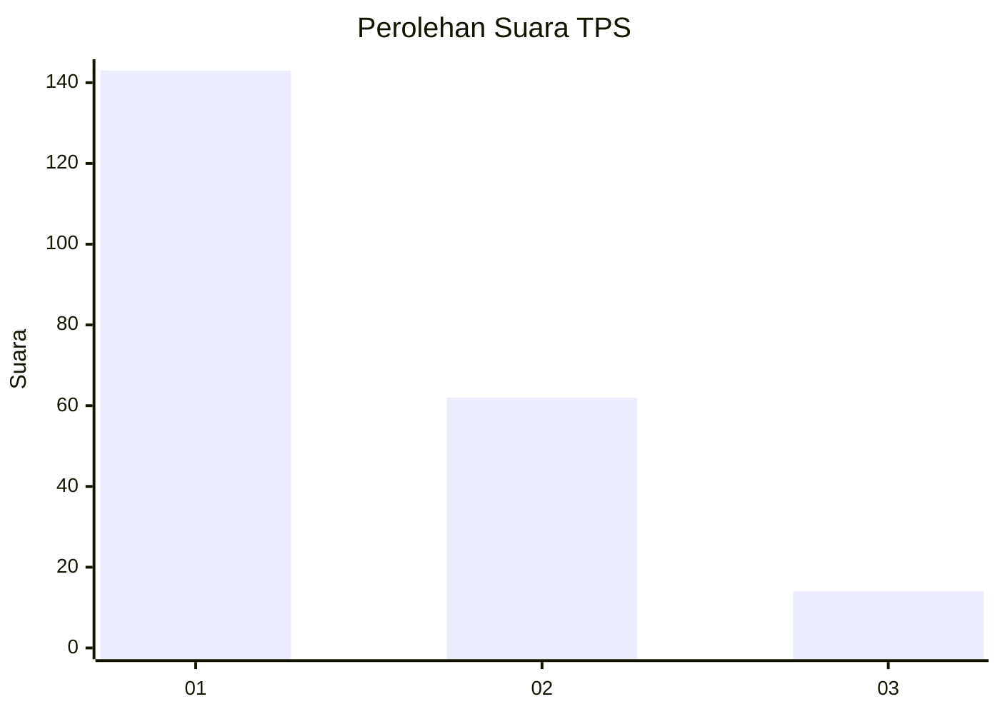
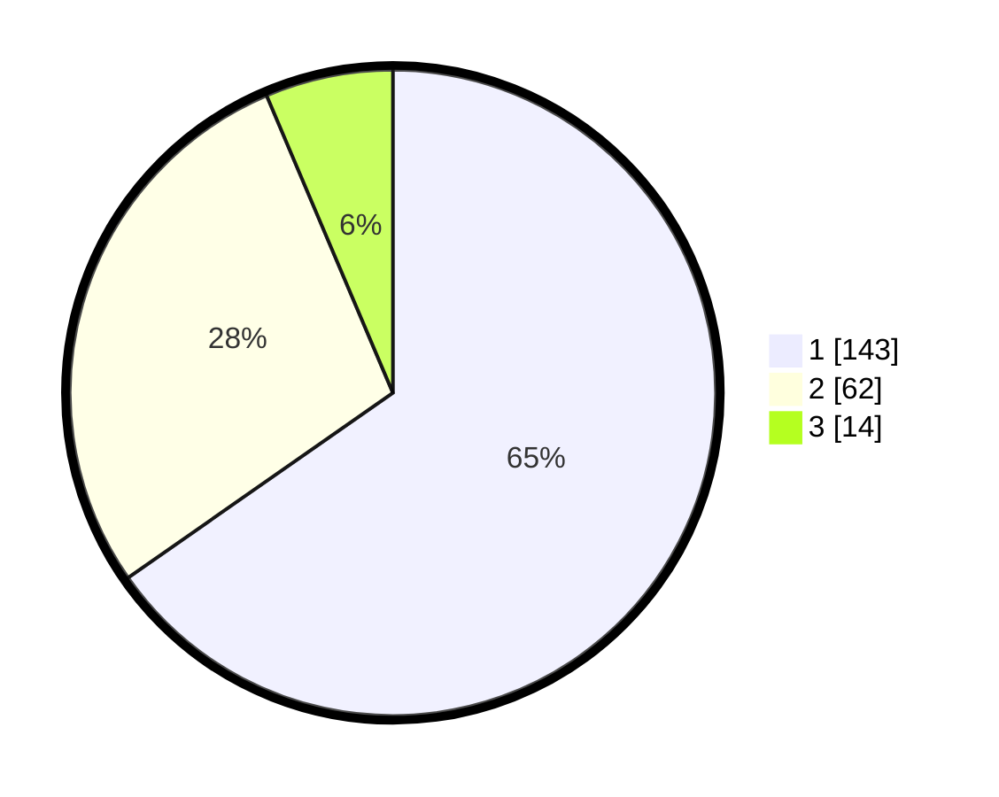

# Hasil

## Grafik

## Tabel

| No. | Nama Paslon    | Suara | Suara (raw) | Persentase |
|:--- |:-------------- | -----:| -----------:| ----------:|
| 1   | ANIES MUHAIMIN | 143   | [143][p-1]  | 65,30      |
| 2   | PRABOWO GIBRAN | 62    | [62][p-2]   | 28,31      |
| 3   | GANJAR MAHFUD  | 14    | [14][p-3]   | 6,39       |

[p-1]: https://github.com/gigit-pemilu/pemilu-2024-14-riau/blob/main/pilpres/hitung-suara/sub/14-riau/sub/04-indragiri-hilir/sub/15-pelangiran/sub/2003-simpang-kateman/sub/010-tps/sub/paslon-1.txt
[p-2]: https://github.com/gigit-pemilu/pemilu-2024-14-riau/blob/main/pilpres/hitung-suara/sub/14-riau/sub/04-indragiri-hilir/sub/15-pelangiran/sub/2003-simpang-kateman/sub/010-tps/sub/paslon-2.txt
[p-3]: https://github.com/gigit-pemilu/pemilu-2024-14-riau/blob/main/pilpres/hitung-suara/sub/14-riau/sub/04-indragiri-hilir/sub/15-pelangiran/sub/2003-simpang-kateman/sub/010-tps/sub/paslon-3.txt

## Foto C Plano

https://sirekap-obj-formc.kpu.go.id/ed49/pemilu/ppwp/14/04/15/20/03/1404152003010-20240215-090909--74ea076a-444e-4cbf-a71e-e4f35c683938.jpg

https://sirekap-obj-formc.kpu.go.id/ed49/pemilu/ppwp/14/04/15/20/03/1404152003010-20240215-142624--b6bd2261-9c12-470f-80c8-c3fd9d507f02.jpg

https://sirekap-obj-formc.kpu.go.id/ed49/pemilu/ppwp/14/04/15/20/03/1404152003010-20240215-142844--92209c4d-3383-47c5-9e81-63bddafc742e.jpg

## Metadata

| Key        | Value               |
| ---------- | ------------------- |
| Time Stamp | 2024-02-25 16:00:00 |

