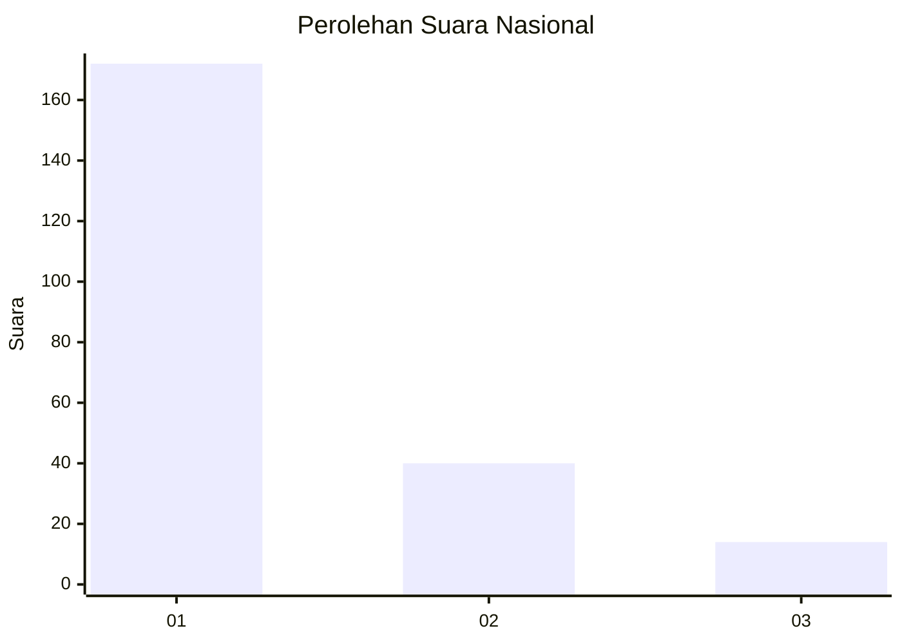
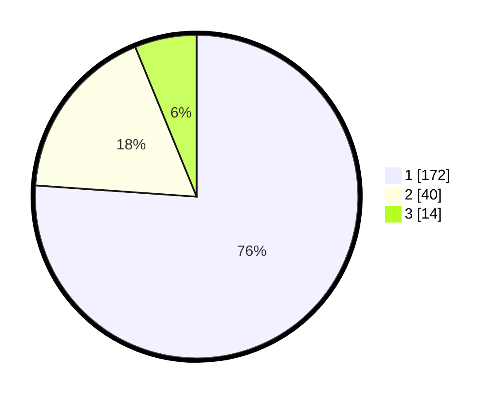

# Hasil

## Grafik

## Tabel

| No. | Nama Paslon    | Suara | Suara (raw) | Persentase |
|:--- |:-------------- | -----:| -----------:| ----------:|
| 1   | ANIES MUHAIMIN | 172   | [172][p-1]  | 76,11      |
| 2   | PRABOWO GIBRAN | 40    | [40][p-2]   | 17,70      |
| 3   | GANJAR MAHFUD  | 14    | [14][p-3]   | 6,19       |

[p-1]: https://github.com/gigit-pemilu/pemilu-2024/blob/main/pilpres/hitung-suara/sub/14-riau/sub/04-indragiri-hilir/sub/15-pelangiran/sub/2003-simpang-kateman/sub/011-tps/sub/paslon-1.txt
[p-2]: https://github.com/gigit-pemilu/pemilu-2024/blob/main/pilpres/hitung-suara/sub/14-riau/sub/04-indragiri-hilir/sub/15-pelangiran/sub/2003-simpang-kateman/sub/011-tps/sub/paslon-2.txt
[p-3]: https://github.com/gigit-pemilu/pemilu-2024/blob/main/pilpres/hitung-suara/sub/14-riau/sub/04-indragiri-hilir/sub/15-pelangiran/sub/2003-simpang-kateman/sub/011-tps/sub/paslon-3.txt

## Foto C Plano

https://sirekap-obj-formc.kpu.go.id/c3fb/pemilu/ppwp/14/04/15/20/03/1404152003011-20240215-092810--ae3fc066-b73d-4407-984c-c10d511ba02b.jpg

https://sirekap-obj-formc.kpu.go.id/c3fb/pemilu/ppwp/14/04/15/20/03/1404152003011-20240215-093046--f272503f-6b86-4367-95c3-fb0bef79825e.jpg

https://sirekap-obj-formc.kpu.go.id/c3fb/pemilu/ppwp/14/04/15/20/03/1404152003011-20240215-093305--f066edbd-1459-4198-9c2f-49c6996be68d.jpg

## Metadata

| Key        | Value               |
| ---------- | ------------------- |
| Time Stamp | 2024-02-25 16:00:00 |

