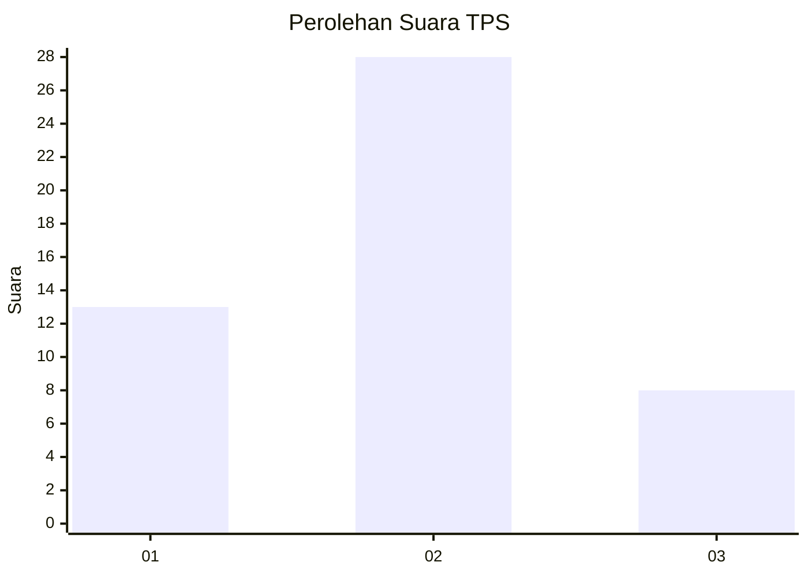
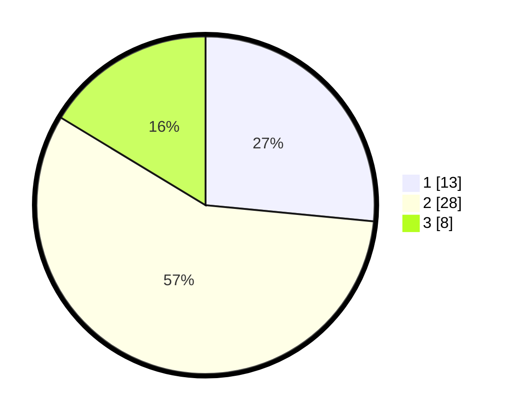

# Hasil

## Grafik

## Tabel

| No. | Nama Paslon    | Suara | Suara (raw) | Persentase |
|:--- |:-------------- | -----:| -----------:| ----------:|
| 1   | ANIES MUHAIMIN | 13    | [13][p-1]   | 26,53      |
| 2   | PRABOWO GIBRAN | 28    | [28][p-2]   | 57,14      |
| 3   | GANJAR MAHFUD  | 8     | [8][p-3]    | 16,33      |

[p-1]: https://github.com/gigit-pemilu/pemilu-2024-14-riau/blob/main/pilpres/hitung-suara/sub/14-riau/sub/04-indragiri-hilir/sub/15-pelangiran/sub/2004-tanjungsimpang/sub/017-tps/sub/paslon-1.txt
[p-2]: https://github.com/gigit-pemilu/pemilu-2024-14-riau/blob/main/pilpres/hitung-suara/sub/14-riau/sub/04-indragiri-hilir/sub/15-pelangiran/sub/2004-tanjungsimpang/sub/017-tps/sub/paslon-2.txt
[p-3]: https://github.com/gigit-pemilu/pemilu-2024-14-riau/blob/main/pilpres/hitung-suara/sub/14-riau/sub/04-indragiri-hilir/sub/15-pelangiran/sub/2004-tanjungsimpang/sub/017-tps/sub/paslon-3.txt

## Foto C Plano

https://sirekap-obj-formc.kpu.go.id/ec53/pemilu/ppwp/14/04/15/20/04/1404152004017-20240214-202011--8ec3ef53-a6aa-4012-8304-ddf40d15992a.jpg

https://sirekap-obj-formc.kpu.go.id/ec53/pemilu/ppwp/14/04/15/20/04/1404152004017-20240214-202246--552afdc2-3ea1-4d1e-86ab-70ce18aff548.jpg

## Metadata

| Key        | Value               |
| ---------- | ------------------- |
| Time Stamp | 2024-02-25 11:00:00 |

