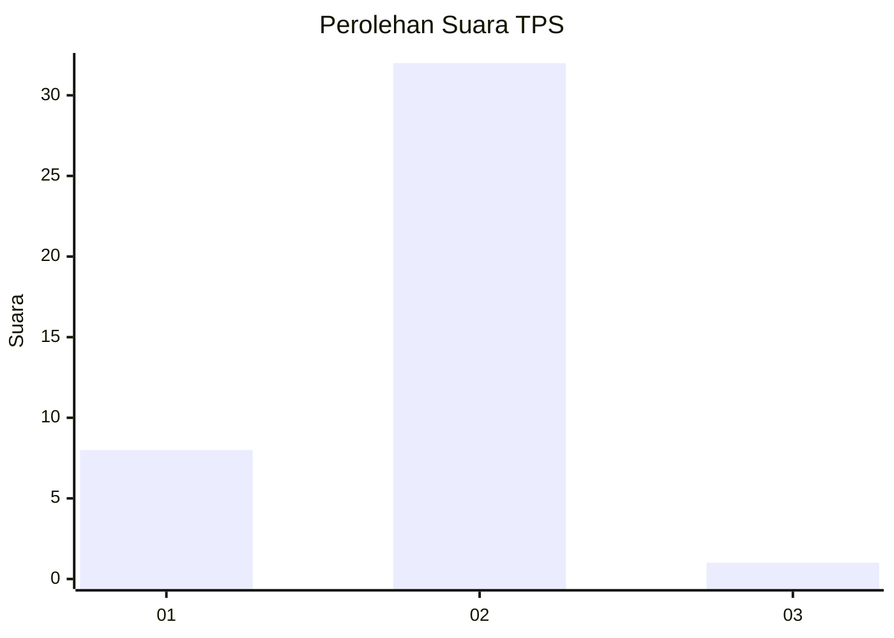
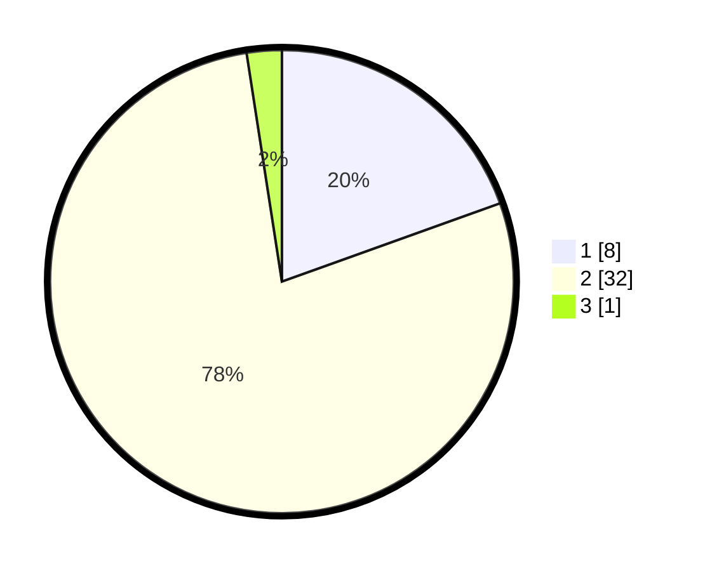

# Hasil

## Grafik

## Tabel

| No. | Nama Paslon    | Suara | Suara (raw) | Persentase |
|:--- |:-------------- | -----:| -----------:| ----------:|
| 1   | ANIES MUHAIMIN | 8     | [8][p-1]    | 19,51      |
| 2   | PRABOWO GIBRAN | 32    | [32][p-2]   | 78,05      |
| 3   | GANJAR MAHFUD  | 1     | [1][p-3]    | 2,44       |

[p-1]: https://github.com/gigit-pemilu/pemilu-2024-14-riau/blob/main/pilpres/hitung-suara/sub/14-riau/sub/04-indragiri-hilir/sub/15-pelangiran/sub/2004-tanjungsimpang/sub/018-tps/sub/paslon-1.txt
[p-2]: https://github.com/gigit-pemilu/pemilu-2024-14-riau/blob/main/pilpres/hitung-suara/sub/14-riau/sub/04-indragiri-hilir/sub/15-pelangiran/sub/2004-tanjungsimpang/sub/018-tps/sub/paslon-2.txt
[p-3]: https://github.com/gigit-pemilu/pemilu-2024-14-riau/blob/main/pilpres/hitung-suara/sub/14-riau/sub/04-indragiri-hilir/sub/15-pelangiran/sub/2004-tanjungsimpang/sub/018-tps/sub/paslon-3.txt

## Foto C Plano

https://sirekap-obj-formc.kpu.go.id/4300/pemilu/ppwp/14/04/15/20/04/1404152004018-20240214-120615--64814947-bd1f-4191-b37b-7fe65d62f813.jpg

https://sirekap-obj-formc.kpu.go.id/4300/pemilu/ppwp/14/04/15/20/04/1404152004018-20240214-120759--c3cc960e-543b-40cc-b3ba-849f012048ad.jpg

https://sirekap-obj-formc.kpu.go.id/4300/pemilu/ppwp/14/04/15/20/04/1404152004018-20240214-120943--054f64e2-3d90-4e3a-bc62-ef15707a2caf.jpg

## Metadata

| Key        | Value               |
| ---------- | ------------------- |
| Time Stamp | 2024-02-25 19:00:00 |

