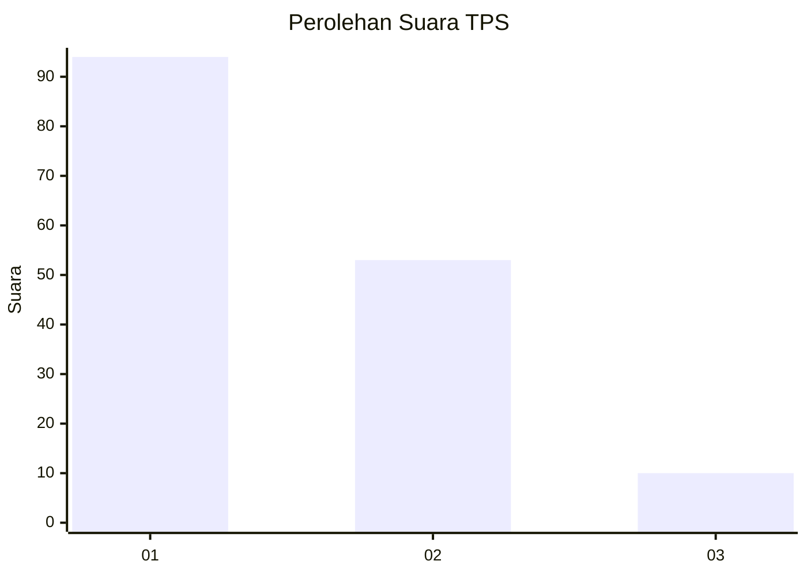
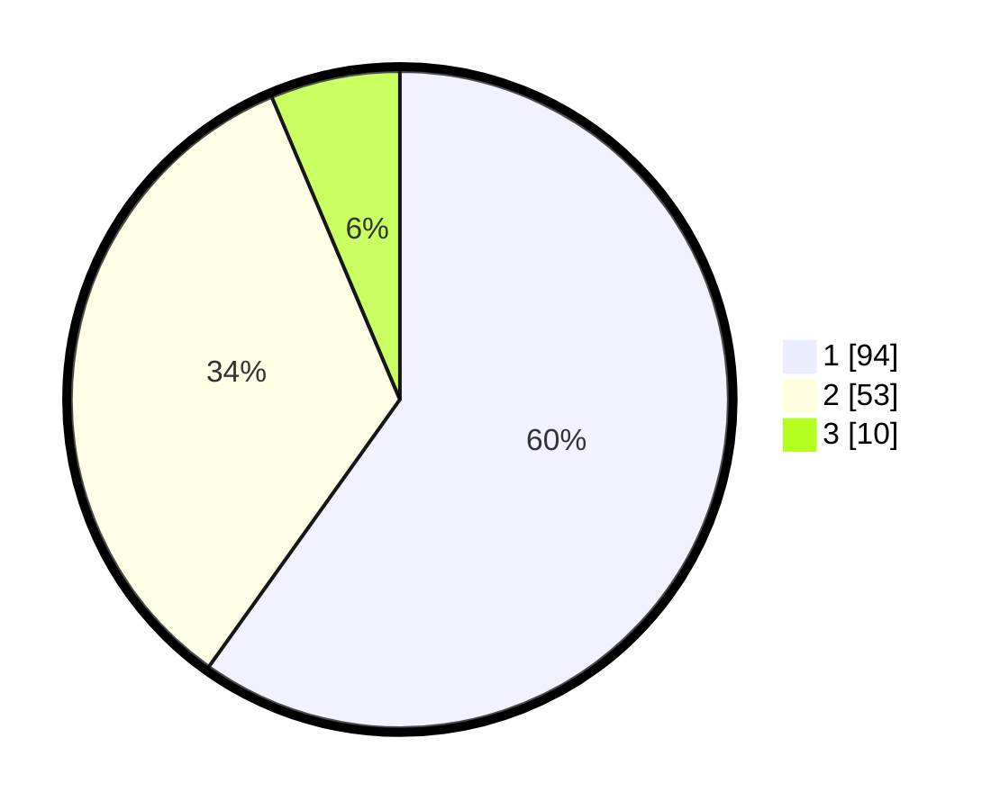

# Hasil

## Grafik

## Tabel

| No. | Nama Paslon    | Suara | Suara (raw) | Persentase |
|:--- |:-------------- | -----:| -----------:| ----------:|
| 1   | ANIES MUHAIMIN | 94    | [94][p-1]   | 59,87      |
| 2   | PRABOWO GIBRAN | 53    | [53][p-2]   | 33,76      |
| 3   | GANJAR MAHFUD  | 10    | [10][p-3]   | 6,37       |

[p-1]: https://github.com/gigit-pemilu/pemilu-2024-14-riau/blob/main/pilpres/hitung-suara/sub/14-riau/sub/04-indragiri-hilir/sub/18-concong/sub/2003-concong-tengah/sub/001-tps/sub/paslon-1.txt
[p-2]: https://github.com/gigit-pemilu/pemilu-2024-14-riau/blob/main/pilpres/hitung-suara/sub/14-riau/sub/04-indragiri-hilir/sub/18-concong/sub/2003-concong-tengah/sub/001-tps/sub/paslon-2.txt
[p-3]: https://github.com/gigit-pemilu/pemilu-2024-14-riau/blob/main/pilpres/hitung-suara/sub/14-riau/sub/04-indragiri-hilir/sub/18-concong/sub/2003-concong-tengah/sub/001-tps/sub/paslon-3.txt

## Foto C Plano

https://sirekap-obj-formc.kpu.go.id/d62e/pemilu/ppwp/14/04/18/20/03/1404182003001-20240215-044523--38a02003-9fc5-4273-ad24-0c80512f19c8.jpg

https://sirekap-obj-formc.kpu.go.id/d62e/pemilu/ppwp/14/04/18/20/03/1404182003001-20240215-044550--5be5d49a-0a45-446a-9491-d0e7b5bb4b3d.jpg

https://sirekap-obj-formc.kpu.go.id/d62e/pemilu/ppwp/14/04/18/20/03/1404182003001-20240215-044612--29d9e743-2cd1-4a93-8197-4834e6b567d4.jpg

## Metadata

| Key        | Value               |
| ---------- | ------------------- |
| Time Stamp | 2024-02-16 09:00:28 |

