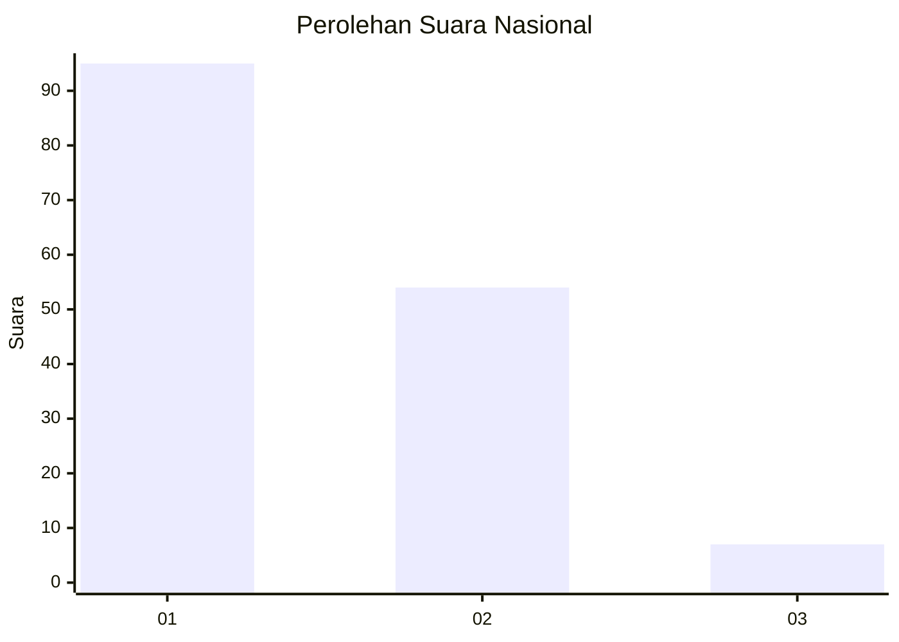
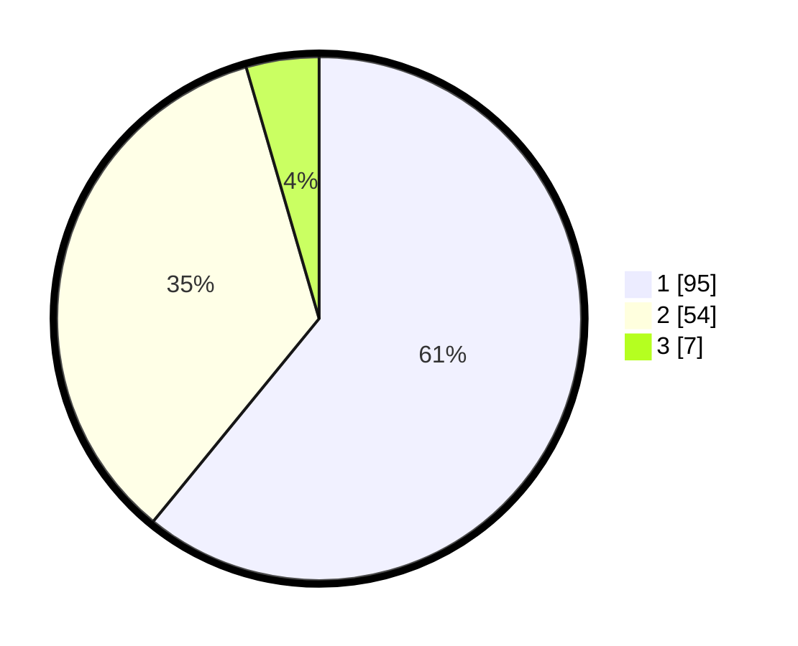

# Hasil

## Grafik

## Tabel

| No. | Nama Paslon    | Suara | Suara (raw) | Persentase |
|:--- |:-------------- | -----:| -----------:| ----------:|
| 1   | ANIES MUHAIMIN | 95    | [95][p-1]   | 60,90      |
| 2   | PRABOWO GIBRAN | 54    | [54][p-2]   | 34,62      |
| 3   | GANJAR MAHFUD  | 7     | [7][p-3]    | 4,49       |

[p-1]: https://github.com/gigit-pemilu/pemilu-2024/blob/main/pilpres/hitung-suara/sub/14-riau/sub/04-indragiri-hilir/sub/18-concong/sub/2003-concong-tengah/sub/002-tps/sub/paslon-1.txt
[p-2]: https://github.com/gigit-pemilu/pemilu-2024/blob/main/pilpres/hitung-suara/sub/14-riau/sub/04-indragiri-hilir/sub/18-concong/sub/2003-concong-tengah/sub/002-tps/sub/paslon-2.txt
[p-3]: https://github.com/gigit-pemilu/pemilu-2024/blob/main/pilpres/hitung-suara/sub/14-riau/sub/04-indragiri-hilir/sub/18-concong/sub/2003-concong-tengah/sub/002-tps/sub/paslon-3.txt

## Foto C Plano

https://sirekap-obj-formc.kpu.go.id/295c/pemilu/ppwp/14/04/18/20/03/1404182003002-20240214-190724--6b81843f-217d-4e19-b47a-8a6d8582c26f.jpg

https://sirekap-obj-formc.kpu.go.id/295c/pemilu/ppwp/14/04/18/20/03/1404182003002-20240214-190726--3a1c9b84-4142-490d-91c5-78d382bf5286.jpg

https://sirekap-obj-formc.kpu.go.id/295c/pemilu/ppwp/14/04/18/20/03/1404182003002-20240214-190728--8190900b-f231-48b6-be56-dbf7b8e40129.jpg

## Metadata

| Key        | Value               |
| ---------- | ------------------- |
| Time Stamp | 2024-02-25 17:00:00 |

