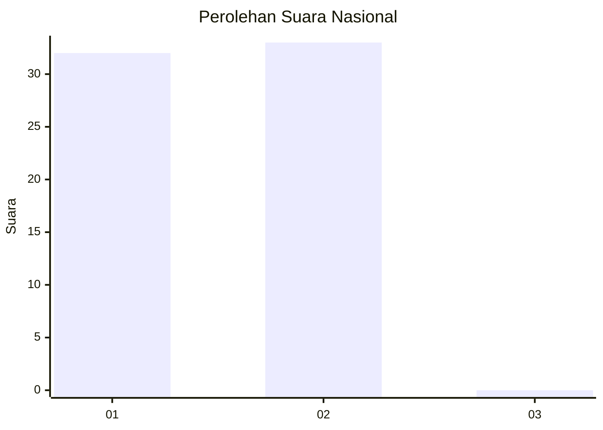
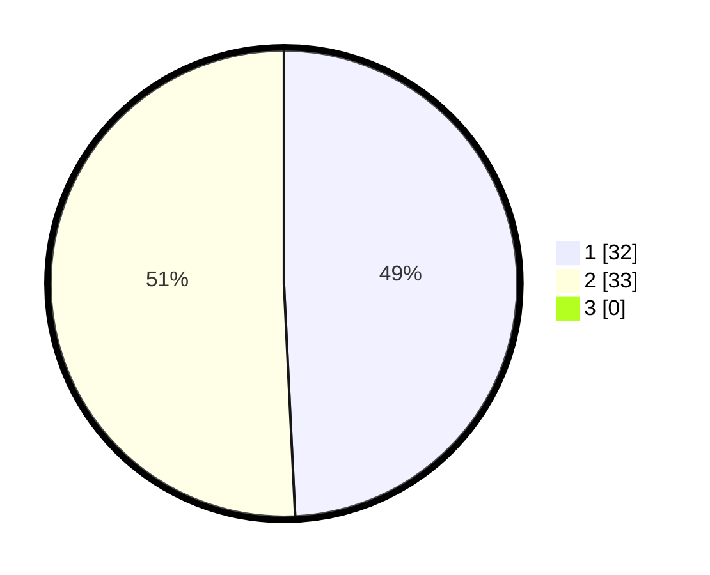

# Hasil

## Grafik

## Tabel

| No. | Nama Paslon    | Suara | Suara (raw) | Persentase |
|:--- |:-------------- | -----:| -----------:| ----------:|
| 1   | ANIES MUHAIMIN | 32    | [32][p-1]   | 49,23      |
| 2   | PRABOWO GIBRAN | 33    | [33][p-2]   | 50,77      |
| 3   | GANJAR MAHFUD  | 0     | [0][p-3]    | 0,00       |

[p-1]: https://github.com/gigit-pemilu/pemilu-2024/blob/main/pilpres/hitung-suara/sub/14-riau/sub/04-indragiri-hilir/sub/18-concong/sub/2005-panglima-raja/sub/009-tps/sub/paslon-1.txt
[p-2]: https://github.com/gigit-pemilu/pemilu-2024/blob/main/pilpres/hitung-suara/sub/14-riau/sub/04-indragiri-hilir/sub/18-concong/sub/2005-panglima-raja/sub/009-tps/sub/paslon-2.txt
[p-3]: https://github.com/gigit-pemilu/pemilu-2024/blob/main/pilpres/hitung-suara/sub/14-riau/sub/04-indragiri-hilir/sub/18-concong/sub/2005-panglima-raja/sub/009-tps/sub/paslon-3.txt

## Foto C Plano

https://sirekap-obj-formc.kpu.go.id/53ee/pemilu/ppwp/14/04/18/20/05/1404182005009-20240214-192023--af2841b8-9ad3-4768-baf1-b68da66981e9.jpg

https://sirekap-obj-formc.kpu.go.id/53ee/pemilu/ppwp/14/04/18/20/05/1404182005009-20240215-010618--08081844-7a8b-4c7e-95c9-eddf947ff31a.jpg

https://sirekap-obj-formc.kpu.go.id/53ee/pemilu/ppwp/14/04/18/20/05/1404182005009-20240214-192102--c023d588-2aa2-4888-a379-b8e4d3a586b6.jpg

## Metadata

| Key        | Value               |
| ---------- | ------------------- |
| Time Stamp | 2024-02-24 22:31:28 |

