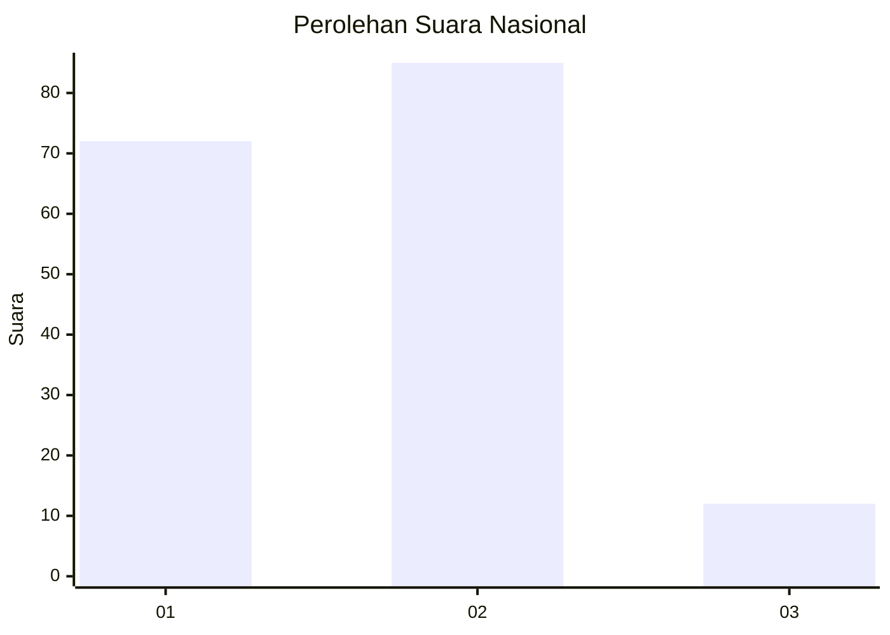
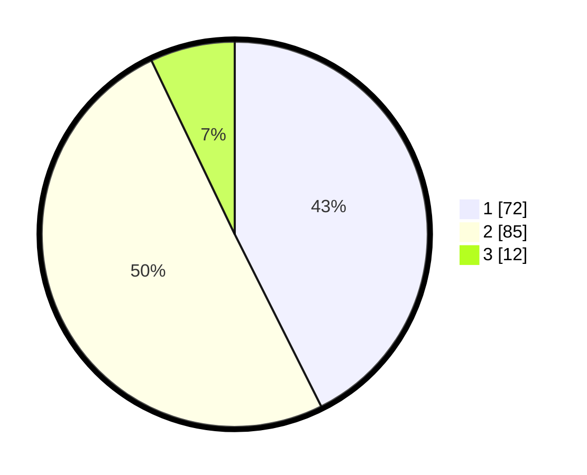

# Hasil

## Grafik

## Tabel

| No. | Nama Paslon    | Suara | Suara (raw) | Persentase |
|:--- |:-------------- | -----:| -----------:| ----------:|
| 1   | ANIES MUHAIMIN | 72    | [72][p-1]   | 42,60      |
| 2   | PRABOWO GIBRAN | 85    | [85][p-2]   | 50,30      |
| 3   | GANJAR MAHFUD  | 12    | [12][p-3]   | 7,10       |

[p-1]: https://github.com/gigit-pemilu/pemilu-2024/blob/main/pilpres/hitung-suara/sub/14-riau/sub/04-indragiri-hilir/sub/19-kempas/sub/1002-kempas-jaya/sub/003-tps/sub/paslon-1.txt
[p-2]: https://github.com/gigit-pemilu/pemilu-2024/blob/main/pilpres/hitung-suara/sub/14-riau/sub/04-indragiri-hilir/sub/19-kempas/sub/1002-kempas-jaya/sub/003-tps/sub/paslon-2.txt
[p-3]: https://github.com/gigit-pemilu/pemilu-2024/blob/main/pilpres/hitung-suara/sub/14-riau/sub/04-indragiri-hilir/sub/19-kempas/sub/1002-kempas-jaya/sub/003-tps/sub/paslon-3.txt

## Foto C Plano

https://sirekap-obj-formc.kpu.go.id/2ead/pemilu/ppwp/14/04/19/10/02/1404191002003-20240214-224346--0cdc3d69-61a9-4482-a2b3-80a9788f56b1.jpg

https://sirekap-obj-formc.kpu.go.id/2ead/pemilu/ppwp/14/04/19/10/02/1404191002003-20240214-224733--891e88ce-fe47-458b-a744-d098f7d51a23.jpg

https://sirekap-obj-formc.kpu.go.id/2ead/pemilu/ppwp/14/04/19/10/02/1404191002003-20240214-224859--8939bec4-2a5d-4655-8cae-fd0d1c42d840.jpg

## Metadata

| Key        | Value               |
| ---------- | ------------------- |
| Time Stamp | 2024-02-25 11:00:00 |

