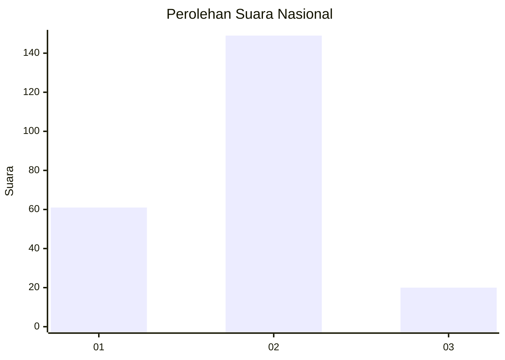
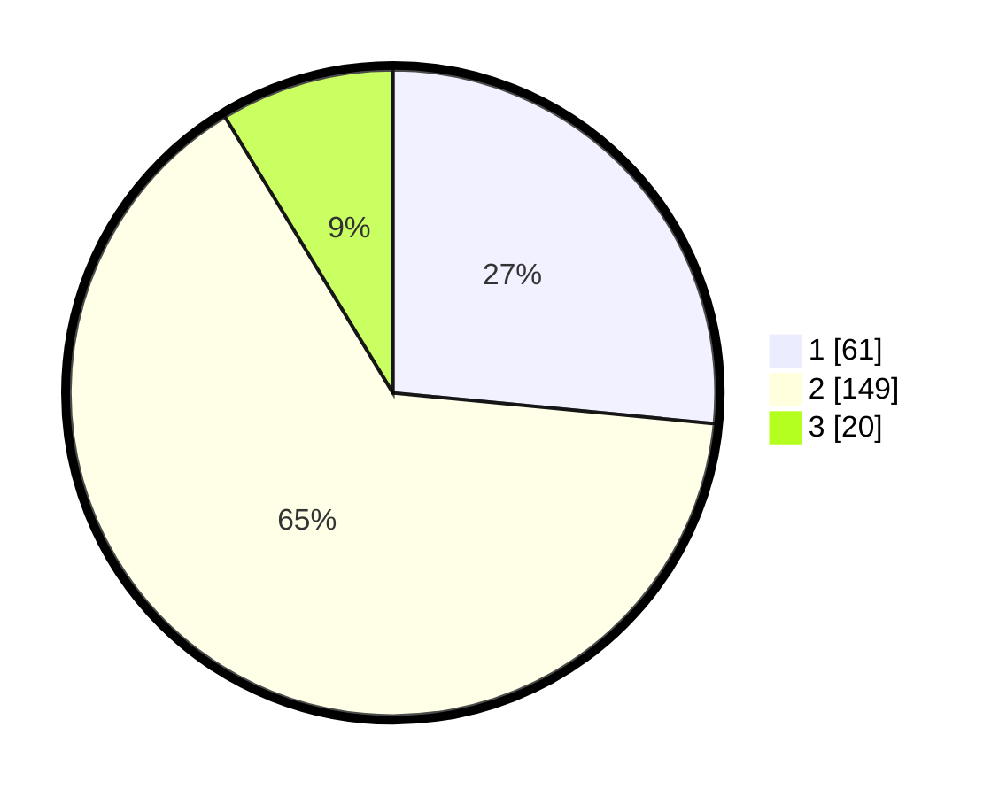

# Hasil

## Grafik

## Tabel

| No. | Nama Paslon    | Suara | Suara (raw) | Persentase |
|:--- |:-------------- | -----:| -----------:| ----------:|
| 1   | ANIES MUHAIMIN | 61    | [61][p-1]   | 26,52      |
| 2   | PRABOWO GIBRAN | 149   | [149][p-2]  | 64,78      |
| 3   | GANJAR MAHFUD  | 20    | [20][p-3]   | 8,70       |

[p-1]: https://github.com/gigit-pemilu/pemilu-2024/blob/main/pilpres/hitung-suara/sub/14-riau/sub/04-indragiri-hilir/sub/19-kempas/sub/1002-kempas-jaya/sub/010-tps/sub/paslon-1.txt
[p-2]: https://github.com/gigit-pemilu/pemilu-2024/blob/main/pilpres/hitung-suara/sub/14-riau/sub/04-indragiri-hilir/sub/19-kempas/sub/1002-kempas-jaya/sub/010-tps/sub/paslon-2.txt
[p-3]: https://github.com/gigit-pemilu/pemilu-2024/blob/main/pilpres/hitung-suara/sub/14-riau/sub/04-indragiri-hilir/sub/19-kempas/sub/1002-kempas-jaya/sub/010-tps/sub/paslon-3.txt

## Foto C Plano

https://sirekap-obj-formc.kpu.go.id/abbb/pemilu/ppwp/14/04/19/10/02/1404191002010-20240214-213915--13849b93-9192-4ad5-aa13-19600c77c2e0.jpg

https://sirekap-obj-formc.kpu.go.id/abbb/pemilu/ppwp/14/04/19/10/02/1404191002010-20240214-214043--7c0072fe-e9eb-4ecf-b112-d0f0702ec12e.jpg

https://sirekap-obj-formc.kpu.go.id/abbb/pemilu/ppwp/14/04/19/10/02/1404191002010-20240214-215837--22a69024-2d19-4ffa-8e99-657412823e9d.jpg

## Metadata

| Key        | Value               |
| ---------- | ------------------- |
| Time Stamp | 2024-02-25 22:00:00 |

