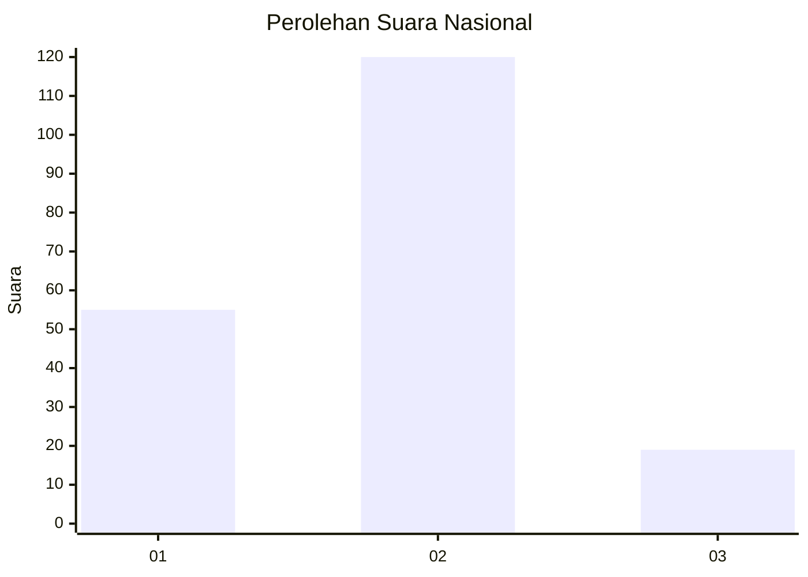
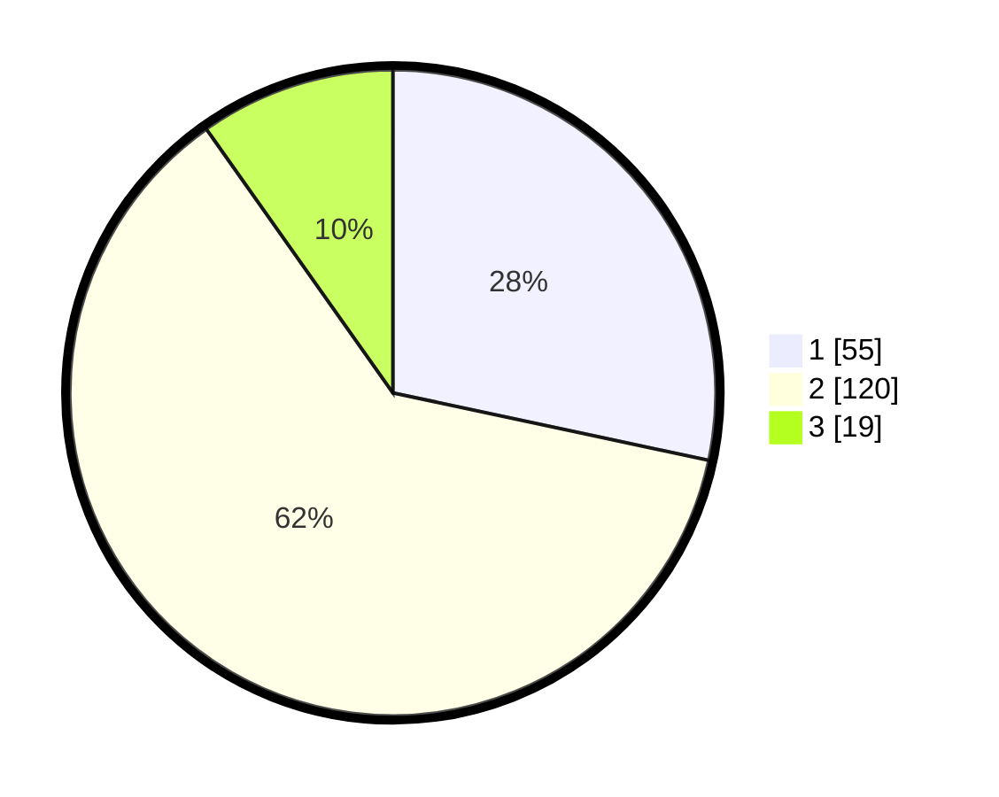

# Hasil

## Grafik

## Tabel

| No. | Nama Paslon    | Suara | Suara (raw) | Persentase |
|:--- |:-------------- | -----:| -----------:| ----------:|
| 1   | ANIES MUHAIMIN | 55    | [55][p-1]   | 28,35      |
| 2   | PRABOWO GIBRAN | 120   | [120][p-2]  | 61,86      |
| 3   | GANJAR MAHFUD  | 19    | [19][p-3]   | 9,79       |

[p-1]: https://github.com/gigit-pemilu/pemilu-2024/blob/main/pilpres/hitung-suara/sub/14-riau/sub/04-indragiri-hilir/sub/19-kempas/sub/1002-kempas-jaya/sub/011-tps/sub/paslon-1.txt
[p-2]: https://github.com/gigit-pemilu/pemilu-2024/blob/main/pilpres/hitung-suara/sub/14-riau/sub/04-indragiri-hilir/sub/19-kempas/sub/1002-kempas-jaya/sub/011-tps/sub/paslon-2.txt
[p-3]: https://github.com/gigit-pemilu/pemilu-2024/blob/main/pilpres/hitung-suara/sub/14-riau/sub/04-indragiri-hilir/sub/19-kempas/sub/1002-kempas-jaya/sub/011-tps/sub/paslon-3.txt

## Foto C Plano

https://sirekap-obj-formc.kpu.go.id/5981/pemilu/ppwp/14/04/19/10/02/1404191002011-20240214-223942--5fc0eb82-2e9b-43a9-8a90-b5539cd3c6f3.jpg

https://sirekap-obj-formc.kpu.go.id/5981/pemilu/ppwp/14/04/19/10/02/1404191002011-20240215-033758--37f9e151-adc9-45e5-b3da-5ac29b2c9e7d.jpg

https://sirekap-obj-formc.kpu.go.id/5981/pemilu/ppwp/14/04/19/10/02/1404191002011-20240215-033532--a507b486-5f34-4e83-9677-9ff50d72f397.jpg

## Metadata

| Key        | Value               |
| ---------- | ------------------- |
| Time Stamp | 2024-02-25 14:00:00 |

