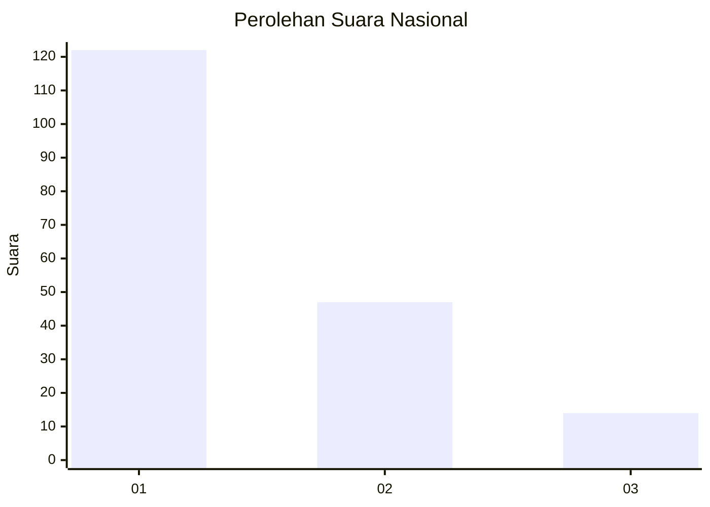
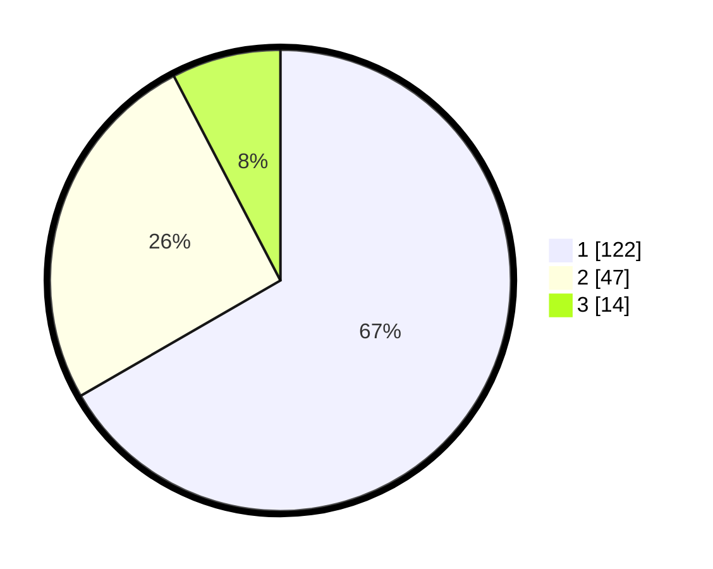

# Hasil

## Grafik

## Tabel

| No. | Nama Paslon    | Suara | Suara (raw) | Persentase |
|:--- |:-------------- | -----:| -----------:| ----------:|
| 1   | ANIES MUHAIMIN | 122   | [122][p-1]  | 66,67      |
| 2   | PRABOWO GIBRAN | 47    | [47][p-2]   | 25,68      |
| 3   | GANJAR MAHFUD  | 14    | [14][p-3]   | 7,65       |

[p-1]: https://github.com/gigit-pemilu/pemilu-2024/blob/main/pilpres/hitung-suara/sub/14-riau/sub/04-indragiri-hilir/sub/19-kempas/sub/2006-sungaigantang/sub/005-tps/sub/paslon-1.txt
[p-2]: https://github.com/gigit-pemilu/pemilu-2024/blob/main/pilpres/hitung-suara/sub/14-riau/sub/04-indragiri-hilir/sub/19-kempas/sub/2006-sungaigantang/sub/005-tps/sub/paslon-2.txt
[p-3]: https://github.com/gigit-pemilu/pemilu-2024/blob/main/pilpres/hitung-suara/sub/14-riau/sub/04-indragiri-hilir/sub/19-kempas/sub/2006-sungaigantang/sub/005-tps/sub/paslon-3.txt

## Foto C Plano

https://sirekap-obj-formc.kpu.go.id/7f2d/pemilu/ppwp/14/04/19/20/06/1404192006005-20240215-065552--135daece-05ef-4068-b804-7061aa33ac1f.jpg

https://sirekap-obj-formc.kpu.go.id/7f2d/pemilu/ppwp/14/04/19/20/06/1404192006005-20240215-065700--e8c786b2-5f38-4ed9-bc8a-20af55e7de7b.jpg

https://sirekap-obj-formc.kpu.go.id/7f2d/pemilu/ppwp/14/04/19/20/06/1404192006005-20240215-065754--2b4e2183-b029-474d-be04-9011015bcc7a.jpg

## Metadata

| Key        | Value               |
| ---------- | ------------------- |
| Time Stamp | 2024-02-25 15:00:00 |

