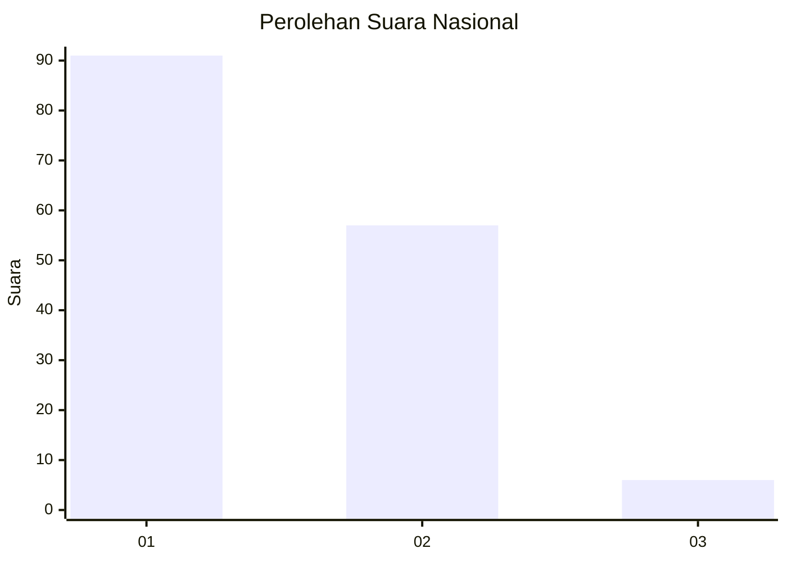
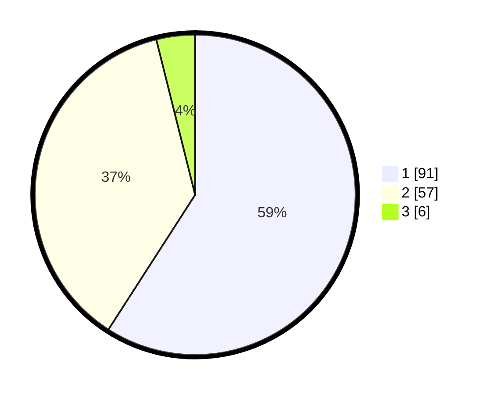

# Hasil

## Grafik

## Tabel

| No. | Nama Paslon    | Suara | Suara (raw) | Persentase |
|:--- |:-------------- | -----:| -----------:| ----------:|
| 1   | ANIES MUHAIMIN | 91    | [91][p-1]   | 59,09      |
| 2   | PRABOWO GIBRAN | 57    | [57][p-2]   | 37,01      |
| 3   | GANJAR MAHFUD  | 6     | [6][p-3]    | 3,90       |

[p-1]: https://github.com/gigit-pemilu/pemilu-2024/blob/main/pilpres/hitung-suara/sub/14-riau/sub/04-indragiri-hilir/sub/20-sungai-batang/sub/1001-benteng/sub/001-tps/sub/paslon-1.txt
[p-2]: https://github.com/gigit-pemilu/pemilu-2024/blob/main/pilpres/hitung-suara/sub/14-riau/sub/04-indragiri-hilir/sub/20-sungai-batang/sub/1001-benteng/sub/001-tps/sub/paslon-2.txt
[p-3]: https://github.com/gigit-pemilu/pemilu-2024/blob/main/pilpres/hitung-suara/sub/14-riau/sub/04-indragiri-hilir/sub/20-sungai-batang/sub/1001-benteng/sub/001-tps/sub/paslon-3.txt

## Foto C Plano

https://sirekap-obj-formc.kpu.go.id/7a6b/pemilu/ppwp/14/04/20/10/01/1404201001001-20240215-035732--8a16edef-cd19-4e88-ab57-32f015c49bee.jpg

https://sirekap-obj-formc.kpu.go.id/7a6b/pemilu/ppwp/14/04/20/10/01/1404201001001-20240215-083219--acfd3549-6882-4a9a-b246-9f60ec08ef4f.jpg

https://sirekap-obj-formc.kpu.go.id/7a6b/pemilu/ppwp/14/04/20/10/01/1404201001001-20240215-035951--85b9144a-c84e-4abc-8538-e6774ce7ad6d.jpg

## Metadata

| Key        | Value               |
| ---------- | ------------------- |
| Time Stamp | 2024-02-25 15:00:00 |

