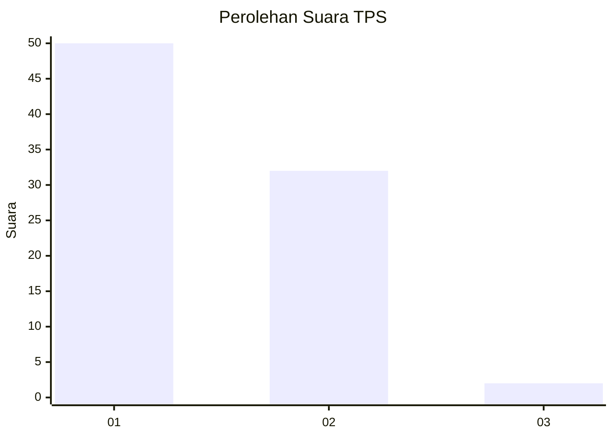
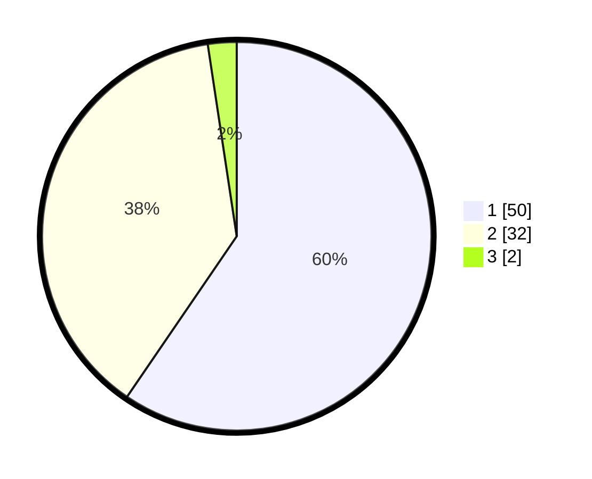

# Hasil

## Grafik

## Tabel

| No. | Nama Paslon    | Suara | Suara (raw) | Persentase |
|:--- |:-------------- | -----:| -----------:| ----------:|
| 1   | ANIES MUHAIMIN | 50    | [50][p-1]   | 59,52      |
| 2   | PRABOWO GIBRAN | 32    | [32][p-2]   | 38,10      |
| 3   | GANJAR MAHFUD  | 2     | [2][p-3]    | 2,38       |

[p-1]: https://github.com/gigit-pemilu/pemilu-2024-14-riau/blob/main/pilpres/hitung-suara/sub/14-riau/sub/04-indragiri-hilir/sub/20-sungai-batang/sub/2002-benteng-utara/sub/005-tps/sub/paslon-1.txt
[p-2]: https://github.com/gigit-pemilu/pemilu-2024-14-riau/blob/main/pilpres/hitung-suara/sub/14-riau/sub/04-indragiri-hilir/sub/20-sungai-batang/sub/2002-benteng-utara/sub/005-tps/sub/paslon-2.txt
[p-3]: https://github.com/gigit-pemilu/pemilu-2024-14-riau/blob/main/pilpres/hitung-suara/sub/14-riau/sub/04-indragiri-hilir/sub/20-sungai-batang/sub/2002-benteng-utara/sub/005-tps/sub/paslon-3.txt

## Foto C Plano

https://sirekap-obj-formc.kpu.go.id/ee6e/pemilu/ppwp/14/04/20/20/02/1404202002005-20240215-131303--cda990b0-214f-4dd8-bfe6-0af12df50cfc.jpg

https://sirekap-obj-formc.kpu.go.id/ee6e/pemilu/ppwp/14/04/20/20/02/1404202002005-20240215-131437--6318f199-3b70-4025-a249-b8d3753ebb61.jpg

https://sirekap-obj-formc.kpu.go.id/ee6e/pemilu/ppwp/14/04/20/20/02/1404202002005-20240215-131613--ba12ca55-a903-4b63-b48b-481804005ca0.jpg

## Metadata

| Key        | Value               |
| ---------- | ------------------- |
| Time Stamp | 2024-02-24 22:31:28 |

