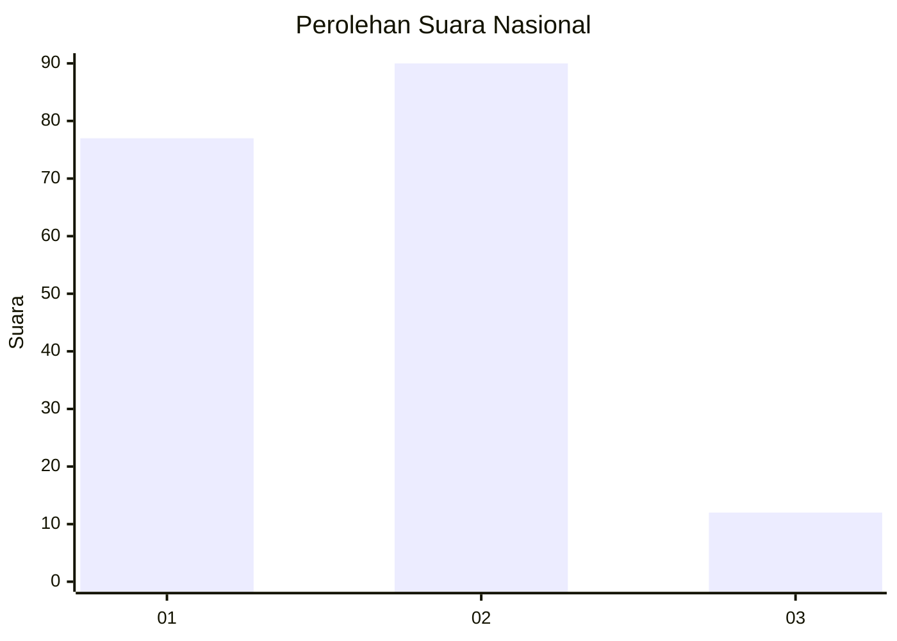
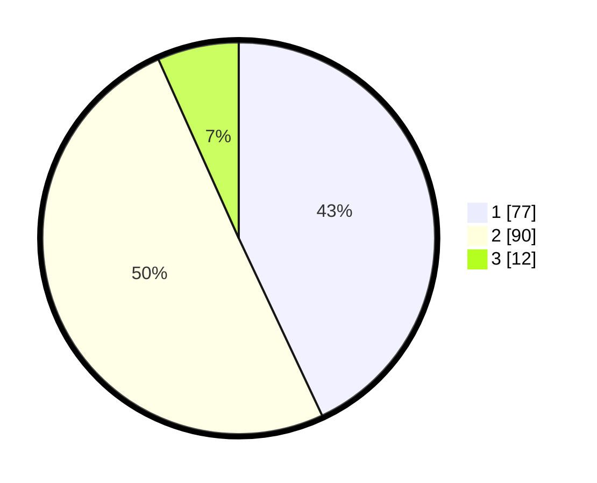

# Hasil

## Grafik

## Tabel

| No. | Nama Paslon    | Suara | Suara (raw) | Persentase |
|:--- |:-------------- | -----:| -----------:| ----------:|
| 1   | ANIES MUHAIMIN | 77    | [77][p-1]   | 43,02      |
| 2   | PRABOWO GIBRAN | 90    | [90][p-2]   | 50,28      |
| 3   | GANJAR MAHFUD  | 12    | [12][p-3]   | 6,70       |

[p-1]: https://github.com/gigit-pemilu/pemilu-2024/blob/main/pilpres/hitung-suara/sub/14-riau/sub/05--pelalawan/sub/01-ukui/sub/1010-ukui-i/sub/001-tps/sub/paslon-1.txt
[p-2]: https://github.com/gigit-pemilu/pemilu-2024/blob/main/pilpres/hitung-suara/sub/14-riau/sub/05--pelalawan/sub/01-ukui/sub/1010-ukui-i/sub/001-tps/sub/paslon-2.txt
[p-3]: https://github.com/gigit-pemilu/pemilu-2024/blob/main/pilpres/hitung-suara/sub/14-riau/sub/05--pelalawan/sub/01-ukui/sub/1010-ukui-i/sub/001-tps/sub/paslon-3.txt

## Foto C Plano

https://sirekap-obj-formc.kpu.go.id/cb46/pemilu/ppwp/14/05/01/10/10/1405011010001-20240219-192632--ded7534b-edf3-4d5b-8713-aa3e813d5937.jpg

https://sirekap-obj-formc.kpu.go.id/cb46/pemilu/ppwp/14/05/01/10/10/1405011010001-20240215-131904--463b1a62-13e5-44f4-82a5-e01b31bf7c90.jpg

https://sirekap-obj-formc.kpu.go.id/cb46/pemilu/ppwp/14/05/01/10/10/1405011010001-20240215-132059--6a6aa45b-79c5-4d95-b4a1-63a728fc3627.jpg

## Metadata

| Key        | Value               |
| ---------- | ------------------- |
| Time Stamp | 2024-02-19 20:00:00 |

