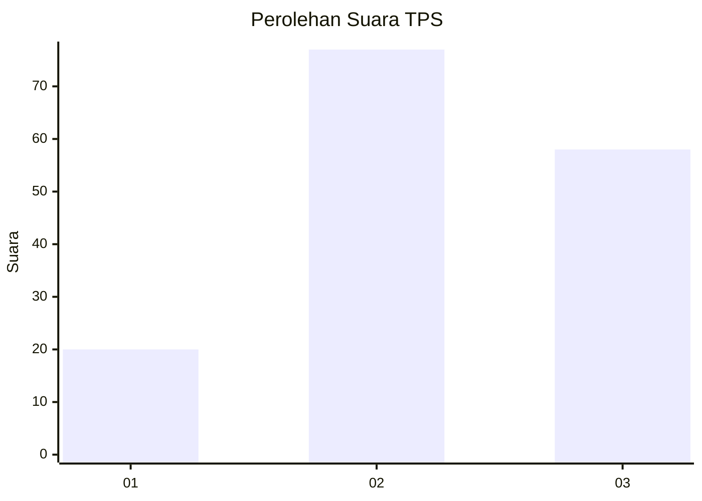
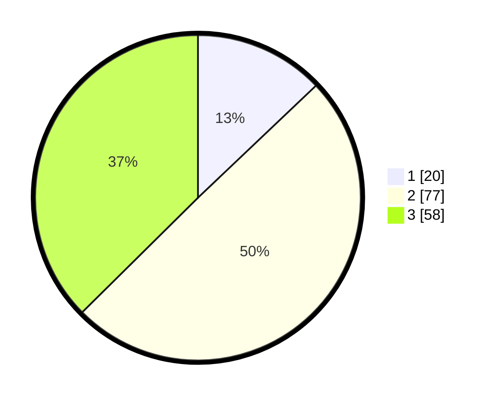

# Hasil

## Grafik

## Tabel

| No. | Nama Paslon    | Suara | Suara (raw) | Persentase |
|:--- |:-------------- | -----:| -----------:| ----------:|
| 1   | ANIES MUHAIMIN | 20    | [20][p-1]   | 12,90      |
| 2   | PRABOWO GIBRAN | 77    | [77][p-2]   | 49,68      |
| 3   | GANJAR MAHFUD  | 58    | [58][p-3]   | 37,42      |

[p-1]: https://github.com/gigit-pemilu/pemilu-2024-14-riau/blob/main/pilpres/hitung-suara/sub/14-riau/sub/05--pelalawan/sub/01-ukui/sub/2006-lubuk-kembang-bunga/sub/006-tps/sub/paslon-1.txt
[p-2]: https://github.com/gigit-pemilu/pemilu-2024-14-riau/blob/main/pilpres/hitung-suara/sub/14-riau/sub/05--pelalawan/sub/01-ukui/sub/2006-lubuk-kembang-bunga/sub/006-tps/sub/paslon-2.txt
[p-3]: https://github.com/gigit-pemilu/pemilu-2024-14-riau/blob/main/pilpres/hitung-suara/sub/14-riau/sub/05--pelalawan/sub/01-ukui/sub/2006-lubuk-kembang-bunga/sub/006-tps/sub/paslon-3.txt

## Foto C Plano

https://sirekap-obj-formc.kpu.go.id/db43/pemilu/ppwp/14/05/01/20/06/1405012006006-20240214-214026--4284c7d4-1ba9-4cd7-b7f6-3ed8d26519c9.jpg

https://sirekap-obj-formc.kpu.go.id/db43/pemilu/ppwp/14/05/01/20/06/1405012006006-20240214-214034--218594e2-a933-453f-b6f9-624038ebdf06.jpg

https://sirekap-obj-formc.kpu.go.id/db43/pemilu/ppwp/14/05/01/20/06/1405012006006-20240214-214043--6251abb5-7403-428a-a7e4-176b139a123b.jpg

## Metadata

| Key        | Value               |
| ---------- | ------------------- |
| Time Stamp | 2024-02-15 16:00:26 |

