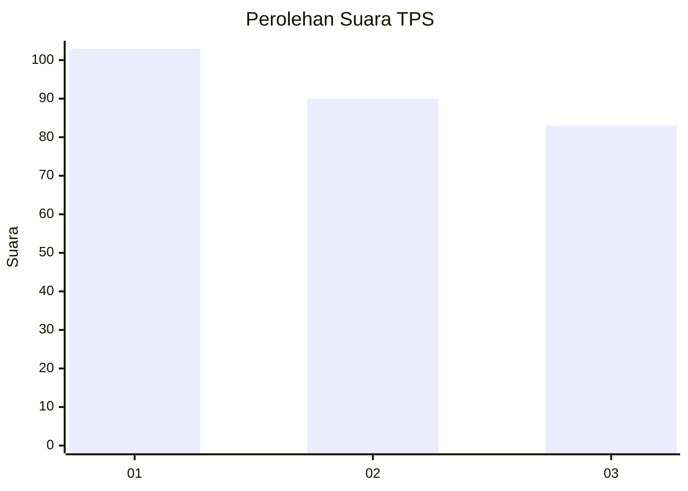
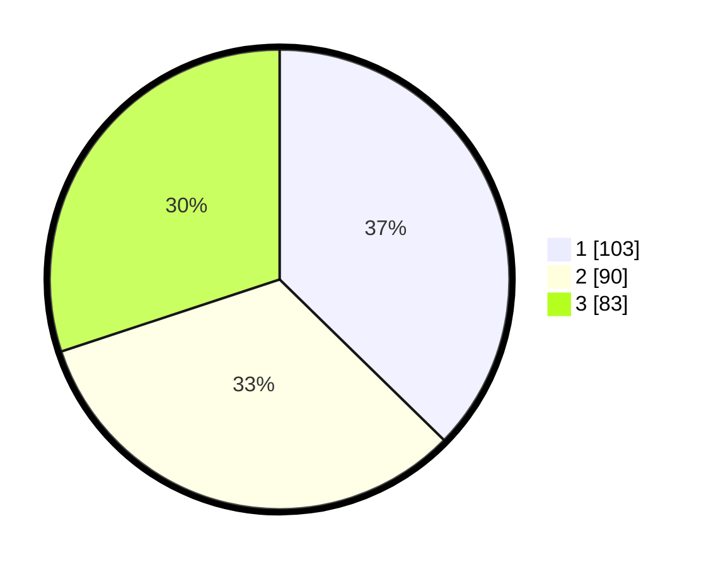

# Hasil

## Grafik

## Tabel

| No. | Nama Paslon    | Suara | Suara (raw) | Persentase |
|:--- |:-------------- | -----:| -----------:| ----------:|
| 1   | ANIES MUHAIMIN | 103   | [103][p-1]  | 37,32      |
| 2   | PRABOWO GIBRAN | 90    | [90][p-2]   | 32,61      |
| 3   | GANJAR MAHFUD  | 83    | [83][p-3]   | 30,07      |

[p-1]: https://github.com/gigit-pemilu/pemilu-2024-14-riau/blob/main/pilpres/hitung-suara/sub/14-riau/sub/05--pelalawan/sub/01-ukui/sub/2006-lubuk-kembang-bunga/sub/008-tps/sub/paslon-1.txt
[p-2]: https://github.com/gigit-pemilu/pemilu-2024-14-riau/blob/main/pilpres/hitung-suara/sub/14-riau/sub/05--pelalawan/sub/01-ukui/sub/2006-lubuk-kembang-bunga/sub/008-tps/sub/paslon-2.txt
[p-3]: https://github.com/gigit-pemilu/pemilu-2024-14-riau/blob/main/pilpres/hitung-suara/sub/14-riau/sub/05--pelalawan/sub/01-ukui/sub/2006-lubuk-kembang-bunga/sub/008-tps/sub/paslon-3.txt

## Foto C Plano

https://sirekap-obj-formc.kpu.go.id/5a36/pemilu/ppwp/14/05/01/20/06/1405012006008-20240221-150523--e3815a9f-9c24-4530-b6a4-80e3ec1cd371.jpg

https://sirekap-obj-formc.kpu.go.id/5a36/pemilu/ppwp/14/05/01/20/06/1405012006008-20240221-150647--cd011bf6-6307-4ce3-afc9-11a3278f0258.jpg

## Metadata

| Key        | Value               |
| ---------- | ------------------- |
| Time Stamp | 2024-02-21 16:00:00 |

