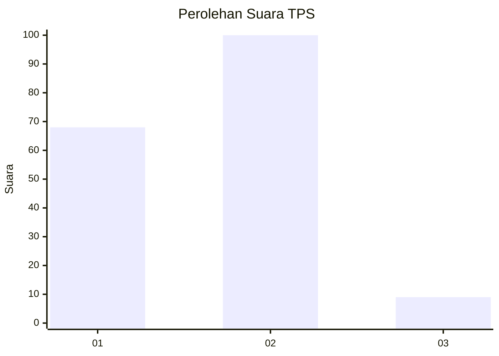
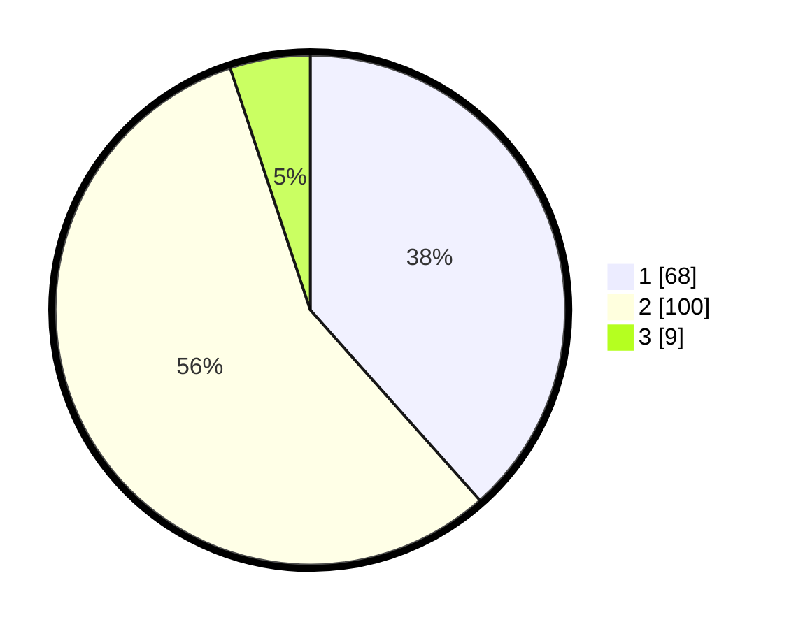

# Hasil

## Grafik

## Tabel

| No. | Nama Paslon    | Suara | Suara (raw) | Persentase |
|:--- |:-------------- | -----:| -----------:| ----------:|
| 1   | ANIES MUHAIMIN | 68    | [68][p-1]   | 38,42      |
| 2   | PRABOWO GIBRAN | 100   | [100][p-2]  | 56,50      |
| 3   | GANJAR MAHFUD  | 9     | [9][p-3]    | 5,08       |

[p-1]: https://github.com/gigit-pemilu/pemilu-2024-14-riau/blob/main/pilpres/hitung-suara/sub/14-riau/sub/05--pelalawan/sub/02-pangkalan-kerinci/sub/1008-pangkalan-kerinci-kota/sub/003-tps/sub/paslon-1.txt
[p-2]: https://github.com/gigit-pemilu/pemilu-2024-14-riau/blob/main/pilpres/hitung-suara/sub/14-riau/sub/05--pelalawan/sub/02-pangkalan-kerinci/sub/1008-pangkalan-kerinci-kota/sub/003-tps/sub/paslon-2.txt
[p-3]: https://github.com/gigit-pemilu/pemilu-2024-14-riau/blob/main/pilpres/hitung-suara/sub/14-riau/sub/05--pelalawan/sub/02-pangkalan-kerinci/sub/1008-pangkalan-kerinci-kota/sub/003-tps/sub/paslon-3.txt

## Foto C Plano

https://sirekap-obj-formc.kpu.go.id/a0a4/pemilu/ppwp/14/05/02/10/08/1405021008003-20240227-131959--3aa30686-0539-4d16-b926-ce1255efe172.jpg

https://sirekap-obj-formc.kpu.go.id/a0a4/pemilu/ppwp/14/05/02/10/08/1405021008003-20240227-131817--5980c3d0-b987-4e31-a4b6-d9f4705eedba.jpg

https://sirekap-obj-formc.kpu.go.id/a0a4/pemilu/ppwp/14/05/02/10/08/1405021008003-20240227-132043--27cfd55a-9e36-45a1-bb71-8641dac23330.jpg

## Metadata

| Key        | Value               |
| ---------- | ------------------- |
| Time Stamp | 2024-02-28 17:00:00 |

## DATA PEMILIH TETAP

Jumlah pemilih dalam DPT: **264**.
 * L: **435**.
 * P: **125**.

## DATA PENGGUNA HAK PILIH

Jumlah pengguna hak pilih dalam DPT: **222**.
 * L: **420**.
 * P: **322**.

Jumlah pengguna hak pilih dalam DPTb: **822**.
 * L: **72**.
 * P: **832**.

Jumlah pengguna hak pilih dalam DPK: **885**.
 * L: **882**.
 * P: **884**.

Jumlah pengguna hak pilih: **181**.
 * L: **893**.
 * P: **303**.

## JUMLAH SUARA SAH DAN TIDAK SAH

JUMLAH SELURUH SUARA SAH: **177**.

JUMLAH SUARA TIDAK SAH: **4**.

JUMLAH SELURUH SUARA SAH DAN SUARA TIDAK SAH: **181**.

