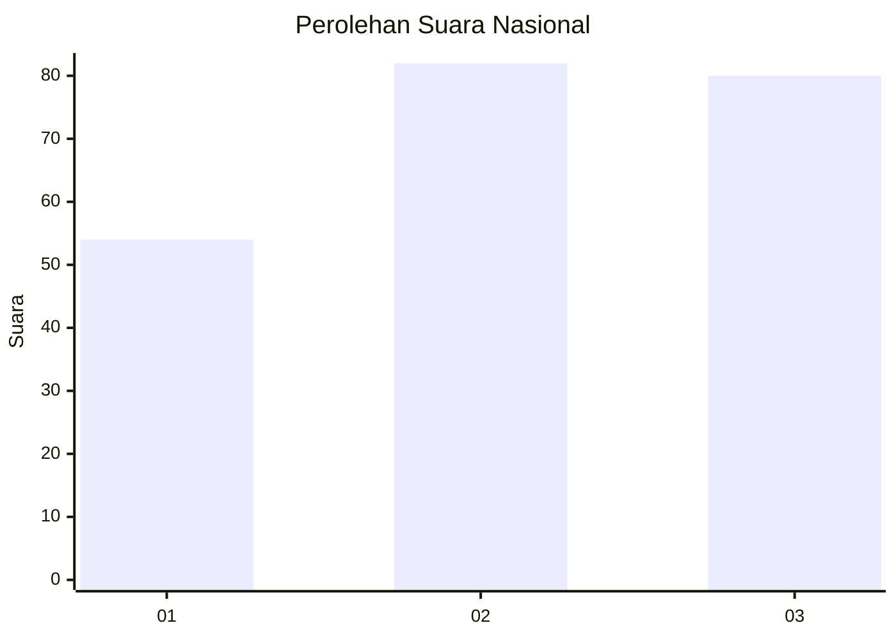
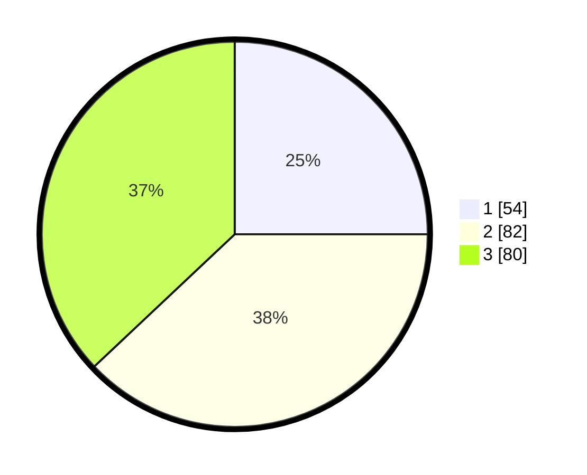

# Hasil

## Grafik

## Tabel

| No. | Nama Paslon    | Suara | Suara (raw) | Persentase |
|:--- |:-------------- | -----:| -----------:| ----------:|
| 1   | ANIES MUHAIMIN | 54    | [54][p-1]   | 25,00      |
| 2   | PRABOWO GIBRAN | 82    | [82][p-2]   | 37,96      |
| 3   | GANJAR MAHFUD  | 80    | [80][p-3]   | 37,04      |

[p-1]: https://github.com/gigit-pemilu/pemilu-2024/blob/main/pilpres/hitung-suara/sub/14-riau/sub/05--pelalawan/sub/02-pangkalan-kerinci/sub/1008-pangkalan-kerinci-kota/sub/071-tps/sub/paslon-1.txt
[p-2]: https://github.com/gigit-pemilu/pemilu-2024/blob/main/pilpres/hitung-suara/sub/14-riau/sub/05--pelalawan/sub/02-pangkalan-kerinci/sub/1008-pangkalan-kerinci-kota/sub/071-tps/sub/paslon-2.txt
[p-3]: https://github.com/gigit-pemilu/pemilu-2024/blob/main/pilpres/hitung-suara/sub/14-riau/sub/05--pelalawan/sub/02-pangkalan-kerinci/sub/1008-pangkalan-kerinci-kota/sub/071-tps/sub/paslon-3.txt

## Foto C Plano

https://sirekap-obj-formc.kpu.go.id/d692/pemilu/ppwp/14/05/02/10/08/1405021008071-20240223-222305--e359d21c-3ed8-4e50-bb8d-a1a7912ce6db.jpg

https://sirekap-obj-formc.kpu.go.id/d692/pemilu/ppwp/14/05/02/10/08/1405021008071-20240223-222211--efff8a6c-0af5-4f77-9ded-ea4de5c91849.jpg

https://sirekap-obj-formc.kpu.go.id/d692/pemilu/ppwp/14/05/02/10/08/1405021008071-20240223-222459--29187533-7865-421e-9f30-a34022257365.jpg

## Metadata

| Key        | Value               |
| ---------- | ------------------- |
| Time Stamp | 2024-02-24 22:31:28 |

## DATA PEMILIH TETAP

Jumlah pemilih dalam DPT: **506**.
 * L: **385**.
 * P: **345**.

## DATA PENGGUNA HAK PILIH

Jumlah pengguna hak pilih dalam DPT: **585**.
 * L: **68**.
 * P: **665**.

Jumlah pengguna hak pilih dalam DPTb: **548**.
 * L: **0**.
 * P: **5**.

Jumlah pengguna hak pilih dalam DPK: **557**.
 * L: **800**.
 * P: **35**.

Jumlah pengguna hak pilih: **75**.
 * L: **69**.
 * P: **3**.

## JUMLAH SUARA SAH DAN TIDAK SAH

JUMLAH SELURUH SUARA SAH: **655**.

JUMLAH SUARA TIDAK SAH: **2**.

JUMLAH SELURUH SUARA SAH DAN SUARA TIDAK SAH: **557**.

