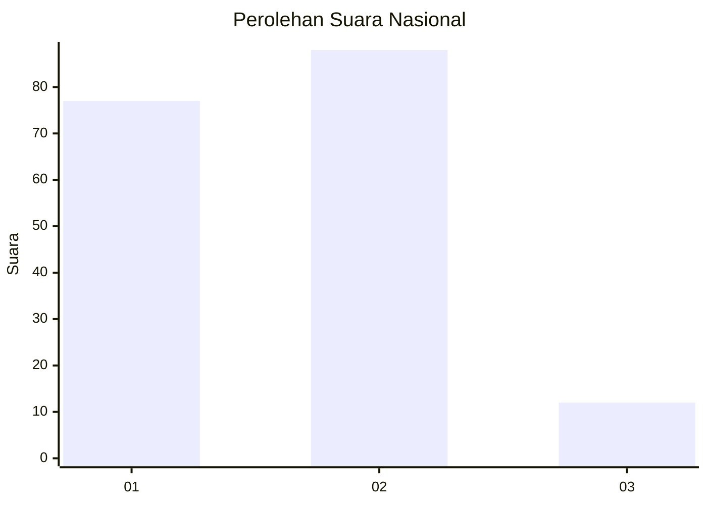
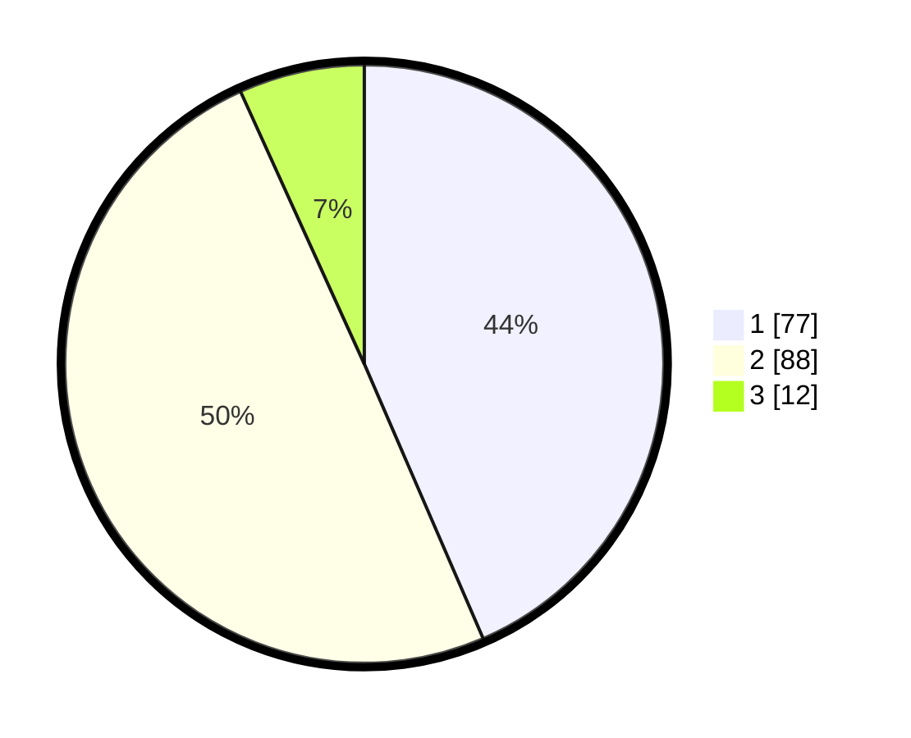

# Hasil

## Grafik

## Tabel

| No. | Nama Paslon    | Suara | Suara (raw) | Persentase |
|:--- |:-------------- | -----:| -----------:| ----------:|
| 1   | ANIES MUHAIMIN | 77    | [77][p-1]   | 43,50      |
| 2   | PRABOWO GIBRAN | 88    | [88][p-2]   | 49,72      |
| 3   | GANJAR MAHFUD  | 12    | [12][p-3]   | 6,78       |

[p-1]: https://github.com/gigit-pemilu/pemilu-2024/blob/main/pilpres/hitung-suara/sub/14-riau/sub/05--pelalawan/sub/02-pangkalan-kerinci/sub/1009-pangkalan-kerinci-timur/sub/090-tps/sub/paslon-1.txt
[p-2]: https://github.com/gigit-pemilu/pemilu-2024/blob/main/pilpres/hitung-suara/sub/14-riau/sub/05--pelalawan/sub/02-pangkalan-kerinci/sub/1009-pangkalan-kerinci-timur/sub/090-tps/sub/paslon-2.txt
[p-3]: https://github.com/gigit-pemilu/pemilu-2024/blob/main/pilpres/hitung-suara/sub/14-riau/sub/05--pelalawan/sub/02-pangkalan-kerinci/sub/1009-pangkalan-kerinci-timur/sub/090-tps/sub/paslon-3.txt

## Foto C Plano

https://sirekap-obj-formc.kpu.go.id/d64b/pemilu/ppwp/14/05/02/10/09/1405021009090-20240227-181026--736fad9d-6260-4e08-98b3-a6bf4b4c9419.jpg

https://sirekap-obj-formc.kpu.go.id/d64b/pemilu/ppwp/14/05/02/10/09/1405021009090-20240227-181141--47f45a89-ff2a-4025-ac45-351c634ff771.jpg

https://sirekap-obj-formc.kpu.go.id/d64b/pemilu/ppwp/14/05/02/10/09/1405021009090-20240227-181237--2be29c72-a245-47f2-a078-a02f66c2aa27.jpg

## Metadata

| Key        | Value               |
| ---------- | ------------------- |
| Time Stamp | 2024-02-28 11:00:00 |

## DATA PEMILIH TETAP

Jumlah pemilih dalam DPT: **285**.
 * L: **455**.
 * P: **630**.

## DATA PENGGUNA HAK PILIH

Jumlah pengguna hak pilih dalam DPT: **872**.
 * L: **94**.
 * P: **78**.

Jumlah pengguna hak pilih dalam DPTb: **80**.
 * L: **880**.
 * P: **800**.

Jumlah pengguna hak pilih dalam DPK: **10**.
 * L: **8**.
 * P: **82**.

Jumlah pengguna hak pilih: **682**.
 * L: **702**.
 * P: **80**.

## JUMLAH SUARA SAH DAN TIDAK SAH

JUMLAH SELURUH SUARA SAH: **177**.

JUMLAH SUARA TIDAK SAH: **5**.

JUMLAH SELURUH SUARA SAH DAN SUARA TIDAK SAH: **182**.

