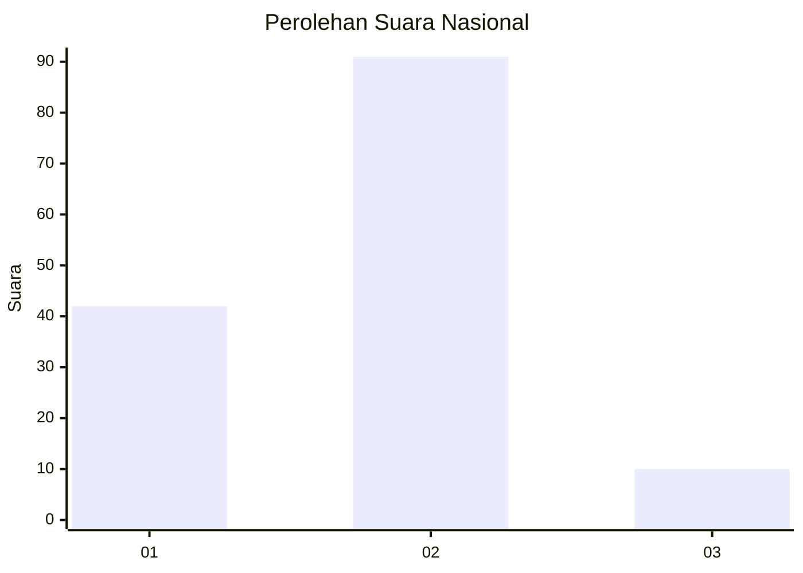
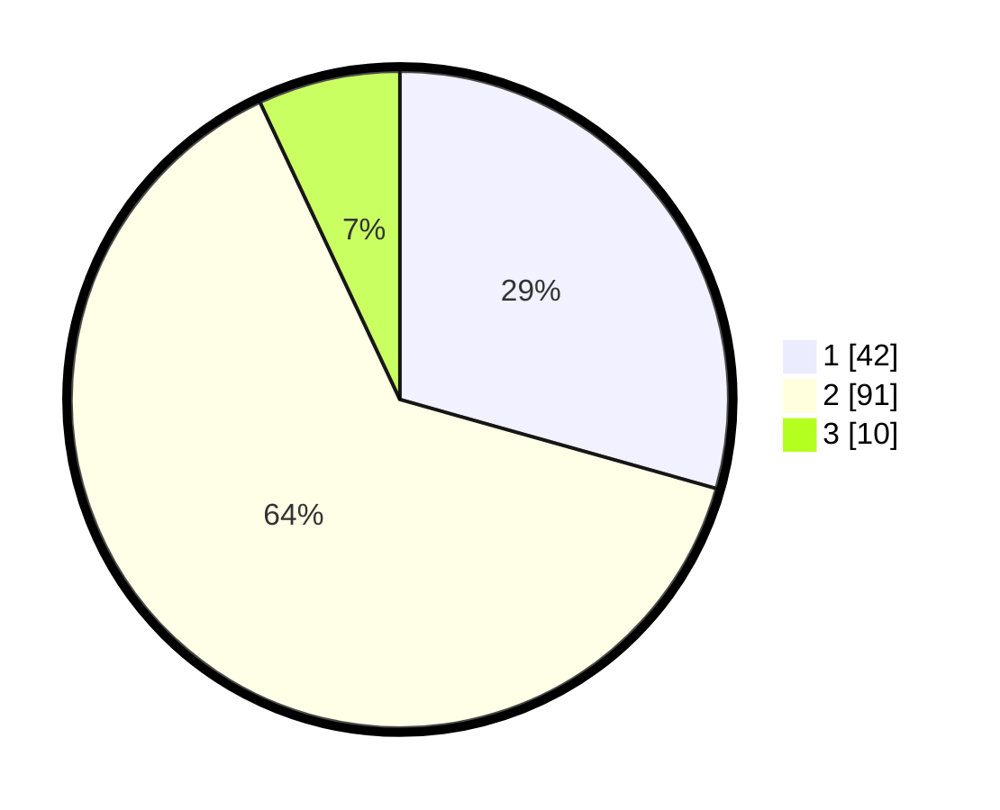

# Hasil

## Grafik

## Tabel

| No. | Nama Paslon    | Suara | Suara (raw) | Persentase |
|:--- |:-------------- | -----:| -----------:| ----------:|
| 1   | ANIES MUHAIMIN | 42    | [42][p-1]   | 29,37      |
| 2   | PRABOWO GIBRAN | 91    | [91][p-2]   | 63,64      |
| 3   | GANJAR MAHFUD  | 10    | [10][p-3]   | 6,99       |

[p-1]: https://github.com/gigit-pemilu/pemilu-2024/blob/main/pilpres/hitung-suara/sub/14-riau/sub/05--pelalawan/sub/03-pangkalan-kuras/sub/2016-batang-kulim/sub/007-tps/sub/paslon-1.txt
[p-2]: https://github.com/gigit-pemilu/pemilu-2024/blob/main/pilpres/hitung-suara/sub/14-riau/sub/05--pelalawan/sub/03-pangkalan-kuras/sub/2016-batang-kulim/sub/007-tps/sub/paslon-2.txt
[p-3]: https://github.com/gigit-pemilu/pemilu-2024/blob/main/pilpres/hitung-suara/sub/14-riau/sub/05--pelalawan/sub/03-pangkalan-kuras/sub/2016-batang-kulim/sub/007-tps/sub/paslon-3.txt

## Foto C Plano

https://sirekap-obj-formc.kpu.go.id/a4ba/pemilu/ppwp/14/05/03/20/16/1405032016007-20240214-155727--a7889d08-e5c4-45d3-a3f5-24108e93b61f.jpg

https://sirekap-obj-formc.kpu.go.id/a4ba/pemilu/ppwp/14/05/03/20/16/1405032016007-20240214-155403--4fd68f5e-f49d-44e1-a483-1449d6d57bd4.jpg

https://sirekap-obj-formc.kpu.go.id/a4ba/pemilu/ppwp/14/05/03/20/16/1405032016007-20240214-155559--8728082b-3975-4d00-b22f-3156f750eeb3.jpg

## Metadata

| Key        | Value               |
| ---------- | ------------------- |
| Time Stamp | 2024-02-14 21:46:01 |

