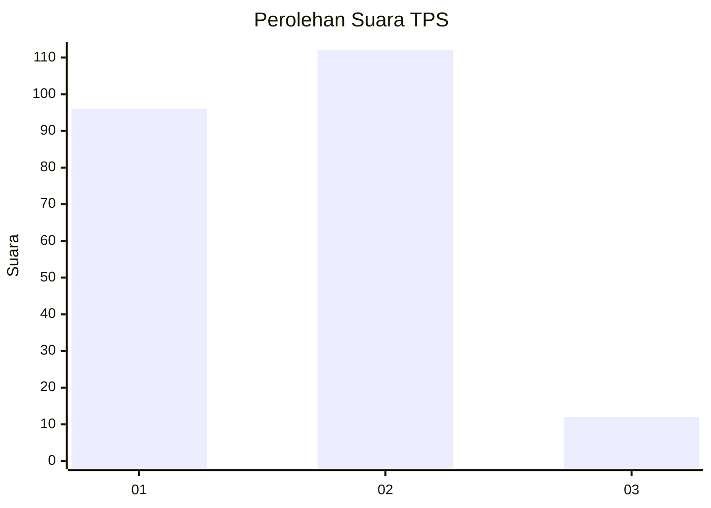
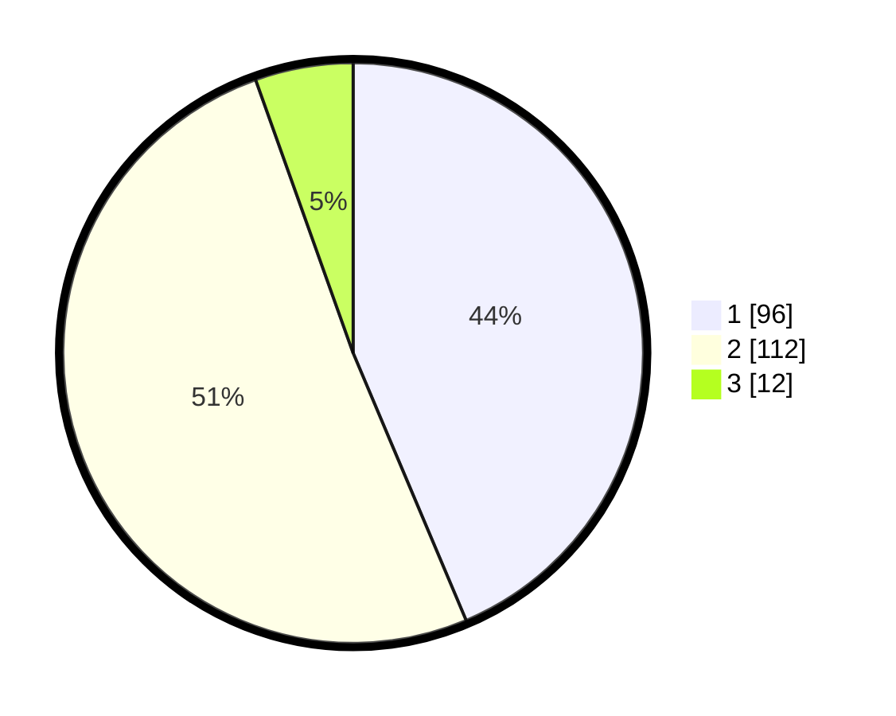

# Hasil

## Grafik

## Tabel

| No. | Nama Paslon    | Suara | Suara (raw) | Persentase |
|:--- |:-------------- | -----:| -----------:| ----------:|
| 1   | ANIES MUHAIMIN | 96    | [96][p-1]   | 43,64      |
| 2   | PRABOWO GIBRAN | 112   | [112][p-2]  | 50,91      |
| 3   | GANJAR MAHFUD  | 12    | [12][p-3]   | 5,45       |

[p-1]: https://github.com/gigit-pemilu/pemilu-2024-14-riau/blob/main/pilpres/hitung-suara/sub/14-riau/sub/05--pelalawan/sub/04-pangkalan-lesung/sub/1001-pangkalan-lesung/sub/006-tps/sub/paslon-1.txt
[p-2]: https://github.com/gigit-pemilu/pemilu-2024-14-riau/blob/main/pilpres/hitung-suara/sub/14-riau/sub/05--pelalawan/sub/04-pangkalan-lesung/sub/1001-pangkalan-lesung/sub/006-tps/sub/paslon-2.txt
[p-3]: https://github.com/gigit-pemilu/pemilu-2024-14-riau/blob/main/pilpres/hitung-suara/sub/14-riau/sub/05--pelalawan/sub/04-pangkalan-lesung/sub/1001-pangkalan-lesung/sub/006-tps/sub/paslon-3.txt

## Foto C Plano

https://sirekap-obj-formc.kpu.go.id/8c1b/pemilu/ppwp/14/05/04/10/01/1405041001006-20240215-020327--0a8320a4-a2db-4daa-abe7-a3488ba33888.jpg

https://sirekap-obj-formc.kpu.go.id/8c1b/pemilu/ppwp/14/05/04/10/01/1405041001006-20240215-003222--691222f4-b2ab-4013-b9e2-f24a99e789b8.jpg

https://sirekap-obj-formc.kpu.go.id/8c1b/pemilu/ppwp/14/05/04/10/01/1405041001006-20240215-003240--7746e036-3300-4c50-a511-0ea792ab45f0.jpg

## Metadata

| Key        | Value               |
| ---------- | ------------------- |
| Time Stamp | 2024-02-15 09:00:24 |

