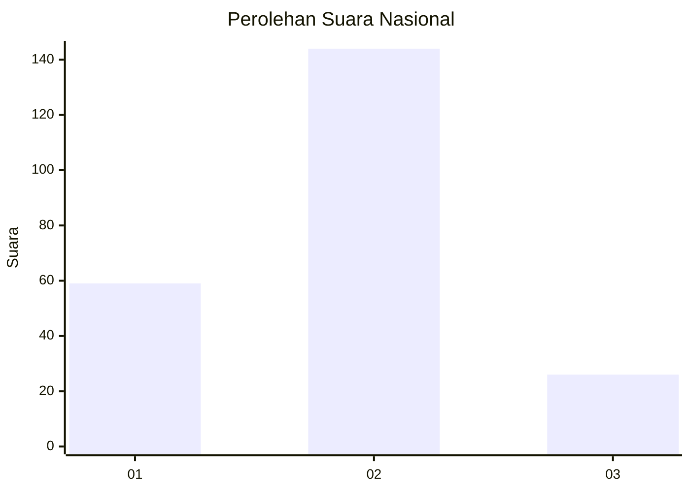
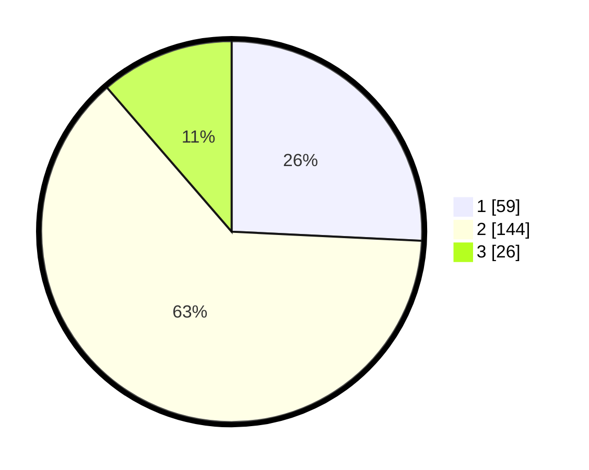

# Hasil

## Grafik

## Tabel

| No. | Nama Paslon    | Suara | Suara (raw) | Persentase |
|:--- |:-------------- | -----:| -----------:| ----------:|
| 1   | ANIES MUHAIMIN | 59    | [59][p-1]   | 25,76      |
| 2   | PRABOWO GIBRAN | 144   | [144][p-2]  | 62,88      |
| 3   | GANJAR MAHFUD  | 26    | [26][p-3]   | 11,35      |

[p-1]: https://github.com/gigit-pemilu/pemilu-2024/blob/main/pilpres/hitung-suara/sub/14-riau/sub/05--pelalawan/sub/04-pangkalan-lesung/sub/2003-genduang/sub/004-tps/sub/paslon-1.txt
[p-2]: https://github.com/gigit-pemilu/pemilu-2024/blob/main/pilpres/hitung-suara/sub/14-riau/sub/05--pelalawan/sub/04-pangkalan-lesung/sub/2003-genduang/sub/004-tps/sub/paslon-2.txt
[p-3]: https://github.com/gigit-pemilu/pemilu-2024/blob/main/pilpres/hitung-suara/sub/14-riau/sub/05--pelalawan/sub/04-pangkalan-lesung/sub/2003-genduang/sub/004-tps/sub/paslon-3.txt

## Foto C Plano

https://sirekap-obj-formc.kpu.go.id/ed57/pemilu/ppwp/14/05/04/20/03/1405042003004-20240215-024423--d34f802d-0bc9-4f7a-97da-4b7ce2ee1907.jpg

https://sirekap-obj-formc.kpu.go.id/ed57/pemilu/ppwp/14/05/04/20/03/1405042003004-20240215-024535--7c9cea1b-8af2-406d-a6e4-2ce7dcc11b23.jpg

https://sirekap-obj-formc.kpu.go.id/ed57/pemilu/ppwp/14/05/04/20/03/1405042003004-20240215-024621--2621cee7-6031-4a59-9ec4-fc244c4e5fdd.jpg

## Metadata

| Key        | Value               |
| ---------- | ------------------- |
| Time Stamp | 2024-02-15 15:00:29 |

