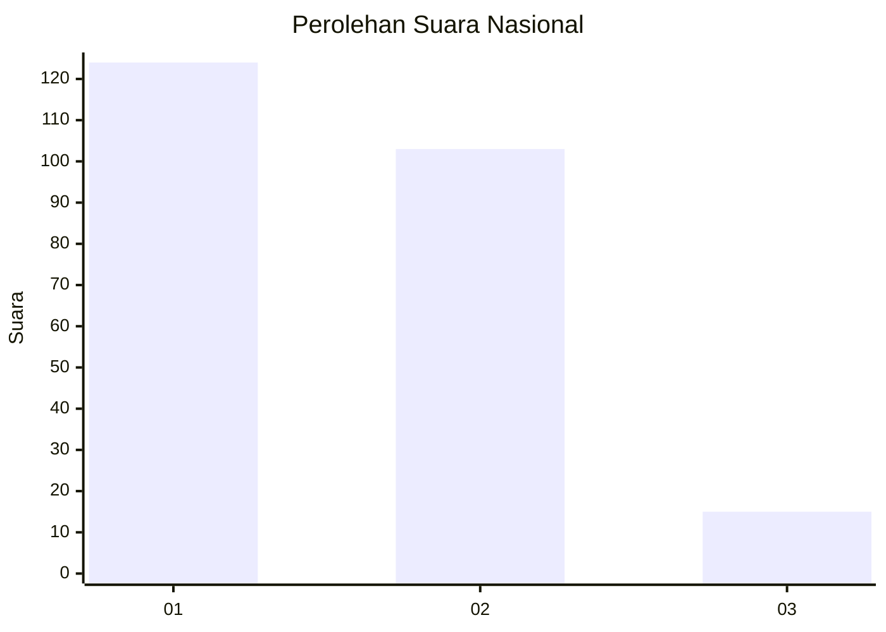
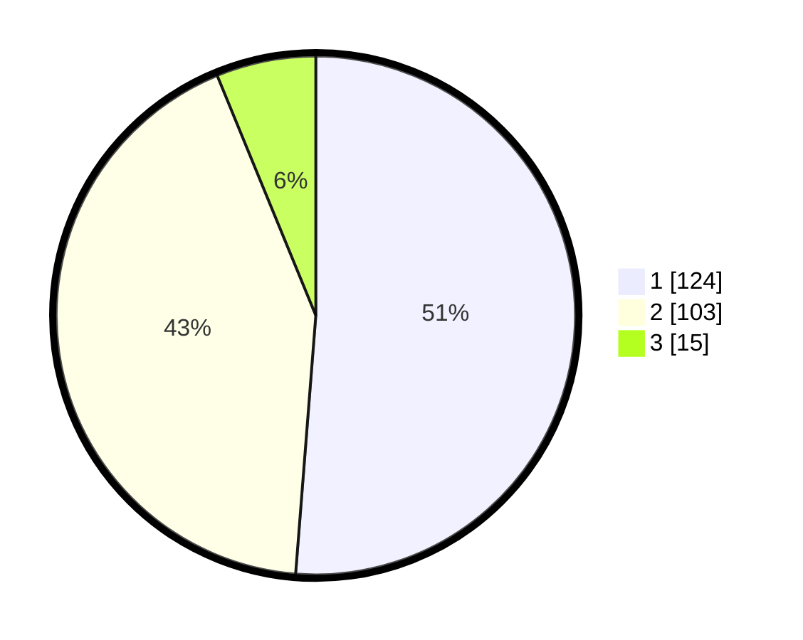

# Hasil

## Grafik

## Tabel

| No. | Nama Paslon    | Suara | Suara (raw) | Persentase |
|:--- |:-------------- | -----:| -----------:| ----------:|
| 1   | ANIES MUHAIMIN | 124   | [124][p-1]  | 51,24      |
| 2   | PRABOWO GIBRAN | 103   | [103][p-2]  | 42,56      |
| 3   | GANJAR MAHFUD  | 15    | [15][p-3]   | 6,20       |

[p-1]: https://github.com/gigit-pemilu/pemilu-2024/blob/main/pilpres/hitung-suara/sub/14-riau/sub/05--pelalawan/sub/05-langgam/sub/1001-langgam/sub/007-tps/sub/paslon-1.txt
[p-2]: https://github.com/gigit-pemilu/pemilu-2024/blob/main/pilpres/hitung-suara/sub/14-riau/sub/05--pelalawan/sub/05-langgam/sub/1001-langgam/sub/007-tps/sub/paslon-2.txt
[p-3]: https://github.com/gigit-pemilu/pemilu-2024/blob/main/pilpres/hitung-suara/sub/14-riau/sub/05--pelalawan/sub/05-langgam/sub/1001-langgam/sub/007-tps/sub/paslon-3.txt

## Foto C Plano

https://sirekap-obj-formc.kpu.go.id/c212/pemilu/ppwp/14/05/05/10/01/1405051001007-20240218-213302--f170cd8b-ff68-4f64-96f0-1a8776c6a609.jpg

https://sirekap-obj-formc.kpu.go.id/c212/pemilu/ppwp/14/05/05/10/01/1405051001007-20240218-213344--df2b54f7-60f8-4249-bbbe-64391837152f.jpg

https://sirekap-obj-formc.kpu.go.id/c212/pemilu/ppwp/14/05/05/10/01/1405051001007-20240218-213423--25e842cb-130d-408e-a1b5-be02fea154ed.jpg

## Metadata

| Key        | Value               |
| ---------- | ------------------- |
| Time Stamp | 2024-02-24 22:31:28 |

