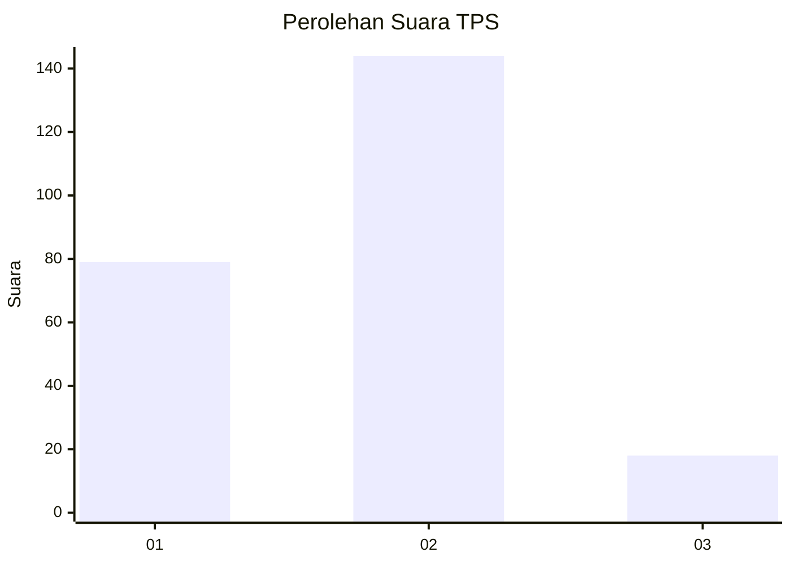
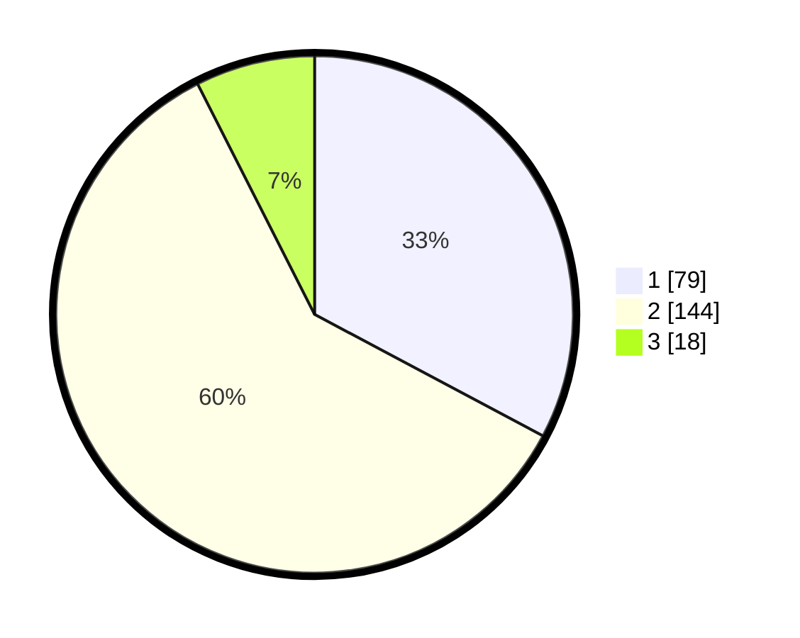

# Hasil

## Grafik

## Tabel

| No. | Nama Paslon    | Suara | Suara (raw) | Persentase |
|:--- |:-------------- | -----:| -----------:| ----------:|
| 1   | ANIES MUHAIMIN | 79    | [79][p-1]   | 32,78      |
| 2   | PRABOWO GIBRAN | 144   | [144][p-2]  | 59,75      |
| 3   | GANJAR MAHFUD  | 18    | [18][p-3]   | 7,47       |

[p-1]: https://github.com/gigit-pemilu/pemilu-2024-14-riau/blob/main/pilpres/hitung-suara/sub/14-riau/sub/05--pelalawan/sub/05-langgam/sub/2006-pangkalan-gondai/sub/006-tps/sub/paslon-1.txt
[p-2]: https://github.com/gigit-pemilu/pemilu-2024-14-riau/blob/main/pilpres/hitung-suara/sub/14-riau/sub/05--pelalawan/sub/05-langgam/sub/2006-pangkalan-gondai/sub/006-tps/sub/paslon-2.txt
[p-3]: https://github.com/gigit-pemilu/pemilu-2024-14-riau/blob/main/pilpres/hitung-suara/sub/14-riau/sub/05--pelalawan/sub/05-langgam/sub/2006-pangkalan-gondai/sub/006-tps/sub/paslon-3.txt

## Foto C Plano

https://sirekap-obj-formc.kpu.go.id/49da/pemilu/ppwp/14/05/05/20/06/1405052006006-20240215-131147--adc05fd9-fcda-4153-84e3-bcf766336b88.jpg

https://sirekap-obj-formc.kpu.go.id/49da/pemilu/ppwp/14/05/05/20/06/1405052006006-20240215-131409--f0811cd1-b306-4d23-9f37-2e96443b045f.jpg

https://sirekap-obj-formc.kpu.go.id/49da/pemilu/ppwp/14/05/05/20/06/1405052006006-20240215-131534--4c515372-a443-4fcd-a646-6263ced04345.jpg

## Metadata

| Key        | Value               |
| ---------- | ------------------- |
| Time Stamp | 2024-02-16 02:30:27 |

