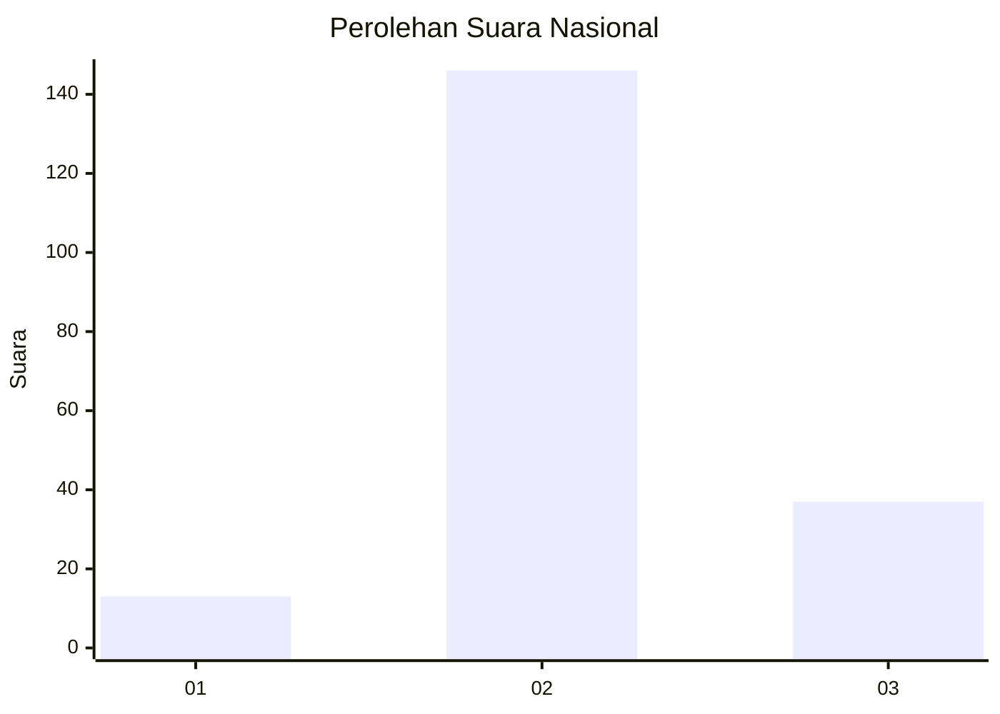
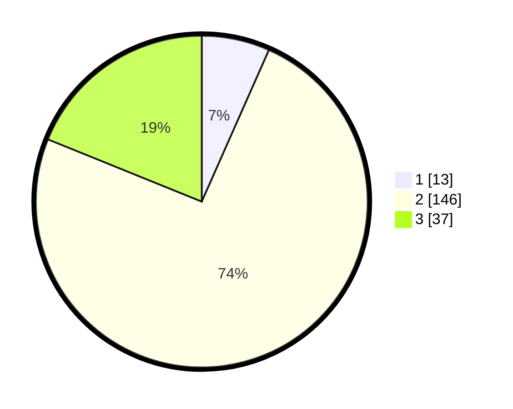

# Hasil

## Grafik

## Tabel

| No. | Nama Paslon    | Suara | Suara (raw) | Persentase |
|:--- |:-------------- | -----:| -----------:| ----------:|
| 1   | ANIES MUHAIMIN | 13    | [13][p-1]   | 6,63       |
| 2   | PRABOWO GIBRAN | 146   | [146][p-2]  | 74,49      |
| 3   | GANJAR MAHFUD  | 37    | [37][p-3]   | 18,88      |

[p-1]: https://github.com/gigit-pemilu/pemilu-2024/blob/main/pilpres/hitung-suara/sub/14-riau/sub/05--pelalawan/sub/05-langgam/sub/2006-pangkalan-gondai/sub/010-tps/sub/paslon-1.txt
[p-2]: https://github.com/gigit-pemilu/pemilu-2024/blob/main/pilpres/hitung-suara/sub/14-riau/sub/05--pelalawan/sub/05-langgam/sub/2006-pangkalan-gondai/sub/010-tps/sub/paslon-2.txt
[p-3]: https://github.com/gigit-pemilu/pemilu-2024/blob/main/pilpres/hitung-suara/sub/14-riau/sub/05--pelalawan/sub/05-langgam/sub/2006-pangkalan-gondai/sub/010-tps/sub/paslon-3.txt

## Foto C Plano

https://sirekap-obj-formc.kpu.go.id/3248/pemilu/ppwp/14/05/05/20/06/1405052006010-20240215-084440--f6157936-fdb7-4882-9abe-d183ba11c329.jpg

https://sirekap-obj-formc.kpu.go.id/3248/pemilu/ppwp/14/05/05/20/06/1405052006010-20240215-084614--70102641-c5a5-4fe8-bb1e-170fee7257b5.jpg

https://sirekap-obj-formc.kpu.go.id/3248/pemilu/ppwp/14/05/05/20/06/1405052006010-20240215-084749--428fecc0-4ae4-4b00-a2d0-dabf8ce6fefa.jpg

## Metadata

| Key        | Value               |
| ---------- | ------------------- |
| Time Stamp | 2024-02-26 12:00:00 |

