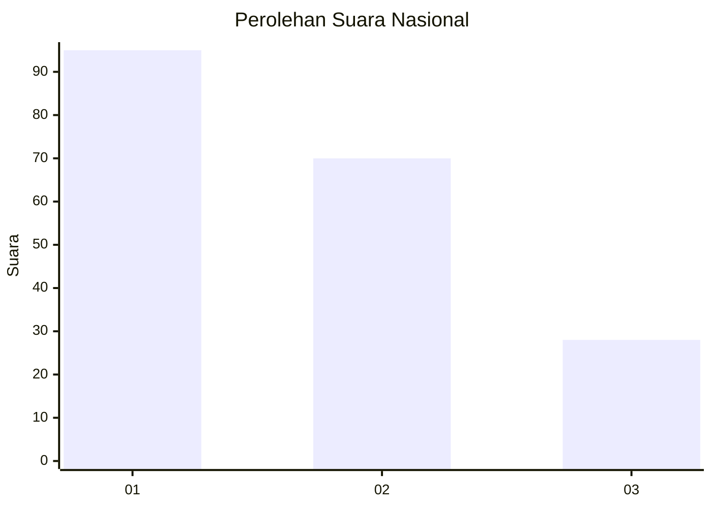
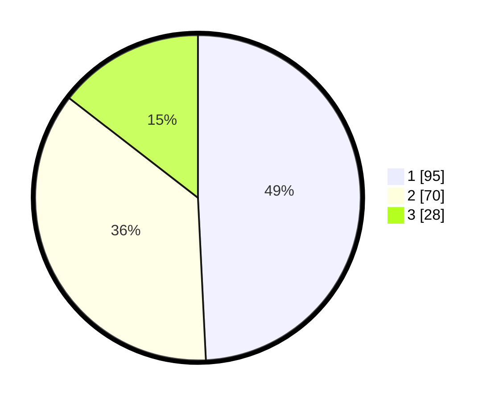

# Hasil

## Grafik

## Tabel

| No. | Nama Paslon    | Suara | Suara (raw) | Persentase |
|:--- |:-------------- | -----:| -----------:| ----------:|
| 1   | ANIES MUHAIMIN | 95    | [95][p-1]   | 49,22      |
| 2   | PRABOWO GIBRAN | 70    | [70][p-2]   | 36,27      |
| 3   | GANJAR MAHFUD  | 28    | [28][p-3]   | 14,51      |

[p-1]: https://github.com/gigit-pemilu/pemilu-2024/blob/main/pilpres/hitung-suara/sub/14-riau/sub/05--pelalawan/sub/06-pelalawan/sub/2005-sering/sub/004-tps/sub/paslon-1.txt
[p-2]: https://github.com/gigit-pemilu/pemilu-2024/blob/main/pilpres/hitung-suara/sub/14-riau/sub/05--pelalawan/sub/06-pelalawan/sub/2005-sering/sub/004-tps/sub/paslon-2.txt
[p-3]: https://github.com/gigit-pemilu/pemilu-2024/blob/main/pilpres/hitung-suara/sub/14-riau/sub/05--pelalawan/sub/06-pelalawan/sub/2005-sering/sub/004-tps/sub/paslon-3.txt

## Foto C Plano

https://sirekap-obj-formc.kpu.go.id/4799/pemilu/ppwp/14/05/06/20/05/1405062005004-20240222-104419--1e483188-7fcd-4157-9699-26d7d143a73e.jpg

https://sirekap-obj-formc.kpu.go.id/4799/pemilu/ppwp/14/05/06/20/05/1405062005004-20240222-104108--d8f094fe-ab1d-4018-b12b-eaac4daed991.jpg

https://sirekap-obj-formc.kpu.go.id/4799/pemilu/ppwp/14/05/06/20/05/1405062005004-20240222-104159--828da66b-31c3-4ed4-a0c7-8cea8daa5601.jpg

## Metadata

| Key        | Value               |
| ---------- | ------------------- |
| Time Stamp | 2024-02-22 11:00:00 |

## DATA PEMILIH TETAP

Jumlah pemilih dalam DPT: **287**.
 * L: **147**.
 * P: **140**.

## DATA PENGGUNA HAK PILIH

Jumlah pengguna hak pilih dalam DPT: **236**.
 * L: **19**.
 * P: **117**.

Jumlah pengguna hak pilih dalam DPTb: **804**.
 * L: **8**.
 * P: **880**.

Jumlah pengguna hak pilih dalam DPK: **80**.
 * L: **5**.
 * P: **82**.

Jumlah pengguna hak pilih: **244**.
 * L: **24**.
 * P: **722**.

## JUMLAH SUARA SAH DAN TIDAK SAH

JUMLAH SELURUH SUARA SAH: **243**.

JUMLAH SUARA TIDAK SAH: **1**.

JUMLAH SELURUH SUARA SAH DAN SUARA TIDAK SAH: **244**.

