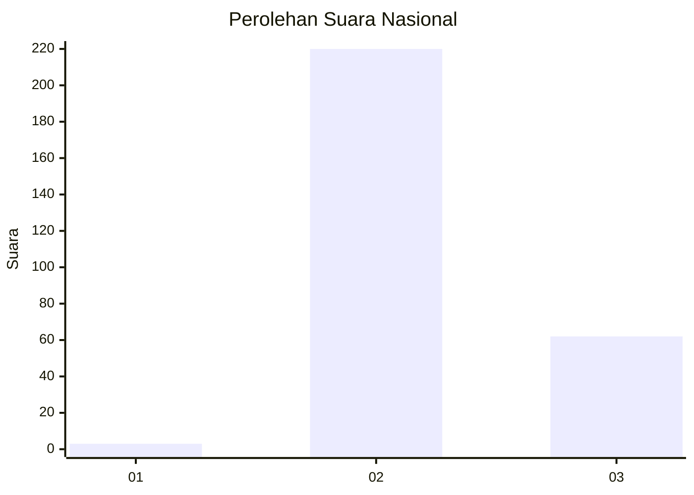
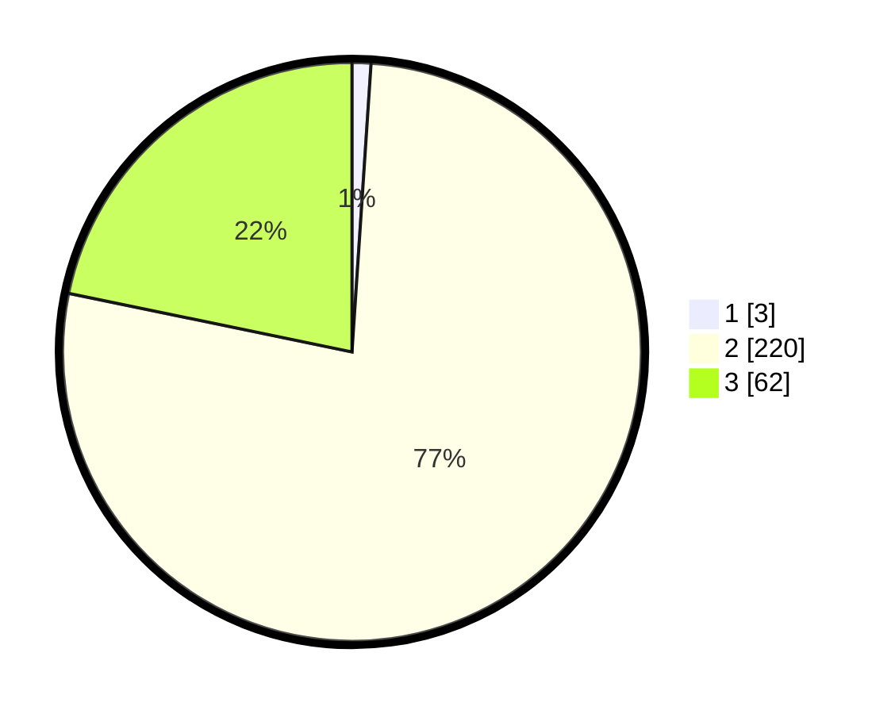

# Hasil

## Grafik

## Tabel

| No. | Nama Paslon    | Suara | Suara (raw) | Persentase |
|:--- |:-------------- | -----:| -----------:| ----------:|
| 1   | ANIES MUHAIMIN | 3     | [3][p-1]    | 1,05       |
| 2   | PRABOWO GIBRAN | 220   | [220][p-2]  | 77,19      |
| 3   | GANJAR MAHFUD  | 62    | [62][p-3]   | 21,75      |

[p-1]: https://github.com/gigit-pemilu/pemilu-2024/blob/main/pilpres/hitung-suara/sub/14-riau/sub/05--pelalawan/sub/06-pelalawan/sub/2006-telayap/sub/007-tps/sub/paslon-1.txt
[p-2]: https://github.com/gigit-pemilu/pemilu-2024/blob/main/pilpres/hitung-suara/sub/14-riau/sub/05--pelalawan/sub/06-pelalawan/sub/2006-telayap/sub/007-tps/sub/paslon-2.txt
[p-3]: https://github.com/gigit-pemilu/pemilu-2024/blob/main/pilpres/hitung-suara/sub/14-riau/sub/05--pelalawan/sub/06-pelalawan/sub/2006-telayap/sub/007-tps/sub/paslon-3.txt

## Foto C Plano

https://sirekap-obj-formc.kpu.go.id/1324/pemilu/ppwp/14/05/06/20/06/1405062006007-20240222-135441--82d998a3-fe2e-49ab-b139-64ae8cedd5cb.jpg

https://sirekap-obj-formc.kpu.go.id/1324/pemilu/ppwp/14/05/06/20/06/1405062006007-20240222-135452--2690e035-1b5c-441d-a6a4-7b1e1f5d6108.jpg

https://sirekap-obj-formc.kpu.go.id/1324/pemilu/ppwp/14/05/06/20/06/1405062006007-20240222-135502--19fdd8f2-39b3-47d8-8598-20d4aa8fa216.jpg

## Metadata

| Key        | Value               |
| ---------- | ------------------- |
| Time Stamp | 2024-02-22 14:00:00 |

## DATA PEMILIH TETAP

Jumlah pemilih dalam DPT: **295**.
 * L: **855**.
 * P: **140**.

## DATA PENGGUNA HAK PILIH

Jumlah pengguna hak pilih dalam DPT: **296**.
 * L: **400**.
 * P: **98**.

Jumlah pengguna hak pilih dalam DPTb: **282**.
 * L: **285**.
 * P: **282**.

Jumlah pengguna hak pilih dalam DPK: **0**.
 * L: **0**.
 * P: **0**.

Jumlah pengguna hak pilih: **136**.
 * L: **200**.
 * P: **96**.

## JUMLAH SUARA SAH DAN TIDAK SAH

JUMLAH SELURUH SUARA SAH: **185**.

JUMLAH SUARA TIDAK SAH: **11**.

JUMLAH SELURUH SUARA SAH DAN SUARA TIDAK SAH: **196**.

