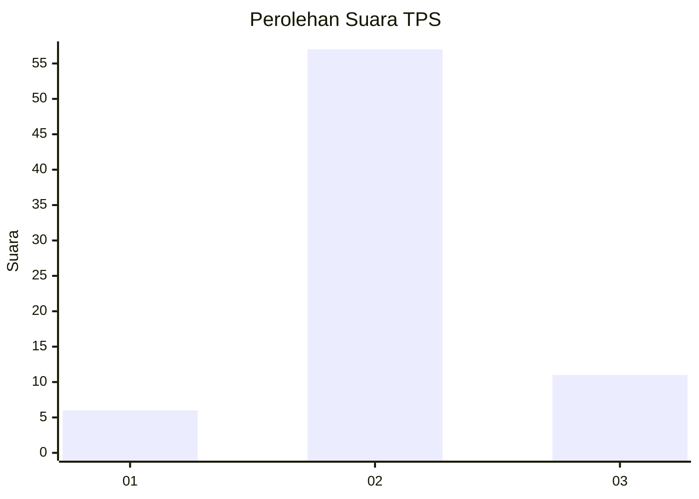

# Hasil

## Grafik

## Tabel

| No. | Nama Paslon    | Suara | Suara (raw) | Persentase |
|:--- |:-------------- | -----:| -----------:| ----------:|
| 1   | ANIES MUHAIMIN | 6     | [6][p-1]    | 8,11       |
| 2   | PRABOWO GIBRAN | 57    | [57][p-2]   | 77,03      |
| 3   | GANJAR MAHFUD  | 11    | [11][p-3]   | 14,86      |

[p-1]: https://github.com/gigit-pemilu/pemilu-2024-14-riau/blob/main/pilpres/hitung-suara/sub/14-riau/sub/05--pelalawan/sub/07-kerumutan/sub/2003-pangkalan-tampui/sub/005-tps/sub/paslon-1.txt
[p-2]: https://github.com/gigit-pemilu/pemilu-2024-14-riau/blob/main/pilpres/hitung-suara/sub/14-riau/sub/05--pelalawan/sub/07-kerumutan/sub/2003-pangkalan-tampui/sub/005-tps/sub/paslon-2.txt
[p-3]: https://github.com/gigit-pemilu/pemilu-2024-14-riau/blob/main/pilpres/hitung-suara/sub/14-riau/sub/05--pelalawan/sub/07-kerumutan/sub/2003-pangkalan-tampui/sub/005-tps/sub/paslon-3.txt

## Foto C Plano

https://sirekap-obj-formc.kpu.go.id/4fc2/pemilu/ppwp/14/05/07/20/03/1405072003005-20240220-215333--8af5d8b7-66ad-4772-bfcd-d6453e4fa96e.jpg

https://sirekap-obj-formc.kpu.go.id/4fc2/pemilu/ppwp/14/05/07/20/03/1405072003005-20240220-215628--8163bec4-77bf-40b7-9c77-b3189d048ac2.jpg

## Metadata

| Key        | Value               |
| ---------- | ------------------- |
| Time Stamp | 2024-02-20 22:00:00 |

