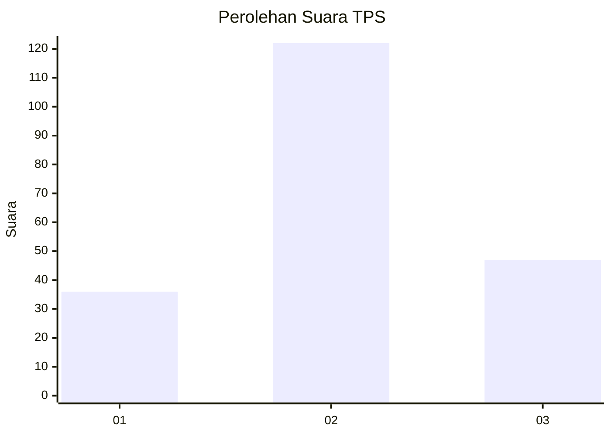
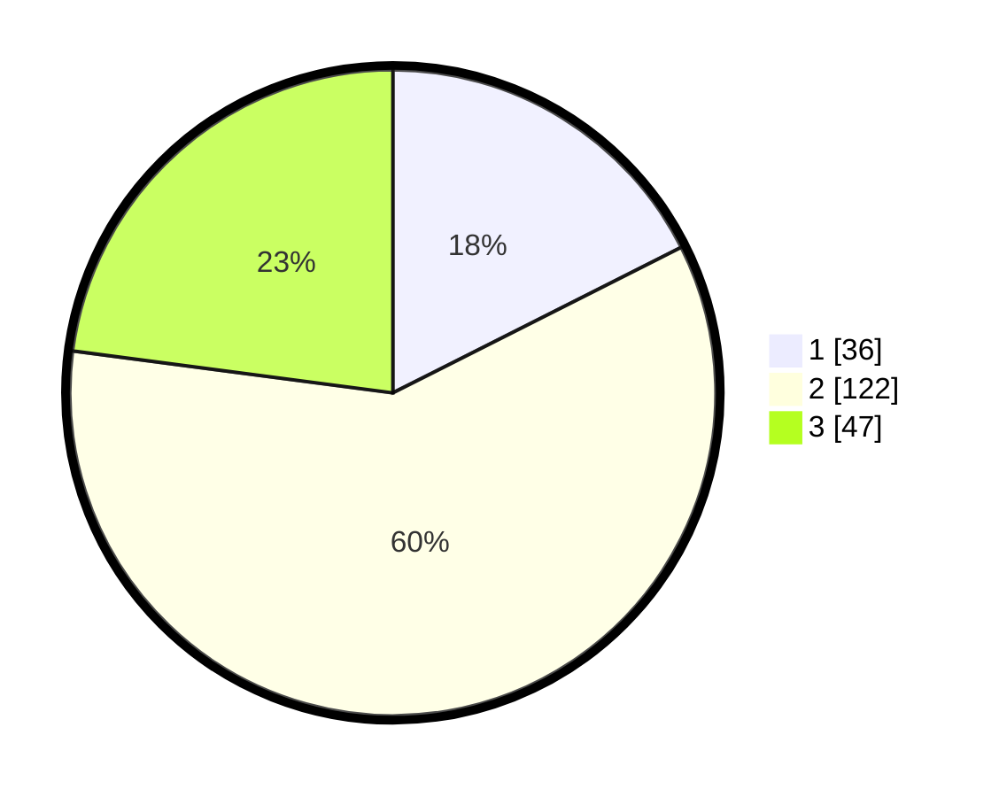

# Hasil

## Grafik

## Tabel

| No. | Nama Paslon    | Suara | Suara (raw) | Persentase |
|:--- |:-------------- | -----:| -----------:| ----------:|
| 1   | ANIES MUHAIMIN | 36    | [36][p-1]   | 17,56      |
| 2   | PRABOWO GIBRAN | 122   | [122][p-2]  | 59,51      |
| 3   | GANJAR MAHFUD  | 47    | [47][p-3]   | 22,93      |

[p-1]: https://github.com/gigit-pemilu/pemilu-2024-14-riau/blob/main/pilpres/hitung-suara/sub/14-riau/sub/05--pelalawan/sub/10-kuala-kampar/sub/2005-teluk/sub/004-tps/sub/paslon-1.txt
[p-2]: https://github.com/gigit-pemilu/pemilu-2024-14-riau/blob/main/pilpres/hitung-suara/sub/14-riau/sub/05--pelalawan/sub/10-kuala-kampar/sub/2005-teluk/sub/004-tps/sub/paslon-2.txt
[p-3]: https://github.com/gigit-pemilu/pemilu-2024-14-riau/blob/main/pilpres/hitung-suara/sub/14-riau/sub/05--pelalawan/sub/10-kuala-kampar/sub/2005-teluk/sub/004-tps/sub/paslon-3.txt

## Foto C Plano

https://sirekap-obj-formc.kpu.go.id/782d/pemilu/ppwp/14/05/10/20/05/1405102005004-20240218-012145--a3c98e5c-f8bb-427f-9073-4ab987e14be8.jpg

https://sirekap-obj-formc.kpu.go.id/782d/pemilu/ppwp/14/05/10/20/05/1405102005004-20240218-012324--2190d705-abc4-4fe6-816c-8251312da7db.jpg

https://sirekap-obj-formc.kpu.go.id/782d/pemilu/ppwp/14/05/10/20/05/1405102005004-20240218-012532--ea255c96-8343-4db0-be2e-f79e4144d205.jpg

## Metadata

| Key        | Value               |
| ---------- | ------------------- |
| Time Stamp | 2024-02-19 06:16:00 |

## DATA PEMILIH TETAP

Jumlah pemilih dalam DPT: **392**.
 * L: **291**.
 * P: **431**.

## DATA PENGGUNA HAK PILIH

Jumlah pengguna hak pilih dalam DPT: **734**.
 * L: **35**.
 * P: **117**.

Jumlah pengguna hak pilih dalam DPTb: **444**.
 * L: **0**.
 * P: **1**.

Jumlah pengguna hak pilih dalam DPK: **444**.
 * L: **3**.
 * P: **0**.

Jumlah pengguna hak pilih: **244**.
 * L: **38**.
 * P: **115**.

## JUMLAH SUARA SAH DAN TIDAK SAH

JUMLAH SELURUH SUARA SAH: **205**.

JUMLAH SUARA TIDAK SAH: **8**.

JUMLAH SELURUH SUARA SAH DAN SUARA TIDAK SAH: **213**.

