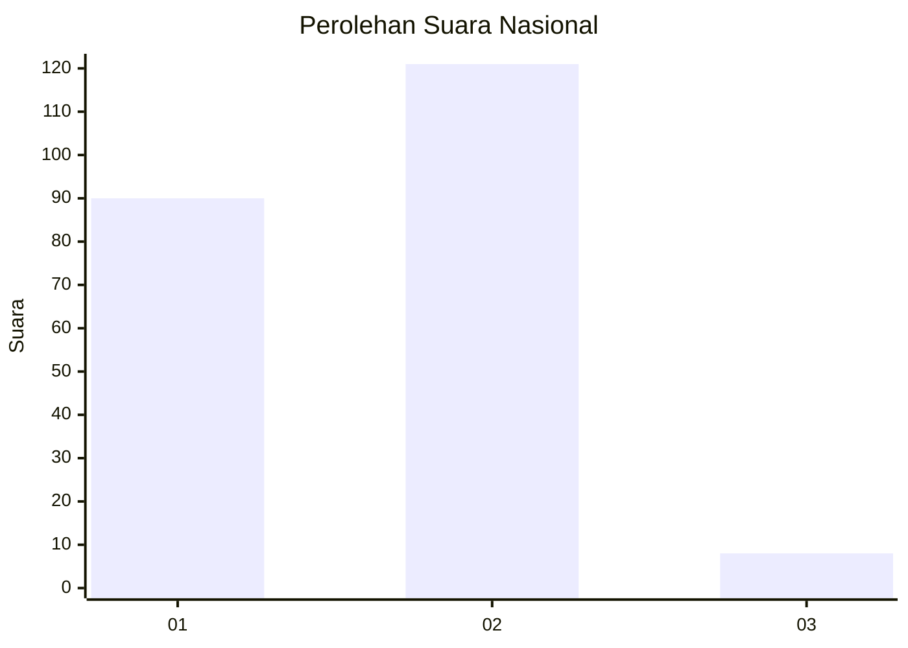
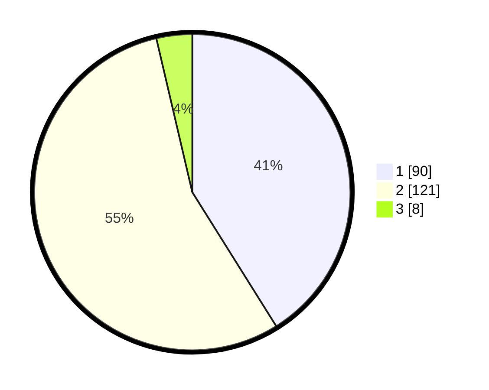

# Hasil

## Grafik

## Tabel

| No. | Nama Paslon    | Suara | Suara (raw) | Persentase |
|:--- |:-------------- | -----:| -----------:| ----------:|
| 1   | ANIES MUHAIMIN | 90    | [90][p-1]   | 41,10      |
| 2   | PRABOWO GIBRAN | 121   | [121][p-2]  | 55,25      |
| 3   | GANJAR MAHFUD  | 8     | [8][p-3]    | 3,65       |

[p-1]: https://github.com/gigit-pemilu/pemilu-2024/blob/main/pilpres/hitung-suara/sub/14-riau/sub/05--pelalawan/sub/11-bandar-sei-kijang/sub/1001-sei-kijang/sub/004-tps/sub/paslon-1.txt
[p-2]: https://github.com/gigit-pemilu/pemilu-2024/blob/main/pilpres/hitung-suara/sub/14-riau/sub/05--pelalawan/sub/11-bandar-sei-kijang/sub/1001-sei-kijang/sub/004-tps/sub/paslon-2.txt
[p-3]: https://github.com/gigit-pemilu/pemilu-2024/blob/main/pilpres/hitung-suara/sub/14-riau/sub/05--pelalawan/sub/11-bandar-sei-kijang/sub/1001-sei-kijang/sub/004-tps/sub/paslon-3.txt

## Foto C Plano

https://sirekap-obj-formc.kpu.go.id/e1d5/pemilu/ppwp/14/05/11/10/01/1405111001004-20240215-030240--017472f4-403a-4a9c-a359-68f3af49f6e5.jpg

https://sirekap-obj-formc.kpu.go.id/e1d5/pemilu/ppwp/14/05/11/10/01/1405111001004-20240215-030615--e195626f-416c-420c-87ab-fd133d870360.jpg

https://sirekap-obj-formc.kpu.go.id/e1d5/pemilu/ppwp/14/05/11/10/01/1405111001004-20240215-030826--bfc7070d-3f64-4152-95b5-9e9616ea642e.jpg

## Metadata

| Key        | Value               |
| ---------- | ------------------- |
| Time Stamp | 2024-02-15 12:00:28 |

