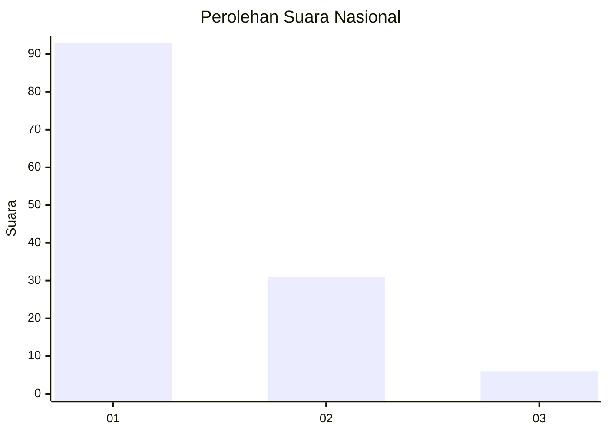
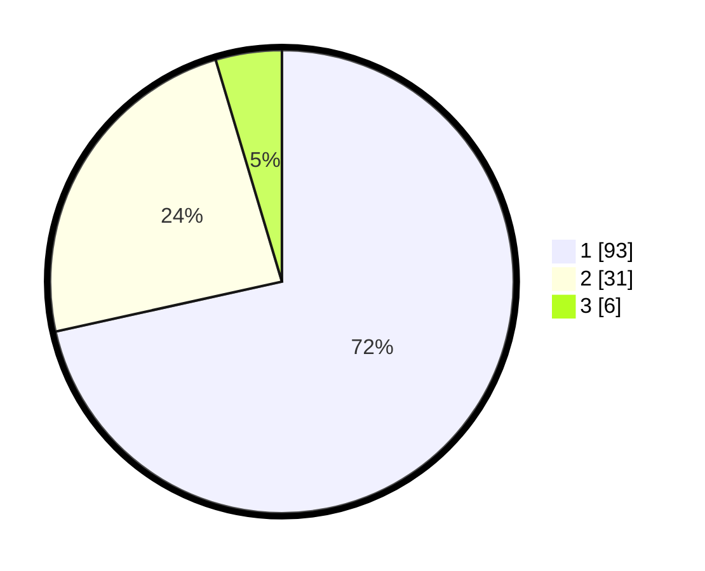

# Hasil

## Grafik

## Tabel

| No. | Nama Paslon    | Suara | Suara (raw) | Persentase |
|:--- |:-------------- | -----:| -----------:| ----------:|
| 1   | ANIES MUHAIMIN | 93    | [93][p-1]   | 71,54      |
| 2   | PRABOWO GIBRAN | 31    | [31][p-2]   | 23,85      |
| 3   | GANJAR MAHFUD  | 6     | [6][p-3]    | 4,62       |

[p-1]: https://github.com/gigit-pemilu/pemilu-2024/blob/main/pilpres/hitung-suara/sub/14-riau/sub/06--rokan-hulu/sub/02-rokan-iv-koto/sub/1001-rokan/sub/003-tps/sub/paslon-1.txt
[p-2]: https://github.com/gigit-pemilu/pemilu-2024/blob/main/pilpres/hitung-suara/sub/14-riau/sub/06--rokan-hulu/sub/02-rokan-iv-koto/sub/1001-rokan/sub/003-tps/sub/paslon-2.txt
[p-3]: https://github.com/gigit-pemilu/pemilu-2024/blob/main/pilpres/hitung-suara/sub/14-riau/sub/06--rokan-hulu/sub/02-rokan-iv-koto/sub/1001-rokan/sub/003-tps/sub/paslon-3.txt

## Foto C Plano

https://sirekap-obj-formc.kpu.go.id/d1ea/pemilu/ppwp/14/06/02/10/01/1406021001003-20240216-203901--c5d90178-1516-4f53-8b7c-dd01f8706f91.jpg

https://sirekap-obj-formc.kpu.go.id/d1ea/pemilu/ppwp/14/06/02/10/01/1406021001003-20240216-205648--6154355f-aac9-40ed-a4c5-d336bfd4fa8f.jpg

## Metadata

| Key        | Value               |
| ---------- | ------------------- |
| Time Stamp | 2024-02-19 19:00:00 |

