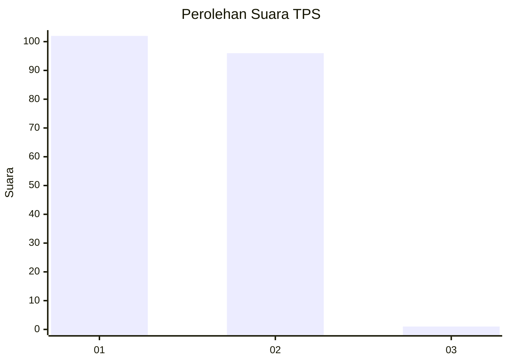
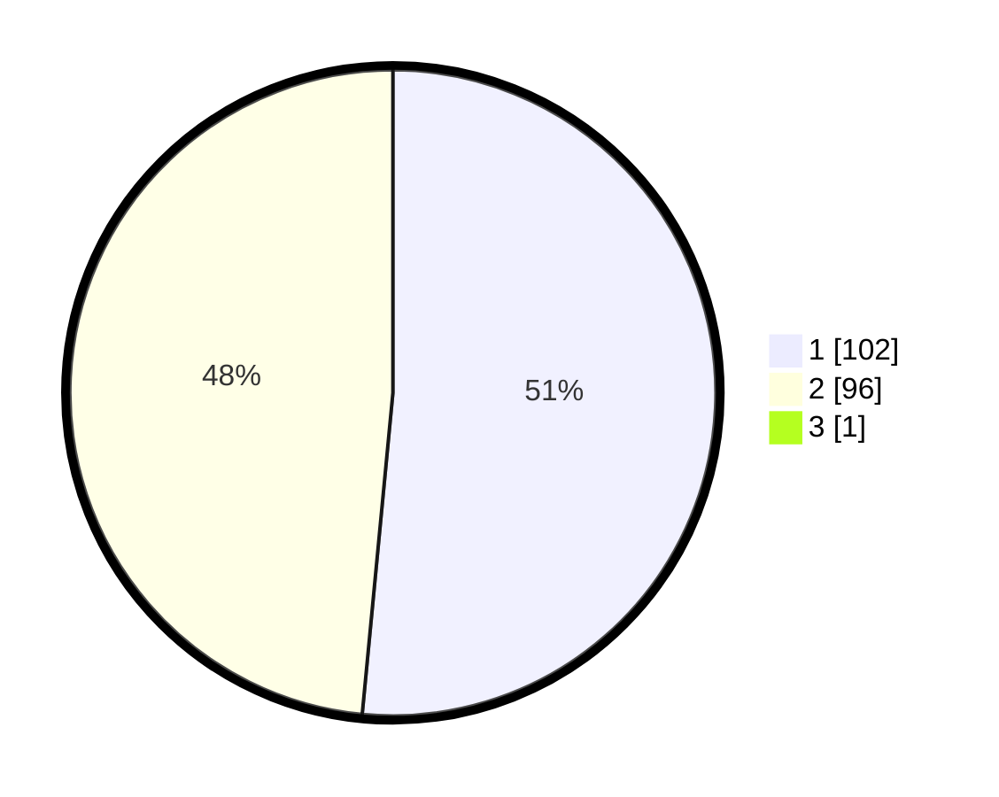

# Hasil

## Grafik

## Tabel

| No. | Nama Paslon    | Suara | Suara (raw) | Persentase |
|:--- |:-------------- | -----:| -----------:| ----------:|
| 1   | ANIES MUHAIMIN | 102   | [102][p-1]  | 51,26      |
| 2   | PRABOWO GIBRAN | 96    | [96][p-2]   | 48,24      |
| 3   | GANJAR MAHFUD  | 1     | [1][p-3]    | 0,50       |

[p-1]: https://github.com/gigit-pemilu/pemilu-2024-14-riau/blob/main/pilpres/hitung-suara/sub/14-riau/sub/06--rokan-hulu/sub/02-rokan-iv-koto/sub/2008-lubuk-bendahara/sub/002-tps/sub/paslon-1.txt
[p-2]: https://github.com/gigit-pemilu/pemilu-2024-14-riau/blob/main/pilpres/hitung-suara/sub/14-riau/sub/06--rokan-hulu/sub/02-rokan-iv-koto/sub/2008-lubuk-bendahara/sub/002-tps/sub/paslon-2.txt
[p-3]: https://github.com/gigit-pemilu/pemilu-2024-14-riau/blob/main/pilpres/hitung-suara/sub/14-riau/sub/06--rokan-hulu/sub/02-rokan-iv-koto/sub/2008-lubuk-bendahara/sub/002-tps/sub/paslon-3.txt

## Foto C Plano

https://sirekap-obj-formc.kpu.go.id/4cc1/pemilu/ppwp/14/06/02/20/08/1406022008002-20240215-233216--91507313-9fbe-46eb-affa-7aa057106f4a.jpg

https://sirekap-obj-formc.kpu.go.id/4cc1/pemilu/ppwp/14/06/02/20/08/1406022008002-20240215-160205--a0f9501b-c9f0-4f1b-97c7-619daa5d2167.jpg

https://sirekap-obj-formc.kpu.go.id/4cc1/pemilu/ppwp/14/06/02/20/08/1406022008002-20240215-160355--98abefbd-24f2-4bcd-9483-8e7c85d17dee.jpg

## Metadata

| Key        | Value               |
| ---------- | ------------------- |
| Time Stamp | 2024-02-16 00:00:26 |

