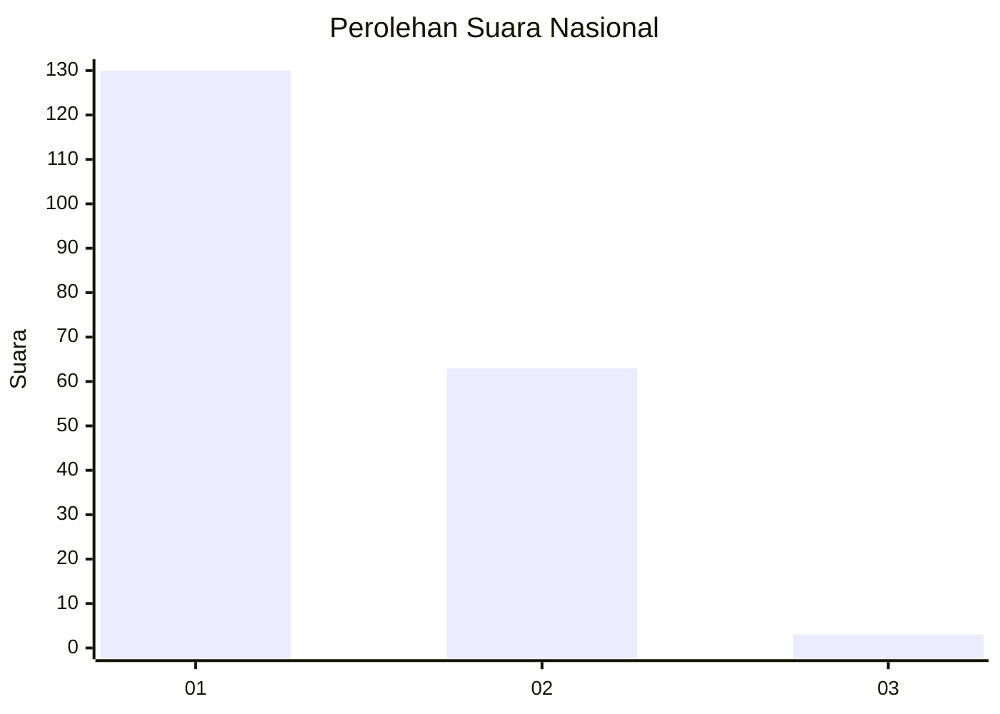
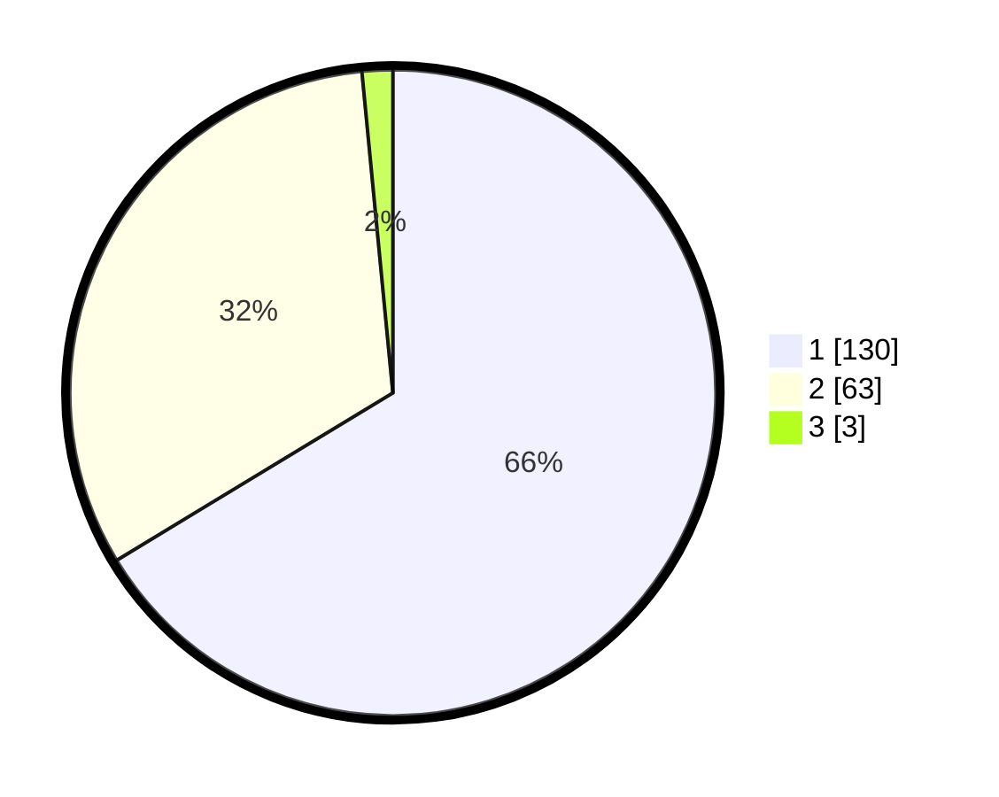

# Hasil

## Grafik

## Tabel

| No. | Nama Paslon    | Suara | Suara (raw) | Persentase |
|:--- |:-------------- | -----:| -----------:| ----------:|
| 1   | ANIES MUHAIMIN | 130   | [130][p-1]  | 66,33      |
| 2   | PRABOWO GIBRAN | 63    | [63][p-2]   | 32,14      |
| 3   | GANJAR MAHFUD  | 3     | [3][p-3]    | 1,53       |

[p-1]: https://github.com/gigit-pemilu/pemilu-2024/blob/main/pilpres/hitung-suara/sub/14-riau/sub/06--rokan-hulu/sub/03-rambah/sub/1001-pasir-pengarayan/sub/005-tps/sub/paslon-1.txt
[p-2]: https://github.com/gigit-pemilu/pemilu-2024/blob/main/pilpres/hitung-suara/sub/14-riau/sub/06--rokan-hulu/sub/03-rambah/sub/1001-pasir-pengarayan/sub/005-tps/sub/paslon-2.txt
[p-3]: https://github.com/gigit-pemilu/pemilu-2024/blob/main/pilpres/hitung-suara/sub/14-riau/sub/06--rokan-hulu/sub/03-rambah/sub/1001-pasir-pengarayan/sub/005-tps/sub/paslon-3.txt

## Foto C Plano

https://sirekap-obj-formc.kpu.go.id/93b1/pemilu/ppwp/14/06/03/10/01/1406031001005-20240220-103813--625551a3-1695-451c-adb0-2e8211d8a199.jpg

https://sirekap-obj-formc.kpu.go.id/93b1/pemilu/ppwp/14/06/03/10/01/1406031001005-20240214-234435--bb11f799-1ac3-4ab8-b3ad-b8ee74457b15.jpg

https://sirekap-obj-formc.kpu.go.id/93b1/pemilu/ppwp/14/06/03/10/01/1406031001005-20240220-105342--a2f78f60-fb50-40c8-9847-459ceffa40e3.jpg

## Metadata

| Key        | Value               |
| ---------- | ------------------- |
| Time Stamp | 2024-02-20 21:00:00 |

