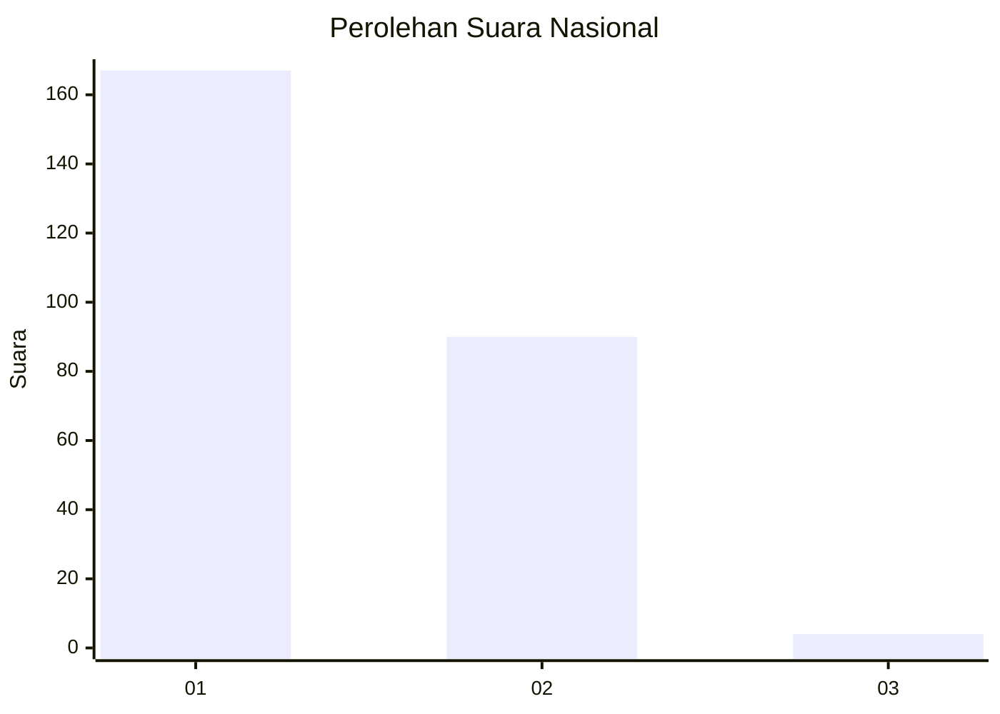
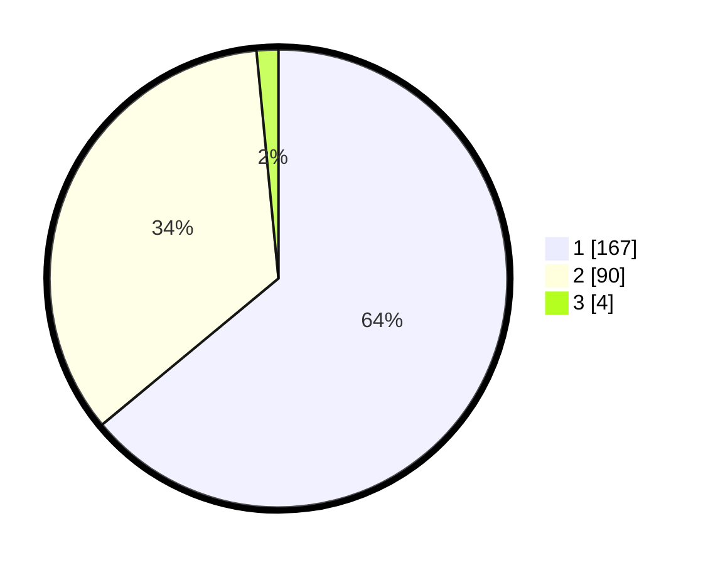

# Hasil

## Grafik

## Tabel

| No. | Nama Paslon    | Suara | Suara (raw) | Persentase |
|:--- |:-------------- | -----:| -----------:| ----------:|
| 1   | ANIES MUHAIMIN | 167   | [167][p-1]  | 63,98      |
| 2   | PRABOWO GIBRAN | 90    | [90][p-2]   | 34,48      |
| 3   | GANJAR MAHFUD  | 4     | [4][p-3]    | 1,53       |

[p-1]: https://github.com/gigit-pemilu/pemilu-2024/blob/main/pilpres/hitung-suara/sub/14-riau/sub/06--rokan-hulu/sub/03-rambah/sub/2005-rambah-tengah-barat/sub/008-tps/sub/paslon-1.txt
[p-2]: https://github.com/gigit-pemilu/pemilu-2024/blob/main/pilpres/hitung-suara/sub/14-riau/sub/06--rokan-hulu/sub/03-rambah/sub/2005-rambah-tengah-barat/sub/008-tps/sub/paslon-2.txt
[p-3]: https://github.com/gigit-pemilu/pemilu-2024/blob/main/pilpres/hitung-suara/sub/14-riau/sub/06--rokan-hulu/sub/03-rambah/sub/2005-rambah-tengah-barat/sub/008-tps/sub/paslon-3.txt

## Foto C Plano

https://sirekap-obj-formc.kpu.go.id/16dd/pemilu/ppwp/14/06/03/20/05/1406032005008-20240219-154345--7b708d91-111a-4dd3-ae2f-aa52f6f49bb7.jpg

https://sirekap-obj-formc.kpu.go.id/16dd/pemilu/ppwp/14/06/03/20/05/1406032005008-20240219-154425--27df1bd1-f35b-497a-9ba5-a8589e77bde6.jpg

https://sirekap-obj-formc.kpu.go.id/16dd/pemilu/ppwp/14/06/03/20/05/1406032005008-20240219-154516--b759f92a-bb68-4c62-a8a0-85120b21e732.jpg

## Metadata

| Key        | Value               |
| ---------- | ------------------- |
| Time Stamp | 2024-02-19 17:00:00 |

