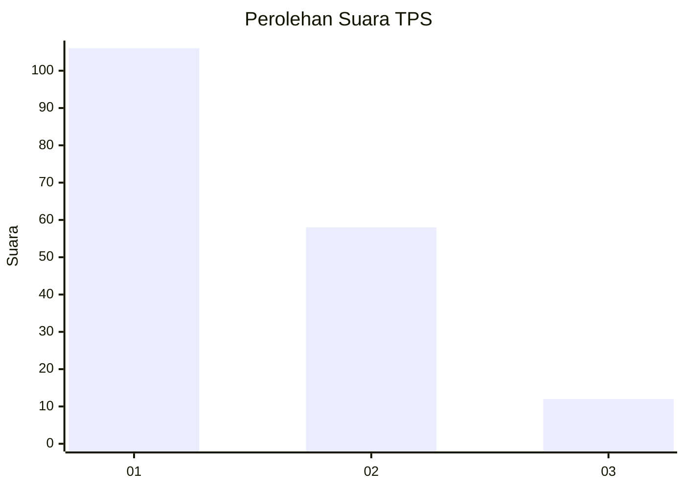
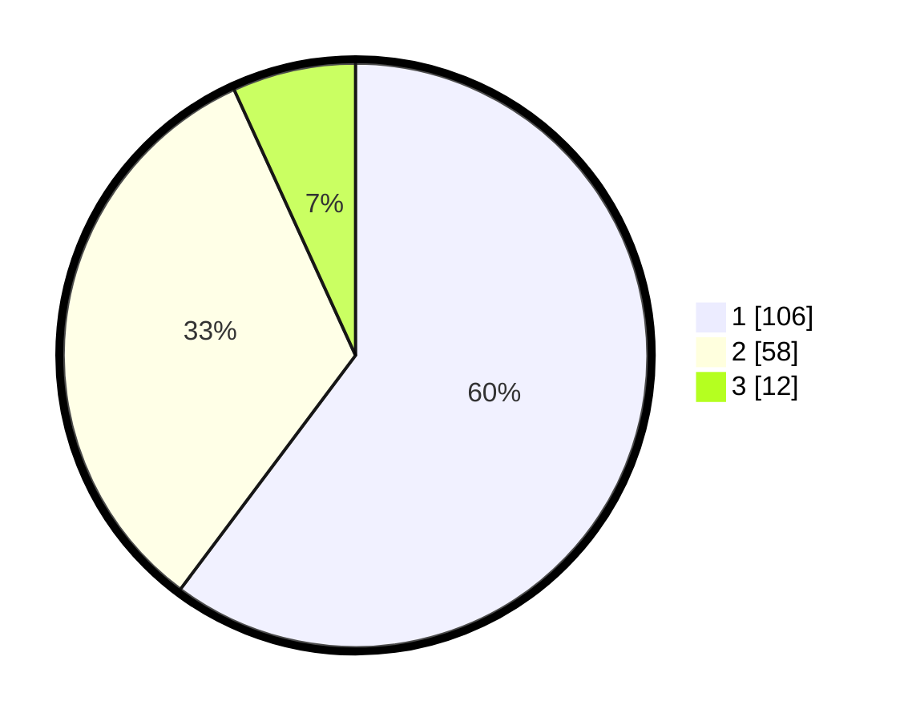

# Hasil

## Grafik

## Tabel

| No. | Nama Paslon    | Suara | Suara (raw) | Persentase |
|:--- |:-------------- | -----:| -----------:| ----------:|
| 1   | ANIES MUHAIMIN | 106   | [106][p-1]  | 60,23      |
| 2   | PRABOWO GIBRAN | 58    | [58][p-2]   | 32,95      |
| 3   | GANJAR MAHFUD  | 12    | [12][p-3]   | 6,82       |

[p-1]: https://github.com/gigit-pemilu/pemilu-2024-14-riau/blob/main/pilpres/hitung-suara/sub/14-riau/sub/06--rokan-hulu/sub/03-rambah/sub/2010-koto-tinggi/sub/011-tps/sub/paslon-1.txt
[p-2]: https://github.com/gigit-pemilu/pemilu-2024-14-riau/blob/main/pilpres/hitung-suara/sub/14-riau/sub/06--rokan-hulu/sub/03-rambah/sub/2010-koto-tinggi/sub/011-tps/sub/paslon-2.txt
[p-3]: https://github.com/gigit-pemilu/pemilu-2024-14-riau/blob/main/pilpres/hitung-suara/sub/14-riau/sub/06--rokan-hulu/sub/03-rambah/sub/2010-koto-tinggi/sub/011-tps/sub/paslon-3.txt

## Foto C Plano

https://sirekap-obj-formc.kpu.go.id/f2eb/pemilu/ppwp/14/06/03/20/10/1406032010011-20240217-125350--c311de49-8339-465b-bb65-f4048facba0a.jpg

https://sirekap-obj-formc.kpu.go.id/f2eb/pemilu/ppwp/14/06/03/20/10/1406032010011-20240217-125358--14d44988-1567-4d37-877d-46253b3df458.jpg

https://sirekap-obj-formc.kpu.go.id/f2eb/pemilu/ppwp/14/06/03/20/10/1406032010011-20240217-125404--1875800d-59d5-4224-a953-57c8b49ef62a.jpg

## Metadata

| Key        | Value               |
| ---------- | ------------------- |
| Time Stamp | 2024-02-19 06:16:00 |

