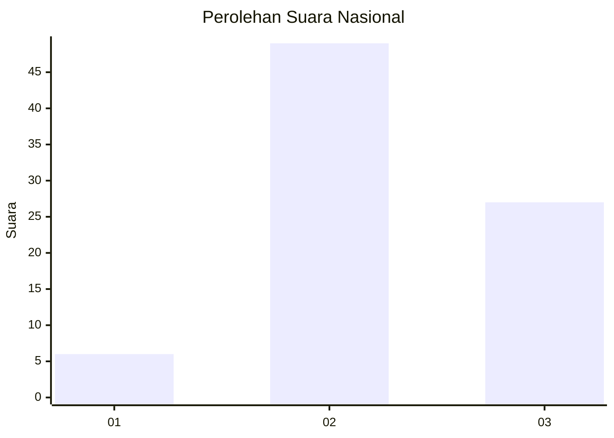
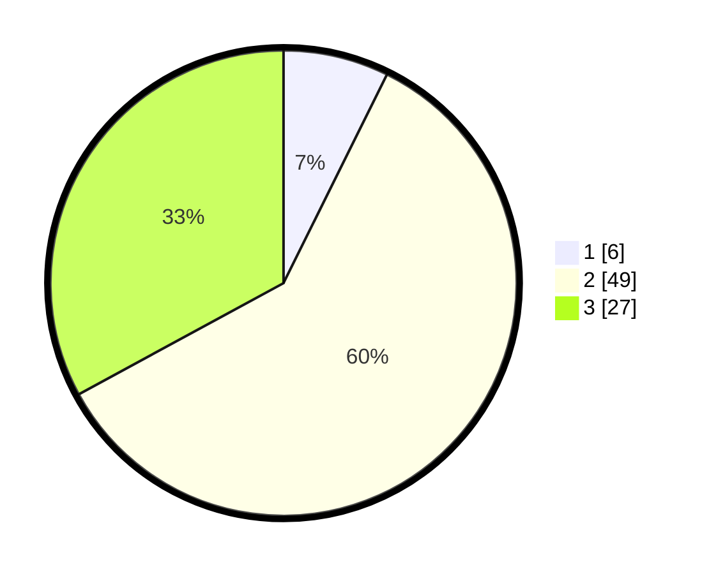

# Hasil

## Grafik

## Tabel

| No. | Nama Paslon    | Suara | Suara (raw) | Persentase |
|:--- |:-------------- | -----:| -----------:| ----------:|
| 1   | ANIES MUHAIMIN | 6     | [6][p-1]    | 7,32       |
| 2   | PRABOWO GIBRAN | 49    | [49][p-2]   | 59,76      |
| 3   | GANJAR MAHFUD  | 27    | [27][p-3]   | 32,93      |

[p-1]: https://github.com/gigit-pemilu/pemilu-2024/blob/main/pilpres/hitung-suara/sub/14-riau/sub/06--rokan-hulu/sub/04-tambusai/sub/2003-tambusai-timur/sub/013-tps/sub/paslon-1.txt
[p-2]: https://github.com/gigit-pemilu/pemilu-2024/blob/main/pilpres/hitung-suara/sub/14-riau/sub/06--rokan-hulu/sub/04-tambusai/sub/2003-tambusai-timur/sub/013-tps/sub/paslon-2.txt
[p-3]: https://github.com/gigit-pemilu/pemilu-2024/blob/main/pilpres/hitung-suara/sub/14-riau/sub/06--rokan-hulu/sub/04-tambusai/sub/2003-tambusai-timur/sub/013-tps/sub/paslon-3.txt

## Foto C Plano

https://sirekap-obj-formc.kpu.go.id/1a4e/pemilu/ppwp/14/06/04/20/03/1406042003013-20240215-125450--3af569bc-f9b7-491f-9411-47ca57edc420.jpg

https://sirekap-obj-formc.kpu.go.id/1a4e/pemilu/ppwp/14/06/04/20/03/1406042003013-20240215-125515--deddcc3a-ce11-44d1-9dc7-dbff8d7d8b40.jpg

https://sirekap-obj-formc.kpu.go.id/1a4e/pemilu/ppwp/14/06/04/20/03/1406042003013-20240215-125542--3a4075f0-44f8-4535-8dd6-3cfd24803654.jpg

## Metadata

| Key        | Value               |
| ---------- | ------------------- |
| Time Stamp | 2024-02-15 22:00:27 |

