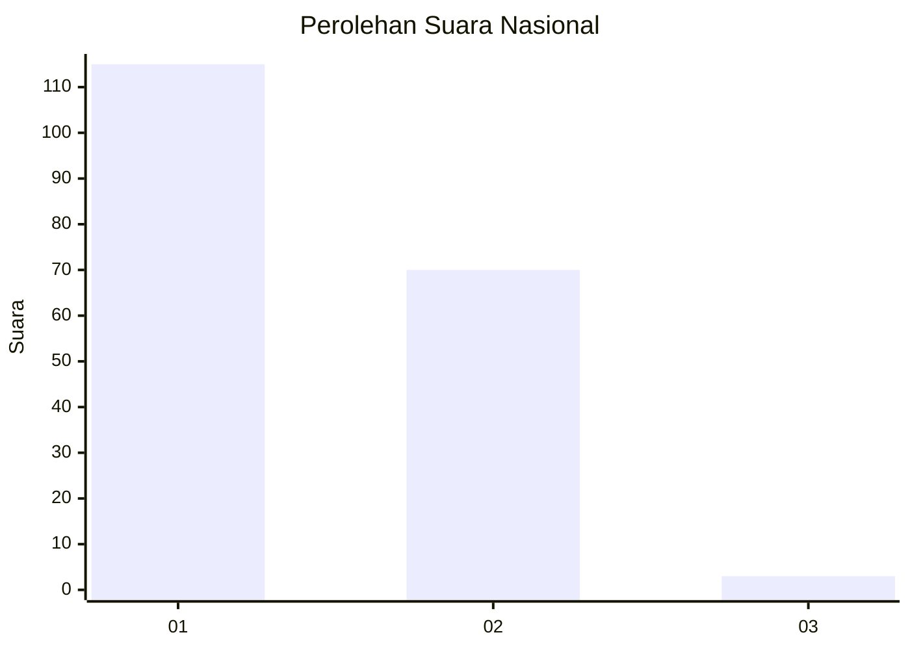
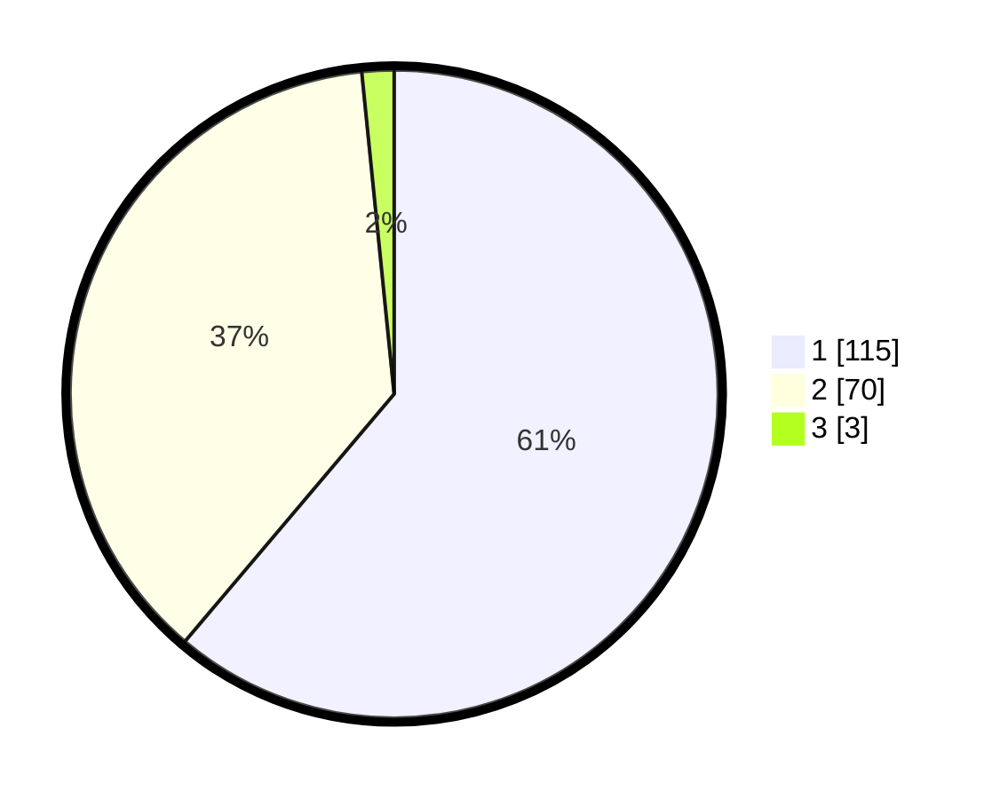

# Hasil

## Grafik

## Tabel

| No. | Nama Paslon    | Suara | Suara (raw) | Persentase |
|:--- |:-------------- | -----:| -----------:| ----------:|
| 1   | ANIES MUHAIMIN | 115   | [115][p-1]  | 61,17      |
| 2   | PRABOWO GIBRAN | 70    | [70][p-2]   | 37,23      |
| 3   | GANJAR MAHFUD  | 3     | [3][p-3]    | 1,60       |

[p-1]: https://github.com/gigit-pemilu/pemilu-2024/blob/main/pilpres/hitung-suara/sub/14-riau/sub/06--rokan-hulu/sub/04-tambusai/sub/2007-sungai-kumango/sub/003-tps/sub/paslon-1.txt
[p-2]: https://github.com/gigit-pemilu/pemilu-2024/blob/main/pilpres/hitung-suara/sub/14-riau/sub/06--rokan-hulu/sub/04-tambusai/sub/2007-sungai-kumango/sub/003-tps/sub/paslon-2.txt
[p-3]: https://github.com/gigit-pemilu/pemilu-2024/blob/main/pilpres/hitung-suara/sub/14-riau/sub/06--rokan-hulu/sub/04-tambusai/sub/2007-sungai-kumango/sub/003-tps/sub/paslon-3.txt

## Foto C Plano

https://sirekap-obj-formc.kpu.go.id/198d/pemilu/ppwp/14/06/04/20/07/1406042007003-20240215-022208--26531dcc-c2a2-4a2c-abb4-1855f9324309.jpg

https://sirekap-obj-formc.kpu.go.id/198d/pemilu/ppwp/14/06/04/20/07/1406042007003-20240215-022333--1c079457-6723-4734-9c8b-ed7a36c09888.jpg

https://sirekap-obj-formc.kpu.go.id/198d/pemilu/ppwp/14/06/04/20/07/1406042007003-20240215-022638--dbfc89fa-7fc3-4ec3-97ca-ecd6b43818c4.jpg

## Metadata

| Key        | Value               |
| ---------- | ------------------- |
| Time Stamp | 2024-02-17 14:56:33 |

