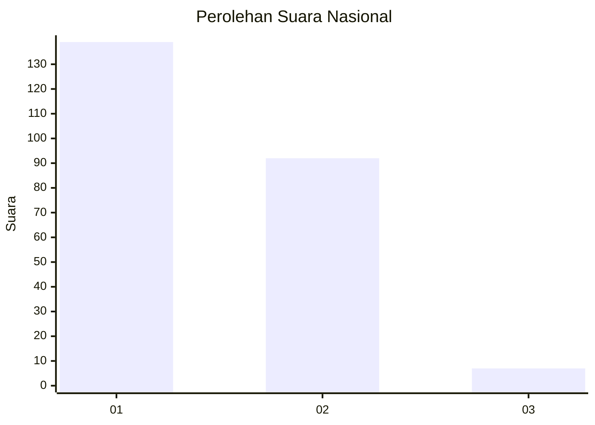
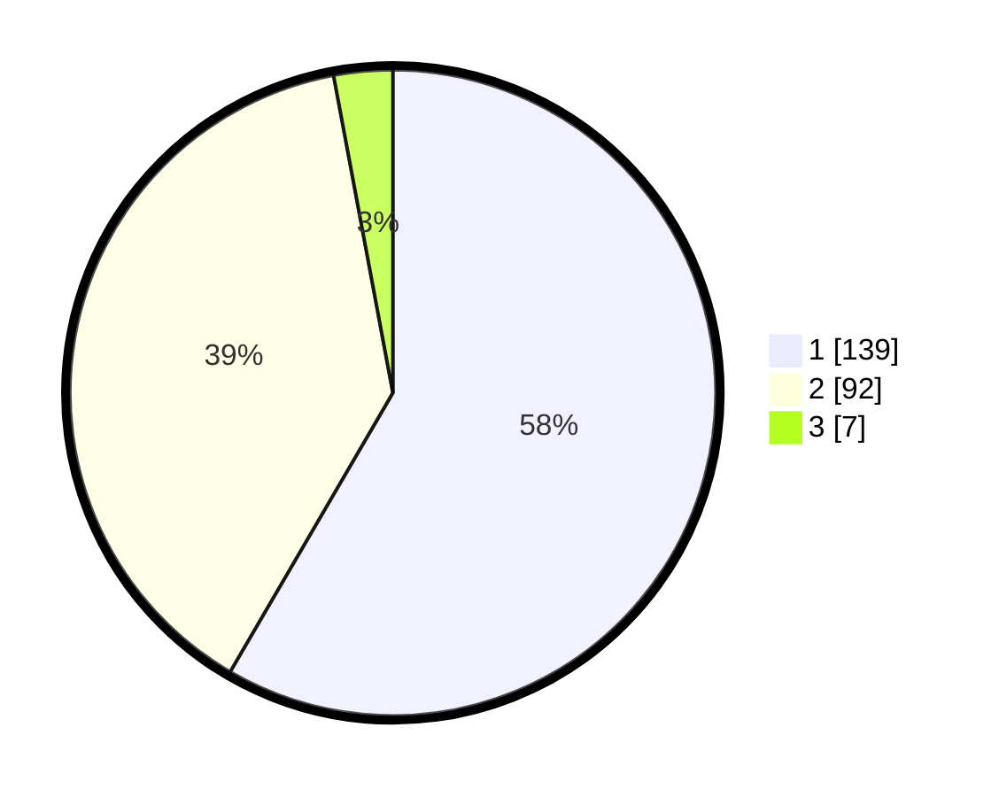

# Hasil

## Grafik

## Tabel

| No. | Nama Paslon    | Suara | Suara (raw) | Persentase |
|:--- |:-------------- | -----:| -----------:| ----------:|
| 1   | ANIES MUHAIMIN | 139   | [139][p-1]  | 58,40      |
| 2   | PRABOWO GIBRAN | 92    | [92][p-2]   | 38,66      |
| 3   | GANJAR MAHFUD  | 7     | [7][p-3]    | 2,94       |

[p-1]: https://github.com/gigit-pemilu/pemilu-2024/blob/main/pilpres/hitung-suara/sub/14-riau/sub/06--rokan-hulu/sub/05-kepenuhan/sub/1001-kepenuhantengah/sub/003-tps/sub/paslon-1.txt
[p-2]: https://github.com/gigit-pemilu/pemilu-2024/blob/main/pilpres/hitung-suara/sub/14-riau/sub/06--rokan-hulu/sub/05-kepenuhan/sub/1001-kepenuhantengah/sub/003-tps/sub/paslon-2.txt
[p-3]: https://github.com/gigit-pemilu/pemilu-2024/blob/main/pilpres/hitung-suara/sub/14-riau/sub/06--rokan-hulu/sub/05-kepenuhan/sub/1001-kepenuhantengah/sub/003-tps/sub/paslon-3.txt

## Foto C Plano

https://sirekap-obj-formc.kpu.go.id/8c58/pemilu/ppwp/14/06/05/10/01/1406051001003-20240214-233002--7693e726-8895-42c2-a670-d4f000c43aeb.jpg

https://sirekap-obj-formc.kpu.go.id/8c58/pemilu/ppwp/14/06/05/10/01/1406051001003-20240214-233354--15e2b95a-3e40-40ac-b05b-741171a36c94.jpg

https://sirekap-obj-formc.kpu.go.id/8c58/pemilu/ppwp/14/06/05/10/01/1406051001003-20240214-235411--c3781c6c-04c6-4395-a227-f659ef6be40f.jpg

## Metadata

| Key        | Value               |
| ---------- | ------------------- |
| Time Stamp | 2024-02-15 21:30:27 |

